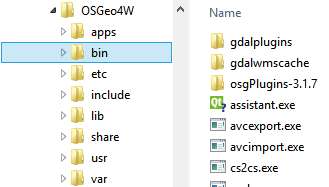

# EnMAP-Box for Developers


The following descriptions describe how to set up an environment to develop EnMAP-Box Applications.

## Prerequisites
Please ensure that the following software is installed:

- An installed QGIS. See http://www.qgis.org/en/site/forusers/download.html for download options.
For windows we recommend to use the OSGeo4W Network installer.

- A git client that can be used from shell. See https://git-scm.com for plattform specific installation options.
In case of missing admin rights download a portable git and ensure it's git.exe is in your system PATH.


- The Git Large File Storage (git-lfs) extension. Check https://git-lfs.github.com for details. Again,


- A proper IDE to develop python code, like PyCharm, https://www.jetbrains.com/pycharm/ , which we will use in the following examples.


- For GUI development: Qt Designer. On windows this can be installed with the OSGeo4W setup (see below)


## Get the Source Code
[Git](https://git-scm.com) is the preferred way to share source code for the purpose of development and the EnMAP-Box source code is hosted on a git server.

1. Clone the EnMAP-Box repository into your folder of choice, e.g. `my_qgis_plugins`, checkout the development branch and pull binary with git LFS.
```
#!batch
cd my_qgis_plugins
git clone https://bitbucket.org/hu-geomatics/enmap-box.git
cd enmap-box
git checkout develop
git lfs pull
```

## Git support in PyCharm
PyCharm supports multiple git commands, so you can use them by mouse-click. It might be required to tell PyCharm where to find the git executable:

* **VCS > Checkout from Version Control > Git**
* Enter the **Git Repository URL**
`https://bitbucket.org/hu-geomatics/enmap-box.git`
* Choose a **Parent Directory** (note: it must already exist) where the repository will be cloned to, and **Directory Name**.


## Setup the development environment - general considerations
To develop EnMAP-Box, or more generally, QGIS applications, we like to use an IDE like PyCharm that provides
state-of-the art tools like debuggers, code completion, spell-checking etc. In particular we like to run scripts or applications without the need
to start a QGIS instance manually. Doing so, we just need to ensure that PyCharm uses the same python environment as the running QGIS instance.
Optimally, the printout of the following python code should be similar in PyCharm and the QGIS Python console:

```
#!python
import sys, os
print(sys.executable) #!Must be the same
print(sys.path)
print(os.environ['PATH'])
```

### Setup the development environment on Windows
The QGIS downloads for windows are based on the OSGeo4W package installer. Depending on which
installer you have used (Standalone / Network), QGIS is likely to be installed either in a root folder called `QGIS` or `OSGeo4W`.
This root folder should be structured like in the following screenshot:




### Install OSGeo4W packages
Packages can be managed using the osgeo4w-setup.exe in expert mode. However, even if OSGeo4W installed in a local user drive, the setup demands
for admin rights. Fortunately there is the environmental variable `__COMPAT_LAYER` (check [this post](shttps://stackoverflow.com/questions/37878185/what-does-compat-layer-actually-do) for details.):
```
#!batch
set OSGEO4W_ROOT=C:\Users\<your_account>\Programs\OSGeo4W
set __COMPAT_LAYER=RUNASINVOKER
start "" %OSGEO4W_ROOT%\bin\osgeo4w-setup.exe -A -R %OSGEO4W_ROOT%
```
Save these line in a batch file (`my_osgeo4w_config.bat`) that you can call to start the OSGeo4W installer, e.g.
to install updates of QGIS and other packages.


Now please ensure that the following packages are installed:

* qgis (Desktop)
* setup OSGEO4W Installer / Updater
* Qt4: pyqt4m qt4.devel, qt4.doc qt4-libs (Libs, includes the QDesigner)
* pyqt4
* setuptools (Libs)
* python-numpy (Libs)
* python-scipy (Libs)
* python-test (Libs)
* python-pip (Libs)
* matplotlib (Libs)

Of course it might be also possible install all packages from the OSGeo4W shell (not fully tested yet):
```
#!batch
set __COMPAT_LAYER=RUNASINVOKER
osgeo4w-setup -k -D -q -P qgis pyqt4 setuptools python-numpy python-scipy python-test python-pip matplotlib
osgeo4w-setup -k -q -P qgis pyqt4 setuptools python-numpy python-scipy python-test python-pip matplotlib
osgeo4w-setup -k -q -P qgis python-pip
```

The first line is to download the requested packages from the internet (`-D`), the second to install them.
Call ``osgeo4w-setup -h`` or see https://trac.osgeo.org/osgeo4w/wiki/CommandLine for more details.

## Install other python packages
Packages like [scikits-learn](http://scikit-learn.org/stable/) are not distributed with the OSGeo4W package installer. We need to install them with pip.
Open the OSGeo4W shell and type `python -m pip install <package to be installed>`, e.g.

```
#!batch
python -m pip install packaging
python -m pip install sklearn
```


## Prepare a PyCharm startup script

When QGIS is initialized, it takes care on its own environment and modifies a couple of environmental variables.
Our development environment PyCharm needs to operate under the same environment as the running QGIS does. We
ensure this with the following batch file that starts PyCharm:

```
#!batch
::OSGeo4W installation (a folder containing a OSGeo4W.bat and subfolders like app,bin,...)
set OSGEO4W_ROOT="<path to>\OSGeo4W"

::PyCharm executable
set PYCHARM="<path to>\pycharm.exe"

::ensure a clean python path to use modules from OSGeo4W python only
set PYTHONPATH=

::set defaults, clean path, load OSGeo4W modules (incrementally)
CALL %OSGEO4W_ROOT%\bin\o4w_env.bat

::lines taken from python-qgis.bat
set QGIS_PREFIX_PATH=%OSGEO4W_ROOT%\apps\qgis
set PATH=%QGIS_PREFIX_PATH%\bin;%PATH%

set QT_PLUGIN_PATH=%OSGEO4W_ROOT%\apps\qgis\qtplugins;%OSGEO4W_ROOT%\apps\qt4\plugins
set PYTHONPATH=%OSGEO4W_ROOT%\apps\qgis\python;%PYTHONPATH%

start "PyCharm aware of QGIS" /B %PYCHARM% %*
```


## Set up a development environment on macOS

Please install the QGIS as described here: http://www.kyngchaos.com/software/qgis

Tbd...


## List of environmental variables

The following environmental variables can be set to change the starting behaviour of the EnMAP-Box.

Name                 | Values, * = Default  | Description
:--------------------| :-----------------|:-----------------
EMB_LOAD_PF     | TRUE*/FALSE        | Load QGIS processing framework.
EMB_LOAD_EA     | TRUE*/FALSE        | Loads external applications.
EMB_DEBUG       | TRUE/FALSE*        | Enable additional debug printouts.
EMB_SPLASHSCREEN | TRUE*/FALSE        | Splashscreen on EnMAP-Box start.
EMB_MESSAGE_TIMEOUT | integer [seconds] | Timeout for popup messages in the message bar.
EMB_APPLICATION_PATH | string | list of directories (separated by ';' or ':') to load EnMAPBoxApplications from.

## Further links and sources

https://docs.python.org/devguide

### Git for Beginners

http://rogerdudler.github.io/git-guide/

http://rogerdudler.github.io/git-guide/files/git_cheat_sheet.pdf


### QGIS
www.qgis.org/api/

https://webgeodatavore.github.io/pyqgis-samples/

http://plugins.qgis.org/planet/

https://www.qgis.org/en/site/getinvolved/development/qgisdevelopersguide.html


### Python Code Documentation

http://www.sphinx-doc.org/en/stable/tutorial.html

https://docs.python.org/devguide/documenting.html

http://docutils.sourceforge.net/rst.html

