=====================
HUB Workflow Cookbook
=====================

General
=======

Is HUB Workflow installed
-------------------------

Imports HUB Workflow and exits the program if the modules are not found.

.. literalinclude:: ../examples/general/import_hubflow.py

Is the testdata installed
-------------------------

In this guide we use the EnMAP-Box testdata (https://bitbucket.org/hu-geomatics/enmap-box-testdata).

.. literalinclude:: ../examples/general/import_testdata.py

Check versions installed
------------------------

.. literalinclude:: ../examples/general/version.py

Raster
======

Save raster to new location and specific format
-----------------------------------------------

.. literalinclude:: ../examples/raster/save_raster.py
   :start-after: START
   :end-before: END

Prints:

.. literalinclude:: ../examples/raster/save_raster.txt

Apply a spatial convolution filter
----------------------------------

.. literalinclude:: ../examples/raster/spatial_convolution_filter.py
   :start-after: START
   :end-before: END

Prints:

.. literalinclude:: ../examples/raster/spatial_convolution_filter.txt

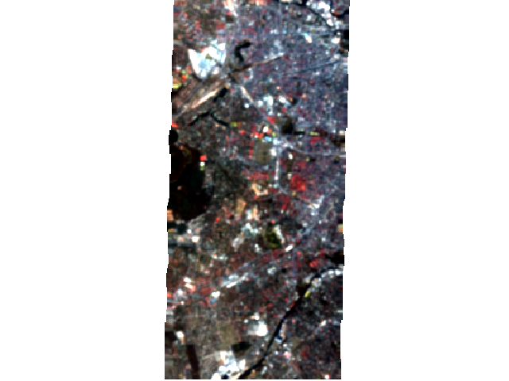

    Result of Gaussian filter

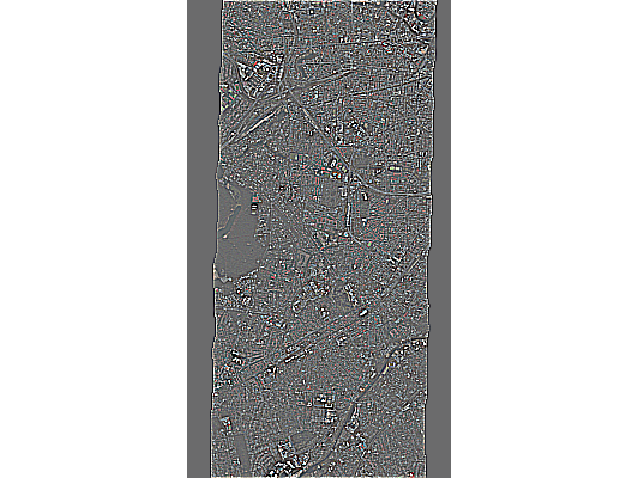

    Result of High-Pass filter

Classification
==============

Reclassify a classification
---------------------------

Merge 6 detailed landcover classes into a binary *urban* vs *non-urban* classification.

.. literalinclude:: ../examples/classification/reclassify_classification.py
   :start-after: START
   :end-before: END

Prints:

.. literalinclude:: ../examples/classification/reclassify_classification.txt

.. raw:: html
   :file: ../examples/classification/reclassify_classification1.html

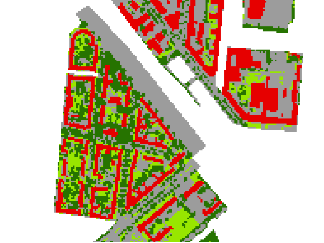

   Original

.. raw:: html
   :file: ../examples/classification/reclassify_classification2.html

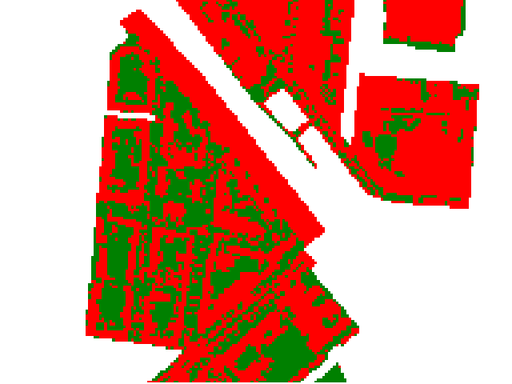

   Reclassified

Fit Random Forest classifier, apply to a raster and assess the performance
--------------------------------------------------------------------------

.. literalinclude:: ../examples/classification/classification_fit_predict_accass.py
   :start-after: START
   :end-before: END

.. raw:: html
   :file: ../examples/classification/classification_fit_predict_accass.html

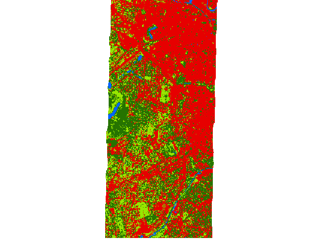

    Random Forest Classification

HTML report:

.. raw:: html

   <iframe src="/_static/ClassificationPerformance.html" width=100% height=500px></iframe>

Set class definition
--------------------

.. literalinclude:: ../examples/classification/set_class_definition.py
   :start-after: START
   :end-before: END

Prints:

.. literalinclude:: ../examples/classification/set_class_definition.txt

.. raw:: html
   :file: ../examples/classification/set_class_definition.html

Regression
==========

Fit Random Forest regressor, apply to a raster and assess the performance
--------------------------------------------------------------------------

.. literalinclude:: ../examples/regression/regression_fit_predict_accass.py
   :start-after: START
   :end-before: END

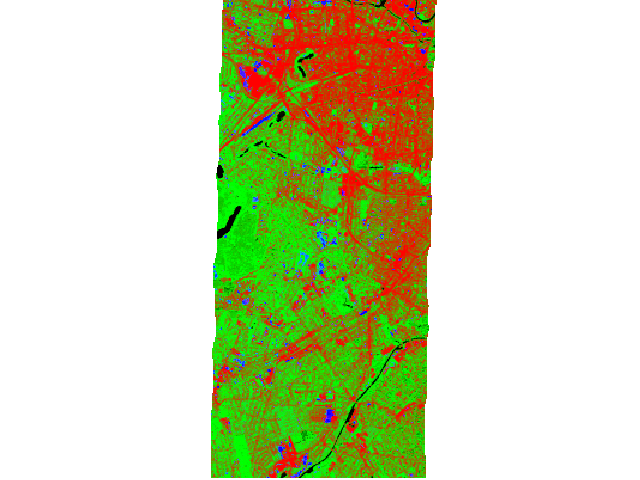

    Random Forest (multi target) regression as false-color-composition
    (Red='impervious', Green='vegetation' and Blue='soil' pixel fractions)

HTML report:

.. raw:: html

   <iframe src="../_static/RegressionPerformance.html" width=100% height=500px></iframe>

Clustering
==========

Fit K-Means clusterer, apply to a raster and assess the performance
-------------------------------------------------------------------

.. literalinclude:: ../examples/clustering/clustering_fit_predict_accass.py
   :start-after: START
   :end-before: END

.. raw:: html
   :file: ../examples/clustering/clustering_fit_predict_accass.html

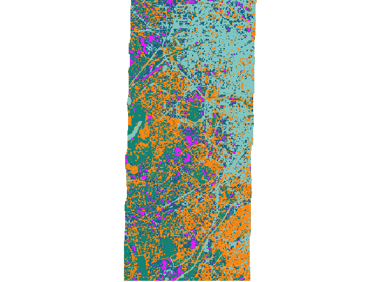

    K-Means clustering.

HTML report:

.. raw:: html

   <iframe src="../_static/ClusteringPerformance.html" width=100% height=500px></iframe>

Transformer
===========

Fit PCA transformer and apply to a raster
-----------------------------------------

.. literalinclude:: ../examples/transformation/transformation_fit_predict_accass.py
   :start-after: START
   :end-before: END

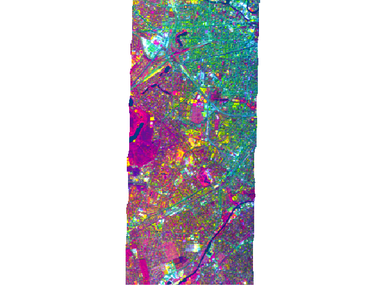

    PCA transformation as false-color-composition
    (Red='pc 1', Green='pc 2' and Blue='pc 3')

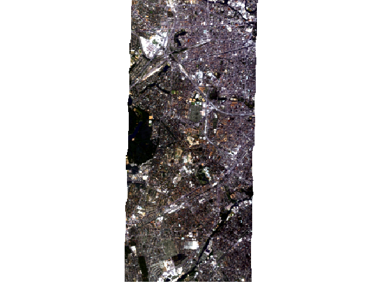

    Reconstructed raster (inverse transformation of PCA transformation) as true-color-composition

Mask
====

Mask values **inside** valid range
----------------------------------

.. literalinclude:: ../examples/mask/mask_valid_range.py
   :start-after: START
   :end-before: END

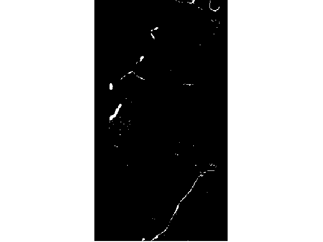

Mask values **outside** valid range
-----------------------------------

.. literalinclude:: ../examples/mask/mask_outside_valid_range.py
   :start-after: START
   :end-before: END

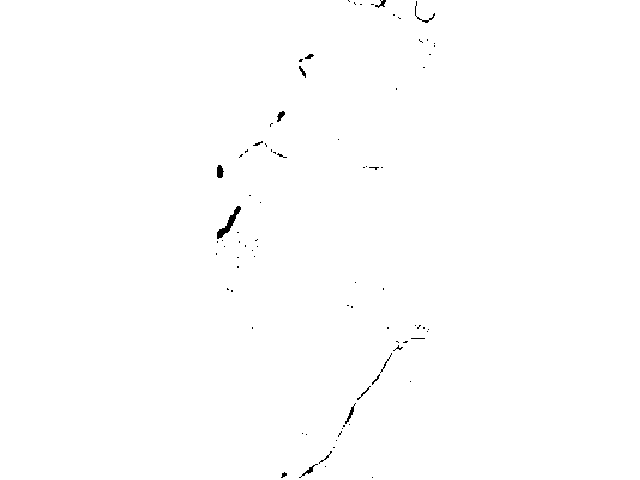

Mask water bodies from classification
-------------------------------------

.. literalinclude:: ../examples/mask/mask_values.py
   :start-after: START
   :end-before: END

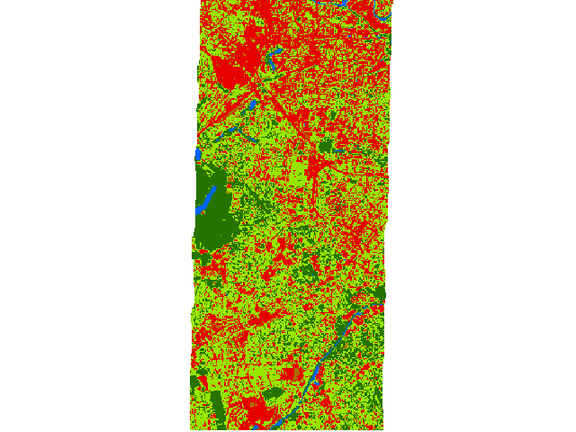
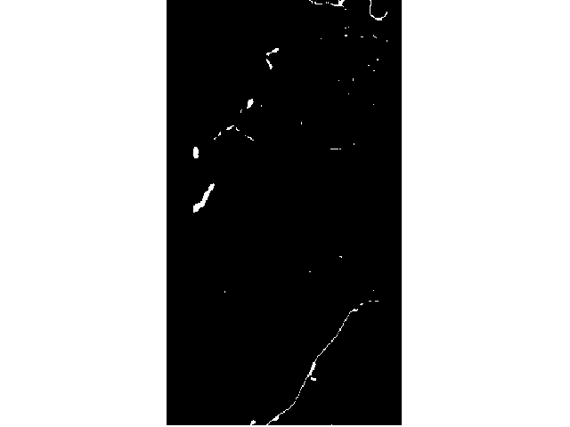

Apply mask to raster
--------------------

.. literalinclude:: ../examples/mask/apply_mask_to_raster.py
   :start-after: START
   :end-before: END

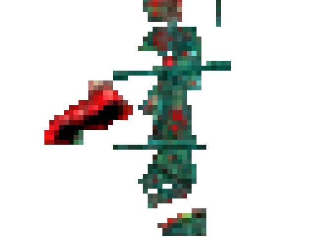

    Raster masked by vector.

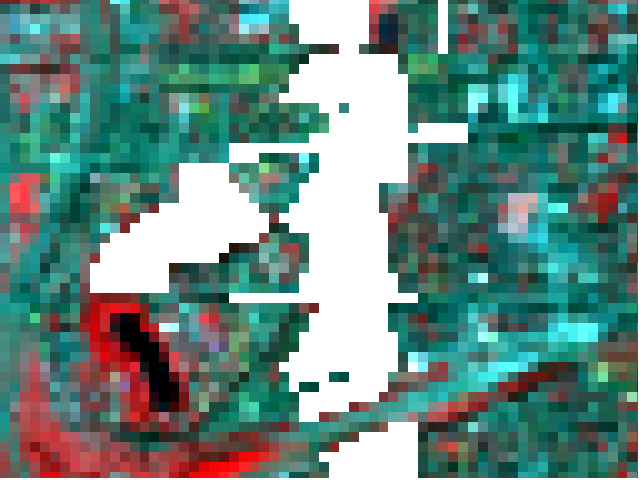

    Raster masked by inverted vector.

ClassificationSample
====================

Create classification sample
----------------------------

.. warning::

   todo

EnviSpectralLibrary
===================

Read profiles and metadata from library
---------------------------------------

.. literalinclude:: ../examples/envispectrallibrary/read_library.py
   :start-after: START
   :end-before: END

Prints:

.. literalinclude:: ../examples/envispectrallibrary/read_library.txt

Create labeled library from raster and vector points
----------------------------------------------------

.. literalinclude:: ../examples/envispectrallibrary/library_from_raster_and_points.py
   :start-after: START
   :end-before: END

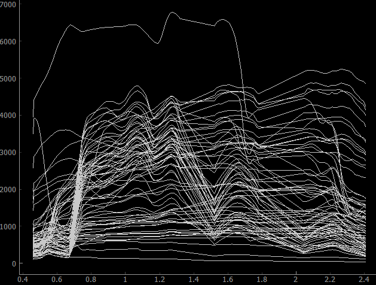
