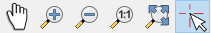

Getting Started
###############

The following examples show how interacte with the EnMAP-Box GUI application.
All examples can be found as unittest TestCases in examples/api_examples.py

1. Start the EnMAP-Box
======================

For simplicity, we like to import some QGIS and Qt libraries which we use for the following examples globally::

    from qgis.core import *
    from qgis.gui import *
    from qgis.PyQt.QtWidgets import *
    from qgis.PyQt.QtGui import *
    from qgis.PyQt.QtCore import *

The Qt and QGIS widgets and objects need a ``QApplication`` or ``QgsApplication``, respectively instance. This application
provides the main GUI Thread and keeps a GUI application alive. As we like to use the following examples from inside a
IDE like PyCharm, we need to emulate the QGIS Desktop Application, which else provides the QgsApplication instance::

    from enmapbox.testing import initQgisApplication
    qgsApp = initQgisApplication()

Now we can start the EnMAP-Box and open the example data::

    from enmapbox import EnMAPBox
    enmapBox = EnMAPBox(None)

    qgsApp.exec_()

The EnMAPBox object is a singleton, which means that there exist only one EnMAPBox instance.
If there is already an existing EnMAP-Box instance, you can connect to like this::

    from enmapbox import EnMAPBox
    enmapBox = EnMAPBox.instance()
    print(enmapBox)

Load the EnMAP-Box test data::

    enmapBox.openExampleData()

Finally, shut down the EnMAP-Box instance::

    enmapBox = EnMAPBox.instance()
    enmapBox.close()

2. Manage Data Sources
======================

Add Data Sources
----------------

The EnMAP-Box differentiates between Raster, Vector, Spectral Libraries and other data sources. To add new data sources
you just need to provide a file-path or other unique resource identifier via ``enmapBox.addSource(r'uri')`` ::

    enmapBox = EnMAPBox.instance()

    # add some data sources
    from enmapboxtestdata import enmap as pathRasterSource
    from enmapboxtestdata import landcover_polygons as pathVectorSource
    from enmapboxtestdata import library as pathSpectralLibrary

    #add a single source
    enmapBox.addSource(pathRasterSource)

    #add a list of sources
    enmapBox.addSources([pathVectorSource, pathSpectralLibrary])

The EnMAP-Box uses the QGIS API to visualize spatial data and allows to show OpenGIS Web Services (OWS)
like Web Map Services (WMS) and Web Feature Services (WFS)::

    wmsUri = 'referer=OpenStreetMap%20contributors,%20under%20ODbL&type=xyz&url=http://tiles.wmflabs.org/hikebike/%7Bz%7D/%7Bx%7D/%7By%7D.png&zmax=17&zmin=1'
    wfsUri = r'restrictToRequestBBOX=''1'' srsname=''EPSG:25833'' typename=''fis:re_postleit'' url=''http://fbinter.stadt-berlin.de/fb/wfs/geometry/senstadt/re_postleit'' version=''auto'''
    enmapBox.addSource(wmsUri, name="Open Street Map")
    enmapBox.addSource(wfsUri, name='Berlin PLZ')

  .. figure:: img/gstart_datasources.png
     :width: 100%

     Different Datasources added to the EnMAP-Box.

List existing data sources
--------------------------

You can iterate over all data sources::

    for source in enmapBox.dataSources():
        print(source)

... or specific ones only, using the ::

    for source in enmapBox.dataSources('RASTER'):
        print(source)

Remove data sources
-------------------

Use the data source path to remove it from the EnMAP-Box::

    enmapBox = EnMAPBox.instance()
    enmapBox.removeSource('source_path')

    #or remove multiple sources
    enmapBox.removeSources(['list-of-source_path'])

Data Sources are unique
-----------------------

Data sources known to the EnMAP-Box are unique, which means that only one data source refers one source path.
Adding the same source multiple times does not change the total number of data sources::

    from enmapbox import EnMAPBox
    from enmapboxtestdata import enmap

    enmapBox = EnMAPBox(None)
    enmapBox.addSource(enmap)
    print('# data sources: {}'.format(len(enmapBox.dataSources())))

    # add the same source again
    enmapBox.addSource(enmap)
    print('# data sources: {}'.format(len(enmapBox.dataSources())))

Data sources are internally described by the `enmapbox.gui.datasources.DataSource` class which
creates a text file
store a reference to the source uri, source name, type and creation date. The following example will print out added
or removed data sources::

        from enmapbox import EnMAPBox

        enmapBox = EnMAPBox(None)
        enmapBox.sigDataSourceAdded.connect(lambda uri:print('DataSource added: {}'.format(uri)))
        enmapBox.sigDataSourceRemoved.connect(lambda uri: print('DataSource removed: {}'.format(uri)))

Now we create a text file and add it to the EnMAP-Box::

        import tempfile, os, time
        tempDir = tempfile.mkdtemp()
        pathFile = os.path.join(tempDir, 'testfile.txt')

        with open(pathFile, 'w', encoding='utf-8') as f:
            f.write('First version')

        assert os.path.isfile(pathFile)
        enmapBox.addSource(pathFile)
        assert len(enmapBox.dataSources()) == 1

which should create a shell printout similar to::

    >DataSource added: C:\Users\user\AppData\Local\Temp\tmp4gjczg1u\testfile.txt

Now we wait overwrite the text file and add it again::

        time.sleep(2)

        with open(pathFile, 'w', encoding='utf-8') as f:
            f.write('Second version')

        assert os.path.exists(pathFile)
        enmapBox.addSource(pathFile)
        assert len(enmapBox.dataSources()) == 1

The shell printouts should be similar to::

    >DataSource removed: C:\Users\user\AppData\Local\Temp\tmp4gjczg1u\testfile.txt
    >DataSource added: C:\Users\user\AppData\Local\Temp\tmp4gjczg1u\testfile.txt

Overwriting a file source and adding it again to the EnMAP-Box will remove the data source first before it is
added again. Listening to the EnMAP-Box signal ``.sigDataSourcesRemoved(...)`` allows to react on overwriting operation,
which might be required to ensure data integrity.

3. Manage Windows
=================

The EnMAP-Box provides specialized windows called ``Docks`` to visualize spatial data and spectral libraries.
They are containers to other, more specialited widgets, e.g. the ``QgsMapCanvas`` or the ``SpectralLibraryWidget``.
``Docks`` can be arranged much more flexible than the standard Qt DockWidgets.

You can create new docks with ``EnMAPBox.createDock('<dockType>')``::

    from enmapbox.gui.enmapboxgui import EnMAPBox, Dock, MapDock, SpectralLibraryDock
    enmapBox = EnMAP-Box.instance()

    enmapBox.createDock('MAP')  # a spatial map
    enmapBox.createDock('SPECLIB') # a spectral library
    enmapBox.createDock('TEXT') # a text editor
    enmapBox.createDock('WEBVIEW') # a browser
    enmapBox.createDock('MIME') # a window to drop mime data (for developers)

Dock titles, visibility and behaviour can be modified::

    # modify dock properties
    mapDock1 = enmapBox.createDock('MAP')  # two spatial maps
    mapDock2 = enmapBox.createDock('MAP')  # a spatial map
    mapDock3 = enmapBox.createDock('MAP')  # a spatial map

    # set dock title
    mapDock1.setTitle('Map 1 (fixed)')
    mapDock2.setTitle('Map 2 (floated)')
    mapDock3.setTitle('Map 3 (hidden)')

    mapDock2.float()
    mapDock3.setVisible(False)

  .. figure:: img/gstart_docks.png
     :width: 100%

     Three map docks. Map 3 is hidden and therefore visible in the dock manager panel only.

Docks can be accessed similar like we have already seen for ``DataSources``::

        from enmapbox.gui.docks import Dock, SpectralLibraryDock
        for dock in enmapBox.dockManager.docks():
            assert isinstance(dock, Dock)
            print(dock)

The ``dockType`` keyword allows to filter the dock type::

        # list map docks only
        for dock in enmapBox.dockManager.docks(dockType='MAP'):
            assert isinstance(dock, Dock)
            print(dock)

        # list all spectral library docks
        for dock in enmapBox.dockManager.docks(dockType='SPELCIB'):
            assert isinstance(dock, Dock)
            print(dock)

4. Map Tools and cursor locations
=================================

A ``QgsMapTool`` controls what happens when a user clicks into a map, e.g. to zoom, zoom out, etc.
The type of map tool which is activated for all maps known to the EnMAP-Box can be specified with
The ``EnMAPBox.setMapTool(...)`` can be used to activate a specific map tool type on all ``QgsMapCanvas`` instances
that are known to the EnMAP-Box, like those shown in `MapDocks`.

        from enmapbox.gui import MapTools
        enmapBox.setMapTool(MapTools.ZoomIn)

Possible map tools are:

===== ====================== =========================== =================================================
Icon  Key (str)              Key (Enum)                  Description
===== ====================== =========================== =================================================
      ``PAN``                ``MapTools.Pan``            Activate pan tool to move the map
      ``ZOOM_IN``            ``MapTools.ZoomIn``         Zoom in
      ``ZOOM_OUT``           ``MapTools.ZoomOut``        Zoom Out
      ``ZOOM_FULL``          ``MapTools.Zoom Full``      Zoom to the full extend
      ``ZOOM_PIXEL_SCALE``   ``MapTools.ZoomPixelScale`` Raster pixel have same size like screen pixel
      ``CURSOR_LOCATION``    ``MapTools.CursorLocation`` Select cursor location information
===== ====================== =========================== =================================================

     Map tool icons to pan, zoom in, out, full extent and pixel scale, and to get cursor location information.

If the ``CursorLocation`` map tool was activated and user performs left-mouse-clicks on a map canvas, the EnMAP-Box
will emit the ``sigCurrentLocationChanged`` signal. Try it by running the following example::

    from enmapbox.gui import MapTools, SpatialPoint

    def printLocation(spatialPoint:SpatialPoint):
        print('Mouse clicked on {}'.format(spatialPoint))

    enmapBox.sigCurrentLocationChanged.connect(printLocation)

.. note:: ``SpatialPoint`` inherits ``QgsPointXY``, enhancing it by keeping a reference to the
          coordinate reference system (CRS) a point coordinate was selected from. Similar, a ``SpatialExtent`` enhances
         ``QgsRectangle``.

If you need the map canvas instance on which a location was selected, you can use the overloaded
``sigCurrentLocationChanged``::

    def printLocationAndCanvas(spatialPoint: SpatialPoint, canvas:QgsMapCanvas):
        print('Mouse clicked on {} in {}'.format(spatialPoint, canvas))

    enmapBox.sigCurrentLocationChanged[SpatialPoint, QgsMapCanvas].connect(printLocationAndCanvas)

If the "Identify raster profile" options is activated, the EnMAP-Box extracts ``SpectralProfiles`` from
the raster layer below the location clicked. Using the ``sigCurrentSpectraChanged`` a signal::

    def printSpectralProfiles(currentSpectra:list):

        print('{} SpectralProfiles collected'.format(len(currentSpectra)))
        for i, p in enumerate(currentSpectra):
            assert isinstance(p, QgsFeature)
            p = SpectralProfile.fromSpecLibFeature(p)
            assert isinstance(p, SpectralProfile)
            print('{}: {}'.format(i+1, p.values()['y']))

    enmapBox.sigCurrentSpectraChanged.connect(printSpectralProfiles)

The last selected cursor location or spectral profiles are stored in the EnMAP-Box and can be returned as followed::

    print('Last location: {}'.format(enmapBox.currentLocation()))
    print('Last SpectralProfile: {}'.format(enmapBox.currentSpectra()))

Points and Extents
==================

Working with spatial data often requires to convert coordinates between different coordinate reference systems (CRS), e.g.
UTM coordinates into geographic latitude longitude value or vice versa.
The EnMAP-Box classes ``SpatialPoint`` and ``SpatialExtent`` inherit from ``QgsPointXY`` and ``QgsRectangle``,
respectively, and enhance them by keeping a reference on the used CRS, and provide the ``.toCrs(...)`` function
which returns them converted into another CRS.

Here is an example than retrieves the center coordinate of a ``QgsRasterLayer`` and converts into geographic
lat/lon coordinates::

        from enmapboxtestdata import enmap
        from enmapbox.gui import SpatialPoint

        layer = QgsRasterLayer(enmap)
        point = SpatialPoint.fromMapLayerCenter(layer)

        targetCrs = QgsCoordinateReferenceSystem('EPSG:4326')

        print('Original CRS: "{}"'.format(layer.crs().description()))
        print('QgsPointXY  : {}'.format(QgsPointXY(point)))
        print('SpatialPoint: {}\n'.format(point))

        pointTargetCRS = point.toCrs(targetCrs)
        print('Target CRS  : "{}"'.format(targetCrs.description()))
        print('QgsPointXY  : {}'.format(QgsPointXY(pointTargetCRS)))
        print('SpatialPoint: {}\n'.format(pointTargetCRS))

Same can be done with the total extent of a ``QgsMapLayer``::

        from enmapbox.gui import SpatialExtent
        extent = SpatialExtent.fromLayer(layer)
        print('Original CRS: "{}"'.format(layer.crs().description()))
        print('QgsRectangle : {}'.format(QgsRectangle(extent)))
        print('SpatialExtent: {}'.format(extent))

        extentTargetCRS = point.toCrs(targetCrs)
        print('Target CRS: "{}"'.format(targetCrs.description()))
        print('QgsRectangle : {}'.format(QgsPointXY(pointTargetCRS)))
        print('SpatialExtent: {}'.format(extentTargetCRS))

.. note:: Be aware that some CRS transformations are not possible and might cause errors, e.g. transforming lat/lon coordinates a projected
CRS like UTM from a regions where the target CRS is not defined for.

