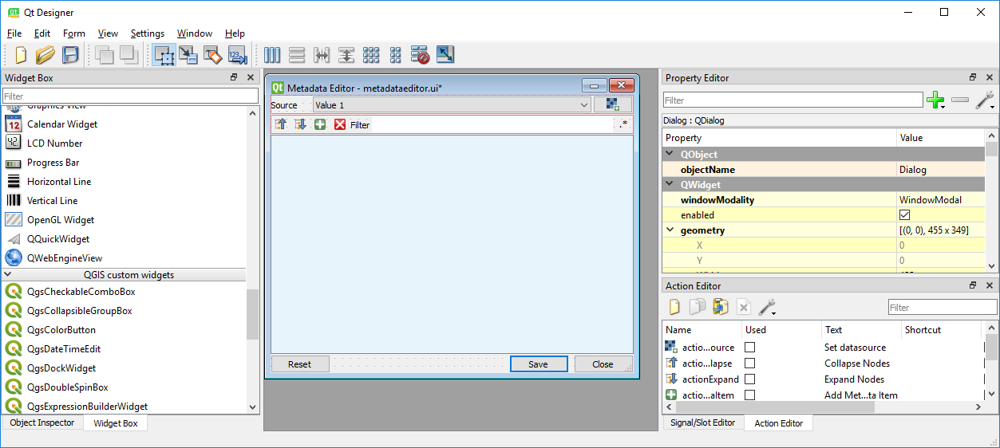
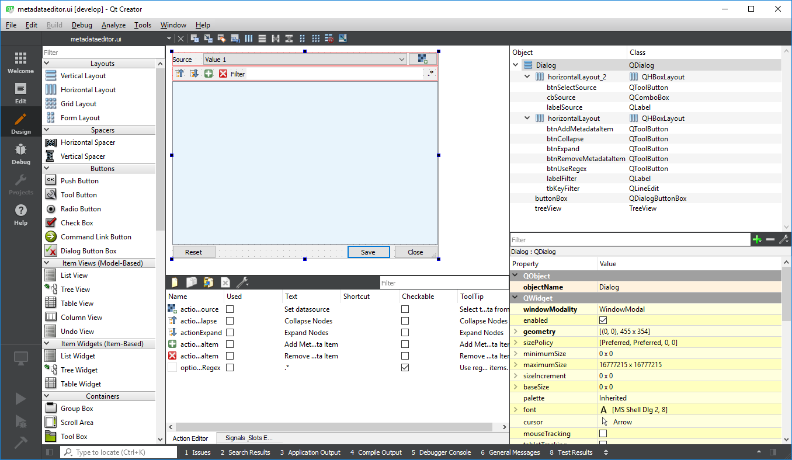

.. include:: external_links.rst

*Last Update: 2020-07-01*

.. _dev_installation:

Installation
############

Overview
========

If you like to develop an EnMAP-Box application, or more general, a QGIS and Qt application, we recommend to use
a state-of-the-art Integrated Development Environment (IDE) like `PyCharm`_. It offers run-time debugging,
code completion, spell-checking, syntax highlighting, SCM support, unit-testing and many other helpful things.

Furthermore, we recommend to install QGIS within a conda / anaconda environment. The installation is (almost) the
same on macOS, windows or linux, it is much easier to install additional python packages and admin rights are
not required, e.g. to update QGIS.

1. Have Git installed
=====================

If not, download and install *Git* from https://git-scm.com/downloads

Check if git is installed to your local shell, e.g. as:

.. code-block:: bat

    C:\Windows\System32>git --version
    git version 2.26.0.windows.1

2. Clone this repository
========================

Clone the EnMAP-Box repository (or a fork) to your local ``my_repositories`` folder:

.. code-block:: bat

    cd my_repositories
    git clone https://bitbucket.org/hu-geomatics/enmap-box.git

Now you can use `git pull <https://git-scm.com/docs/git-pull>`_ to update your local copy of the
EnMAP-Box repository:

.. code-block:: bat

    cd my_repositories/enmap-box
    git pull

.. tip::

        Replace the repo uri with that of your EnMAP-Box repo fork, if you like to
        provide code via pull requests.

.. _dev_installation_create_conda_qgis:

3. Create a QGIS conda environment
==================================

The following setup bases on `this description <http://planet.qgis.org/planet/user/22/tag/conda/>`_ and
installs QGIS into a `Conda`_ environment.
It was tested successfully on Windows 10, Ubuntu 18 and macOS.

1.  `Create <https://docs.conda.io/projects/conda/en/latest/user-guide/tasks/manage-environments.html#creating-an-environment-with-commands>`_
    a new conda environment called *qgis_stable*

    .. code-block:: bat

         $>conda create --name qgis_stable

2.  `Activate <https://docs.conda.io/projects/conda/en/latest/user-guide/tasks/manage-environments.html#activating-an-environment>`_
    the new environment

    .. code-block:: bat

        $>conda activate qgis_stable

3.  `Install <https://docs.conda.io/projects/conda/en/latest/user-guide/tasks/manage-pkgs.html#installing-packages>`_
    QGIS from the `conda-forge`_ channel

    .. code-block:: batch

        (qgis_stable) $>conda install qgis --channel=conda-forge

4.  Install other required packages, e.g. that listed in ``enmap-box/requirements.txt`` and ``enmap-box/requirements_developers.txt``.

    .. code-block:: batch

         (qgis_stable) $>conda install scikit-learn --channel=conda-forge
         (qgis_stable) $>conda install scipy --channel=conda-forge
         (qgis_stable) $>conda install matplotlib --channel=conda-forge

    Packages which are not a conda package can be installed with pip_.

    .. code-block:: batch

        (qgis_stable) $>pip install gitpython
        (qgis_stable) $>pip install git-lfs

    .. admonition:: Note

        Depending on the components and applications you like to use, it might be required to install more packages.

5.  Now you can start `QGIS`_, the :ref:`dev_qt_designer` and :ref:`dev_qt_assistant` from your conda shell:

    .. code-block:: batch

        (qgis_stable) $>qgis
        (qgis_stable) $>desginer
        (qgis_stable) $>assistant

    If you can't start QGIS, you might need to update libzip (thanks to Florian P. who discovered that):

    .. code-block:: batch

            (qgis_stable) $>conda update libzip

6.  Start python and check it's version. It should be a Python >= 3.7.
    Calling ``quit()`` will close the python interpreter and return you to the conda shell:

    .. code-block:: batch

        (qgis_stable) C:\>python
        Python 3.8.1 | packaged by conda-forge | (default, Jan  5 2020, 20:17:16) [MSC v.1916 64 bit (AMD64)] on win32
        Type "help", "copyright", "credits" or "license" for more information.
        >>> quit()

        (qgis_stable) C:\>

4. Setup PyCharm
================

1.  Start `PyCharm`_ and add `my_repositories/enmap-box` as new project via *File > Open File or Project*

2.  If this is not already the case, tell PyCharm where to find your Git-executable.
    Open *File > Settings > Version Control > Git* to set *Path to Git executable*. Press *Test* to check the used Git version.

    .. figure:: img/pycharm_git_settings.png

        Set the Git executable used by PyCharm

    .. tip::

        Use ``where`` to return the path of a git-executable that is available in your DOS/Linux/macOS shell

        .. code-block:: bat

            (qgis_stable) C:\>where git
            C:\Users\geo_beja\AppData\Local\Programs\Git\cmd\git.exe

3.  Switch to *Project: enmap-box > Project Interpreter* and add your conda *qgis_stable* python as project interpreter

    .. figure:: img/pycharm_conda_interpreter_add.png

        Add the *qgis_stable* python to the list of python interpreters

    .. figure:: img/pycharm_conda_interpreter.png

        Select the *qgis_stable* python as project interpreter

4.  Switch to *Project Structure* and add

    * (Linux/Win) ``<your conda installation>/envs/qgis_stable/Library/python`` as additional project content root.

    * (macOS) ``<your conda installation>/envs/qgis_stable/QGIS.app/Contents/MacOS/../Resources/python``

    Right-click on the ``plugins`` subfolder and select :guilabel:`Sources`. Now the PyQGIS API is available to your Python installation.

    .. tip::

        The same way allows you to include other directories to your project's *PYTHONPATH*,
        e.g. to make code available from other folder or repositories.

    .. figure:: img/pycharm_project_content_roots.png

        Use ``qgis_stable/Library/python`` as additional content root

5.  (Windows + macOS) set the QGIS_PREFIX_PATH variable

    PyCharm and PyQGIS need the environmental variable ``QGIS_PREFIX_PATH``.

    Typical paths are:

    ======== ===============================================================================
    OS       QGIS_PREFIX_PATH
    ======== ===============================================================================
    Windows  `<your conda installation>\\envs\\qgis_stable\\Library`
    Linux    `<your conda installation>/envs/qgis_stable/Library`
    macOS    `<your conda installation>/envs/qgis_stable/QGIS.app/Contents/Resources`
    ======== ===============================================================================

    Open *Run > Debug ... > Edit Configurations* and add the *QGIS_PREFIX_PATH* to the User environmental variables.
    This way PyCharm runs python files in a environment with *QGIS_PREFIX_PATH* defined.

    .. figure:: img/pycharm_QGIS_PREFIX_PATH.png

    You might also like to use the conda environment shell in your Pycharm terminal.
    Open *Tools > Terminal* and set the shell path to
    ``cmd.exe "/K" <your conda installation>\Scripts\activate.bat qgis_stable``

    .. figure:: img/pycharm_conda_terminal.png

        How to use the conda terminal in PyCharm

7.  Test the Python environment

    To check if the QGIS API is available, open a *Python Console* and import the `QgsApplication`_ object.

    .. code-block:: python

        from qgis.core import QgsApplication
        QgsApplication.instance() is None

    The output should return ``True``, as we have not initialized any QgsApplication.

    Now check if we can use the EnMAP-Box API to start the EnMAP-Box

    .. code-block:: python

        import enmapbox
        enmapbox.run()

    This should initialize a new QgsApplication and start the EnMAP-Box.
    The outputs printed to the python shell should look like:

    .. code-block:: bash

        Application state:
        QGIS_PREFIX_PATH env var:		D:\miniconda3\envs\qgis_stable\Library
        Prefix:		D:\miniconda3\envs\qgis_stable\Library
        Plugin Path:		D:\miniconda3\envs\qgis_stable\Library/plugins
        Package Data Path:	D:\miniconda3\envs\qgis_stable\Library/.
        Active Theme Name:
        Active Theme Path:	D:\miniconda3\envs\qgis_stable\Library/./resources/themes\\icons/
        Default Theme Path:	:/images/themes/default/
        SVG Search Paths:	D:\miniconda3\envs\qgis_stable\Library/./svg/
                C:\Users\geo_beja\AppData\Local\Temp\QGIS-PythonTestConfigPathp1k7w_s_\profiles\default/svg/
        User DB Path:	D:\miniconda3\envs\qgis_stable\Library/./resources/qgis.db
        Auth DB Path:	C:\Users\geo_beja\AppData\Local\Temp\QGIS-PythonTestConfigPathp1k7w_s_\profiles\default/qgis-auth.db

    If the terminal environment was setup well, you
    can start the EnMAP-Box from the *Terminal* window as well by

    .. code-block:: bat

        (qgis_stable) ..\enmap-box>python enmapbox

Other Tools
===========

The Qt company provides several tools to that help to create Qt applications and are useful for PyQt and PyQGIS users
as well.

.. _dev_qt_assistant:

Qt Assistant
------------

The Qt Assistant allows you to browse fast and offline through Qt help files (``*.qch``). These files exists for
all Qt classes and the QGIS API. They can be generated event with Sphinx, which allows you to provide your
own source-code documentation as ``.qch`` file as well.

1.  Start the Qt Assistant, e.g. from your PyCharm terminal:

    .. code-block:: bat

        (qgis_stable) $>assistant

2.  Download the ``*.qch*`` files which contain:

    * the Qt API documentation `QtDocs.zip <https://box.hu-berlin.de/f/7d72e47293974636b090/?dl=1>`_ (please extract)
    * the QGIS API documentation `qgis.qch <https://qgis.org/api/qgis.qch>`_

    Go to *Preferences > Add* and add the follwing ``*.qch`` files

    ============= =====================================
    File          Documentation
    ============= =====================================
    qgis.qch      qgis.core, qgis.gui
    qtcore.qch    Qt5.QtCore
    qtgui.qch     Qt5.QtGui
    qtwidgets.qch Qt5.QtWidgets
    ============= =====================================

    Now you can explore the Qt (``Q...``) and QGIS (``Qgs...``) classes

    .. figure:: img/qt_assistant.png
         :width: 100%

.. _dev_qt_designer:

Qt Designer
-----------

The Qt Designer is a powerful tool to create GUI frontends by drawing, drag and drop.
Created GUI form files are saved in a XML file ending with ``*.ui``. These can be called from
python to automatically create the entire GUI backend, e.g. windows and buttons defined with the Qt Designer.

You can start the Qt Designer from your PyCharm terminal by:

    .. code-block:: bat

        (qgis_stable) $>designer

     Qt Designer showing the metadataeditor.ui for the Metadata editor.

..

Qt Creator
----------

Qt Creator is the one-in-all IDE to develop Qt C++ applications. It includes the functionality covered by Qt Assistant
(here called Help) and Qt Designer (here called form designer) and helps to browse C++ code. It is the preferred tool to
explore the QGIS C++ source code, for example if you like to better understand what it does behind the QGIS python API.

Qt and the Qt Creator are available at https://www.qt.io/download. Ensure to install the code documentation for the same
Qt version used by QGIS.

     Qt Creator with opened metadataeditor.ui.

..
        SSH access on windows
        1. create a ssh key pair
        2. upload public key to repository of choice
        3. install Putty
        4. start Pageant.ext and add your private key to
        5. add :code:`set GIT_SSH=C:\Program Files\PuTTY\plink.exe` to your startup script
        6. there is an issue with a frozen command line when a server is connected the first time with ssh
           (see https://stackoverflow.com/questions/33240137/git-clone-pull-continually-freezing-at-store-key-in-cache)
           to solve it, start putty and connect try to the server once per SSH (e.g. to bitbucket.org). puty will save its fingerprint
        7. now you can call git push using ssh authentification in background

References
==========

- Git -the simple guide (no deep shit) http://rogerdudler.github.io/git-guide/
- Qt5 C++ API https://doc.qt.io/qt-5/
- QGIS C++ API https://qgis.org/api/
- QGIS Python https://qgis.org/pyqgis
- QGIS Python developer cookbook https://docs.qgis.org/3.4/en/docs/pyqgis_developer_cookbook

