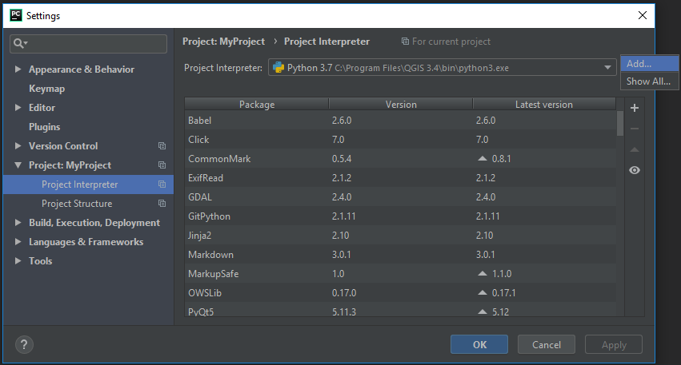
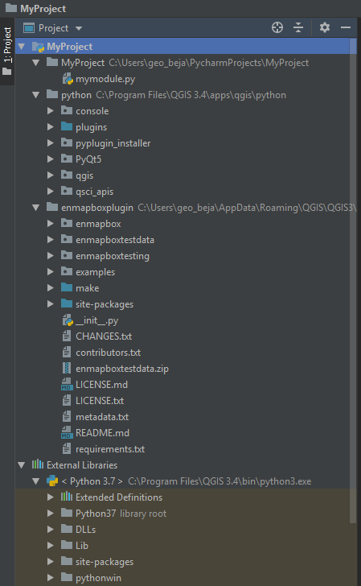

.. include:: links.rst

Installation (Dev)
##################

Last Update: 2019-02-18

If you like to develop an EnMAP-Box application, or more general, a Qt or QGIS application, we highly recommend using
a state-of-the-art Integrated Development Environment (IDE), which offers run-time debugging, code completion,
spell-checking, syntax highlighting, unit-testing and more. In the following we therefore describe how to run and debug
the EnMAP-Box from the PyCharm_ IDE. This allows us to develop and start
the EnMAP-Box and other applications *without* starting the QGIS desktop. Although we haven't tested it, these
steps should be similar for other IDEs like PyDev_.

For developing EnMAP-Box Applications in PyCharm_, the following steps should be done and will be explained in detail:

#. Install required python packages to your QGIS python that your application and the EnMAP-Box depends on.

#. Setup your Pycharm IDE to start with same environmental settings as your QGIS desktop application.

#. Create a new project ("MyProject") and ensure that it uses the same python as QGIS, as well as it required
   QGIS and EnMAP-Box code locations are linked into.


The more you get into the details of EnMAP-Box, QGIS, or more general Qt application development, you might want to
explore the respective APIs and use some more specialized tools for. For this we recommended to read section ":ref:`dev_qt_development_support`".


.. _dev_install_dependencies:

1. Install required packages
============================


First of all, follow the :ref:`user installation guide <install-python-packages>` to install the EnMAP-Box and all required python packages to your QGIS python.

If not already done, install `git <https://git-scm.com>`_ and `git-lfs <https://git-lfs.github.com>`_. It needs to be
available to your operating systems shell.

Now use `pip <https://pip.pypa.io/en/stable>`_ and install additional packages required for developers. Call:

.. code-block:: batch

    python3 -m pip install -r https://bitbucket.org/hu-geomatics/enmap-box/raw/develop/requirements_developer.txt

or install each package separately.

=================== =============================================================================
Package             Description
=================== =============================================================================
gitpython           Git command from python
                    https://gitpython.readthedocs.io/en/stable/index.html
git-lfs             Git Large File Storage (git-lfs) support
                    https://github.com/liberapay/git-lfs-fetch.py
pb_tool             Plugin Builder Tool to create a QGIS Plugin
                    http://g-sherman.github.io/plugin_build_tool/
sphinx              Python documentation generator
                    http://www.sphinx-doc.org/en/master/
sphinx_argparse
sphinx-markdown
sphinx-red-theme
sphinx-autobuild
recommonmark
=================== =============================================================================


.. _dev_setup_pycharm:

2. Setup PyCharm
=================


PyCharm needs to run under the same environmental settings as the QGIS Desktop Application. In particular it needs
to use the same Python interpreter as QGIS does.


Windows
-------


The following description is based on http://spatialgalaxy.net/2018/02/13/quick-guide-to-getting-started-with-pyqgis3-on-windows/

QGIS for Windows (OSGeo4W) uses a set of cascading batch (``*.bat``) files to setup up the QGIS environment.
We recommend to use similar approaches to start the IDE and other applications that require the same environment to operate in as the desktop QGIS does.

First, we need to know the root folder of our QGIS3/OSGeo4W installation, hereafter referred as ``OSGEO4W_ROOT``, e.g. ````OSGEO4W_ROOT=C:\Program Files\QGIS 3.0\`` or ````OSGEO4W_ROOT=C:\Program Files\OSGeo4W\``.

OSGeo4W Shell
~~~~~~~~~~~~~

The following script shows how to setup and start the QGIS shell with a Python 3 and Qt 5 environment:

.. code-block:: bat

    ::STARTUP Script to start a IDE like PyCharm under the same environment as QGIS
    ::OSGeo4W/QGIS installation folder
    set OSGEO4W_ROOT="C:\Program Files\QGIS 3.4"

    ::set defaults, clean path, load OSGeo4W modules (incrementally)
    call %OSGEO4W_ROOT%\bin\o4w_env.bat
    call qt5_env.bat
    call py3_env.bat


Now you can type ``python`` to start a python 3 shell. Please note that without calling ```py3_env.bat`` before, the QGIS shell would start a python 2 shell instead.

Commands available in the QGIS shell can be listed with ``o-help``. E.g. calling ``qgis`` will start the QGIS desktop and ``setup`` the graphical OSGeo Installer.
Some important applications to develop applications are:

=====================     ============================================================================
Command                   Description
=====================     ============================================================================
``qgis``                  QGIS desktop application
``setup``                 OSGeo4W graphical installer
``designer``              Qt Designer to draw graphical user interfaces
``qgis-designer``         Qt Designer + additional QGIS widgets
``assistant``             Qt Assistant to browse Qt + QGIS API reference
``python``                python shell. call ``py3_env.bat`` before to activate python 3
``pip``                   python package installer (similar to ``python -m pip``)
=====================     ============================================================================


Depending on previous setup steps, some of these commands might not be installed by default.
The Qt Designer and Qt Assistant, for example, require to have the ``qt5-doc`` and ``qt5-devel`` packages installed.


IDE Start script
~~~~~~~~~~~~~~~~

1. Create a ``start_IDE_with_QGIS.bat`` to start your IDE in the same environment as the QGIS desktop application:

.. code-block:: bat

    ::STARTUP Script to start a IDE like PyCharm under the same environment as QGIS
    ::OSGeo4W or QQGIS installation folder
    set OSGEO4W_ROOT="C:\Program Files\QGIS 3.4"

    ::Executable of your IDE
    set IDE="C:\Program Files\JetBrains\PyCharm 2017.3.4\bin\pycharm64.exe"

    ::set defaults, clean path, load OSGeo4W modules (incrementally)
    call %OSGEO4W_ROOT%\bin\o4w_env.bat
    call qt5_env.bat
    call py3_env.bat

    ::lines taken from python-qgis.bat
    set QGIS_PREFIX_PATH=%OSGEO4W_ROOT%\apps\qgis
    set PATH=%QGIS_PREFIX_PATH%\bin;%PATH%

    ::make git and git-lfs accessible
    set PATH=%PATH%;C:\Users\geo_beja\AppData\Local\Programs\Git\bin
    set PATH=%PATH%;C:\Users\geo_beja\AppData\Local\Programs\Git LFS

    ::make PyQGIS packages available to Python
    set PYTHONPATH=%OSGEO4W_ROOT%\apps\qgis\python;%PYTHONPATH%

    :: GDAL Configuration (https://trac.osgeo.org/gdal/wiki/ConfigOptions)
    :: Set VSI cache to be used as buffer, see #6448 and
    set GDAL_FILENAME_IS_UTF8=YES
    set VSI_CACHE=TRUE
    set VSI_CACHE_SIZE=1000000
    set QT_PLUGIN_PATH=%OSGEO4W_ROOT%\apps\qgis\qtplugins;%OSGEO4W_ROOT%\apps\qt5\plugins

    ::
    set QGIS_DEBUG=1

    start "Start your IDE aware of QGIS" /B %IDE% %*

    ::uncomment the following lines to start the Qt Designer, Assistent or QGIS 3 as well
    ::start "Start Qt Designer" /B designer
    ::start "Start Qt Assistant" /B assistant
    ::start "Start QGIS" /B "%OSGEO4W_ROOT%\bin\qgis-bin.exe" %*

    ::uncomment the following lines to open the OSGeo4W Shell
    ::@echo on
    ::@if [%1]==[] (echo run o-help for a list of available commands & cmd.exe /k) else (cmd /c "%*")

Note the lines to extend ``PATH`` by locations of local Git executables. This might be required to enable your IDE to access the git and git-lfs executables.

.. code-block:: bat

    set PATH=%PATH%;C:\Users\geo_beja\AppData\Local\Programs\Git\bin
    set PATH=%PATH%;C:\Users\geo_beja\AppData\Local\Programs\Git LFS


If installed, you can start other Qt development tools with:

.. code-block:: bat

    start "Start Qt Designer" /B designer
    start "Start Qt Assistant" /B assistant
    start "Start QGIS" /B "%OSGEO4W_ROOT%\bin\qgis-bin.exe" %*


3. Call ``start_IDE_with_QGIS.bat`` to start your IDE and create a new project.

   Open the project settings and select the ``C:\Program Files\QGIS 3.0\bin\python3.exe`` as the project interpreter.


4. Finally, add the following locations to your project:

=================================================== ======================
Path                                                Notes
=================================================== ======================
``C:\YourRepositories\enmapbox``                    EnMAP-Box Source Code
``C:\Program Files\QGIS 3.0\apps\qgis\python``      QGIS and Qt Python API
``C:\Program Files\QGIS 3.0\apps\Python36\Scripts`` other helpful scripts
=================================================== ======================


macOS
-----

1. Ensure that the `QGIS_PREFIX_PATH` is available to the macOS shell. If not, edit the users `.bash_profile`:

    PATH="/Library/Frameworks/Python.framework/Versions/3.6/bin:${PATH}"
    export PATH
    QGIS_PREFIX_PATH="/Applications/QGIS3.app/Contents/MacOS"
    export QGIS_PREFIX_PATH

2. Start your IDE and ensure the following QGIS paths are part of your python project:

    /Applications/QGIS3.app/Contents/Resources/python
    /Applications/QGIS3.app/Contents/Resources/python/plugins


Linux
-----


.. todo:: Linux descriptions


.. _dev_create_ide_project:

3. Create a new project
=======================


Chose the Python Interpreter
----------------------------


PyCharm needs to know which python interpreter it has to use. There might exist multiple python interpreters on your
system, but we need exactly the one used by your QGIS desktop application. You can identify the right python interpreter by
calling from your QGIS desktop python shell::

    import sys
    print(sys.base_exec_prefix)


The output shows you the executable python interpreters, e.g.:

=====================     ============================================================================
Operating System          Typical QGIS Python interpreter location(s)
=====================     ============================================================================
Windows                   ``C:\PROGRA~1\QGIS3~1.4\apps\Python37``
                          ``C:\PROGRA~1\OSGeo4W\apps\Python37``
macOS                     ``/Library/Frameworks/Python.framework/Versions/3.6``
Ubuntu                    tbd
=====================     ============================================================================

Use the python executable as the PyCharm project interpreter:



     PyCharm's python interpreter needs to be the same which is used by the QGIS desktop application.


Add QGIS Code
--------------------

Now we tell PyCharm where to find QGIS python code. Open Project settings, Project > Projects Structure.
Click `+ Add Content Root`. Navigate into your QGIS installation and select the `python` folder that contains
the `qgis` package and the `plugins` subfolder:

=====================     ============================================================================
Operating System          Typical QGIS Python location(s)
=====================     ============================================================================
Windows                   ``C:\Program Files\QGIS 3.4\apps\qgis\python``
                          ``C:\Program Files\OSGeo4W\apps\qgis\python``
macOS                     ``/Applications/QGIS3.app/Contents/Resources/python``
Ubuntu                    tbd
=====================     ============================================================================


Activate the `plugins` subfolder as sources, so that it is marked in blue.

.. figure:: img/pycharm_add_qgis_sources.png
     :width: 100%

     The QGIS python folder is set as content root of the PyCharm project. Subfolder ``plugins`` is marked as additional
     source folder.


.. note::

    Folders in the PyCharm project tree can be defined as source root by right-mouse click > `Mark Directory as` > `Source Root`.

    Adding source locations or subfolders as source locations will add them
    to the python path. This is like calling ``sys.path.append(r'<source code directory>'`` during runtime, but
    allows PyCharm to this python code even before starting a python session.


.. _dev_install_add_enmapbox_code:

Add EnMAP-Box Code
-------------------------

As in the previous step, open the project structure settings and click `+ Add Content Root`.

If you like the EnMAP-Box code as it is distributed as official QGIS Plugin, navigate to the active profile folder,
where QGIS has installed the EnMAP-Box Plugin.
You find it in the active profile folder, which can be opened from the QGIS GUI via Settings > User Profiles

.. figure:: img/qgis_userfolder.png
     :width: 50%

     How to find the QGIS active profile folder

This folder contains a subdirectory `python/plugins'/enmapboxplugin`. Add it to your project sources.

=====================     ========================================================================================================================================================
Operating System          Typical QGIS Python location(s)
=====================     ========================================================================================================================================================
Windows                   ``C:\Users\geo_beja\AppData\Roaming\QGIS\QGIS3\profiles\default\python\plugins\enmapboxplugin``
                          ``C:\Users\geo_beja\AppData\Roaming\QGIS\QGIS3\profiles\default\python\plugins\enmapboxplugin``
macOS                     ``<computername>/Users/<username>/Library/Application Support/QGIS/QGIS3/profiles/default/python/plugins/enmapboxplugin``
Ubuntu                    tbd
=====================     ========================================================================================================================================================


If you prefer to use source code from the EnMAP-Box repository, just:

    1. Use git to clone the repository::

        cd <my_repositories>
        git clone https://bitbucket.org/hu-geomatics/enmap-box.git
        cd enmap-box
        git checkout development

    2. Add ``<my_repositories>/enmapbox/`` as source location to your PyCharm project
    (instead of that in your QGIS active profile)


Finally mark the following subfolders as source root:

* ``enmapboxplugin/site-packages``

* ``enmapboxplugin/make``


Your PyCharm project structure should now look similar to like.
Note the subfolders highlighted in blue, they are added to the Python path and its modules can be imported directly:




    PyCharm project structure after added the QGIS and EnMAP-Box source code as project sources


.. _dev_start_enmapbox_from_ide:

4. Start the EnMAP-Box
======================


If everything is set up correctly, you should be able to start the EnMAP-Box using this Python script:

.. code-block:: python

    if __name__ == '__main__':

        from enmapbox.testing import initQgisApplication
        qgsApp = initQgisApplication()

        from enmapbox import EnMAPBox
        enmapBox = EnMAPBox(None)
        enmapBox.openExampleData(mapWindows=1)

        qgsApp.exec_()
        qgsApp.quit()


.. _dev_qt_development_support:

Other Sources and Tools
=======================

Online API references can be found at:

* http://doc.qt.io/qt-5/ (Qt5 API)

* https://qgis.org/api/ (C++ API)

* https://qgis.org/pyqgis/master/ (autogenerated Python API)


The Qt company provides several tools to create Qt C++ applications. Although these focus primarily on
C++ developers, they are helpful also for developer which make use of the Qt and QGIS python API.

Qt Assistant
------------

The Qt Assistant allows you to browse fast and offline through Qt help files (``*.qch``). These files exists for
all Qt classes and the QGIS API. They can be generated event with Sphinx, which allows you to provide your
own source-code documentation as ``.qch`` file as well.


.. figure:: img/qt_assistant_example.png
     :width: 100%

     Qt Assistant, showing the documentation of the QgsMapCanvas class.


The recent QGIS API help file ``qgis.qch`` can be downloaded from https://qgis.org/api/ . Open the Qt Assistant
preferences > Documentatino to add it or other qch files.

.. figure:: img/qt_assistant_add_qch.png
     :width: 50%

     Documentations registered to the Qt Assistant


Qt API help files, e.g. those that document the QtCore, QtGui and QtWidgets libraries
are often installed within your local Qt installation. E.g. windows users might find it under
`C:\Program Files\QGIS 3.4\apps\Qt5\doc`. Just file search for ``qtcore.qch``, ``qtgui.qch`` and ``qtwidgets.qch`` to find
the location of Qt help files.


Qt Designer
-----------

The Qt Designer is a powerful tool to create GUI frontends by drawing, drag and drop.
Created GUI form files are saved in a XML file with file ending ``*.ui``. They can be called from
python code that implement the entire backend of a GUI application.


.. figure:: img/qt_designer_example.png
     :width: 100%

     Qt Designer showing the metadataeditor.ui for the Metadata editor.


Qt Creator
----------

Qt Creator is the one-in-all IDE to develop Qt C++ applications. It includes the functionality covered by Qt Assistant
(here called Help) and Qt Designer (here called form designer) and helps to browse C++ code. It is the preferred tool to
explore the QGIS C++ source code, for example if you like to better understand what it does behind the QGIS python API.


.. figure:: img/qt_creator_example_ui.png
     :width: 100%

     Qt Creator with opened metadataeditor.ui.


