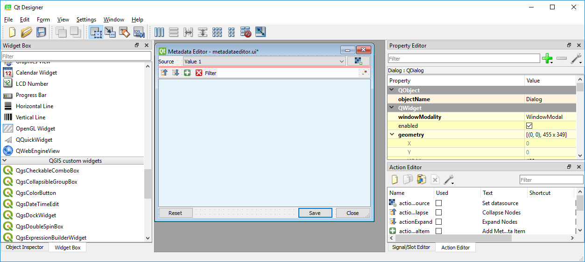

.. include:: links.rst

*Last Update: 2019-02-18*

.. _dev_installation_detailed:

Installation (Detailed)
#######################


Overview
========

If you like to develop an EnMAP-Box application, or more general, a Qt or QGIS application, we highly recommend using
a state-of-the-art Integrated Development Environment (IDE), which offers run-time debugging, code completion,
spell-checking, syntax highlighting, unit-testing and more. In the following we therefore describe how to run and debug
the EnMAP-Box from the PyCharm_ IDE. This allows us to develop and start
the EnMAP-Box and other applications *without* starting the QGIS desktop. Although we haven't tested it, these
steps should be similar for other IDEs like PyDev_.

For developing EnMAP-Box Applications in PyCharm_, the following steps should be done and will be explained in detail:

#. Install required python packages to your QGIS python that your application and the EnMAP-Box depends on.

#. Setup your Pycharm IDE to start with same environmental settings as your QGIS desktop application.

#. Create a new project ("MyProject") and ensure that it uses the same python as QGIS, as well as it required
   QGIS and EnMAP-Box code locations are linked into.


The more you get into the details of EnMAP-Box, QGIS, or more general Qt application development, you might want to
explore the respective APIs and use some more specialized tools for. For this we recommended to read the final section
of this page.


1. Install QGIS and the EnMAP-Box
=================================
First of all, follow the :ref:`user installation guide <usr_installation>` to install the EnMAP-Box and all required python packages to your QGIS python.

.. _dev_install_dependencies:

2. Install packages required for developers
===========================================

.. note::

    If not already done, it is highly recommended to install `git <https://git-scm.com>`_ and `git-lfs <https://git-lfs.github.com>`_. Git should be
    available to your operating systems shell and we appreciate to use it to save and backup your own source code.

Use pip_ and install additional packages required for developers (on Windows open the :ref:`OSGeo4W shell <install-packages-windows>` for that). Call:

.. code-block:: batch

    python3 -m pip install -r https://bitbucket.org/hu-geomatics/enmap-box/raw/develop/requirements_developer.txt

.. tip::

    The `requirements_developer.txt` installs the following python packages:

    =================== =============================================================================
    Package             Description
    =================== =============================================================================
    gitpython           Git command from python
                        https://gitpython.readthedocs.io/en/stable/index.html
    git-lfs             Git Large File Storage (git-lfs) support
                        https://github.com/liberapay/git-lfs-fetch.py
    pb_tool             Plugin Builder Tool to create a QGIS Plugin
                        http://g-sherman.github.io/plugin_build_tool/
    sphinx              Python documentation generator
                        http://www.sphinx-doc.org/en/master/
    sphinx_argparse
    sphinx-markdown
    sphinx-red-theme
    sphinx-autobuild
    recommonmark
    =================== =============================================================================


.. _dev_setup_pycharm:

3. Setup PyCharm
=================


PyCharm needs to run under the same environmental settings as the QGIS Desktop Application. In particular, it needs
to use the same Python interpreter as QGIS does.


Windows
-------


The following description is based on http://spatialgalaxy.net/2018/02/13/quick-guide-to-getting-started-with-pyqgis3-on-windows/

QGIS for Windows uses an OSGeo4W_ environment and is installed with the OSGeo4W installer.
Internally, the QGIS environment is set-up by calling a set of cascading batch ``*.bat`` files.
We recommend to use a similar approache to set-up the environment in which Pycharm starts.

#. We first need to know the root folder of our QGIS/OSGeo4W installation, hereafter referred as `OSGEO4W_ROOT`.
   Start QGIS, open the Python Console (Ctrl+Alt+P) and type::

        import sysprint(sys.executable)
        print(sys.executable)

   .. image:: img/qgis_pythonshell_findqgis.png

   `OSGEO4W_ROOT` is the path before ``\bin\qgis-bin.exe``. Typical locations are:

        ``OSGEO4W_ROOT=C:\Program Files\QGIS 3.0``

        ``OSGEO4W_ROOT=C:\Program Files\OSGeo4W``

   .. tip::

        The following general script starts the OSGeo4W_ shell with a Python 3 and Qt 5 environment:

        .. code-block:: bat

                ::STARTUP Script to start PyCharm or other application under the same environment as QGIS
                ::OSGeo4W/QGIS installation folder
                set OSGEO4W_ROOT="C:\Program Files\QGIS 3.4"

                ::set defaults, clean path, load OSGeo4W modules (incrementally)
                call %OSGEO4W_ROOT%\bin\o4w_env.bat
                call qt5_env.bat
                call py3_env.bat

        Now you can call ``python`` to start a python 3 shell. Note that without calling ```py3_env.bat`` before,
        the OSGeo4W shell would start a python 2 instead.

        Commands available in the QGIS shell can be listed with ``o-help``. Import commands are:

        =====================     ============================================================================
        Command                   Description
        =====================     ============================================================================
        ``qgis``                  start QGIS desktop
        ``setup``                 start OSGeo4W graphical installer
        ``designer``              start Qt Designer to draw graphical user interfaces
        ``qgis-designer``         start Qt Designer with QGIS widgets loaded
        ``assistant``             start Qt Assistant to browse Qt + QGIS API reference
        ``python``                start python shell. call ``py3_env.bat`` before to activate python 3
        ``pip``                   start the python package installer (similar to ``python -m pip``)
        =====================     ============================================================================


        Depending on previous setup steps, some of these commands might not be installed by default. The Qt Designer and
        Qt Assistant, for example, require to have the ``qt5-doc`` and ``qt5-devel`` :ref:`packages installed <install-packages-windows>`.


#. Create a `start_PyCharm_with_QGIS.bat` that starts PyCharm_:

    .. code-block:: bat
        :linenos:

        :: PYCHARM STARTUP SCRIPT

        :: ################ SET LOCAL PATHS #############################################

        :: OSGeo4W or QQGIS installation folder
        set OSGEO4W_ROOT="C:\Program Files\QGIS 3.4"

        :: PyCharm executable
        set IDE="C:\Program Files\JetBrains\PyCharm 2017.3.4\bin\pycharm64.exe"

        :: Git and Git-Lfs executables
        set GIT="C:\Users\<user_name>\AppData\Local\Programs\Git\bin"
        set GIT_LFS="C:\Users\<user_name>\AppData\Local\Programs\Git LFS"

        :: ##############################################################################

        :: set defaults, clean path, load OSGeo4W modules (incrementally)
        call %OSGEO4W_ROOT%\bin\o4w_env.bat
        call qt5_env.bat
        call py3_env.bat

        :: lines taken from python-qgis.bat
        set QGIS_PREFIX_PATH=%OSGEO4W_ROOT%\apps\qgis
        set PATH=%QGIS_PREFIX_PATH%\bin;%PATH%

        :: add git and git-lfs executables to PATH
        set PATH=%PATH%;%GIT%
        set PATH=%PATH%;%GIT_LFS%

        :: make PyQGIS packages available to Python
        set PYTHONPATH=%OSGEO4W_ROOT%\apps\qgis\python;%PYTHONPATH%

        :: GDAL Configuration (https://trac.osgeo.org/gdal/wiki/ConfigOptions)
        :: Set VSI cache to be used as buffer, see #6448 and
        set GDAL_FILENAME_IS_UTF8=YES
        set VSI_CACHE=TRUE
        set VSI_CACHE_SIZE=1000000
        set QT_PLUGIN_PATH=%OSGEO4W_ROOT%\apps\qgis\qtplugins;%OSGEO4W_ROOT%\apps\qt5\plugins

        start "Start PyCharm aware of QGIS" /B %IDE% %*

    .. tip::

        To start other applications, replace or append to the last line:

        .. code-block:: batch

            start "Start Qt Designer" /B designer
            start "Start Qt Assistant" /B assistant
            start "Start QGIS" /B "%OSGEO4W_ROOT%\bin\qgis-bin.exe" %*

        To keep the OSGeo4W_ shell open:

        .. code-block:: batch

            @echo on
            @if [%1]==[] (echo run o-help for a list of available commands & cmd.exe /k) else (cmd /c "%*")


#. Call `start_IDE_with_QGIS.bat` to start PyCharm


macOS
-----

Ensure that the ``QGIS_PREFIX_PATH`` variable is available on your macOS shell. If not, edit the users `.bash_profile`:

.. code-block:: bash

    PATH="/Library/Frameworks/Python.framework/Versions/3.6/bin:${PATH}"
    export PATH
    QGIS_PREFIX_PATH="/Applications/QGIS3.6.app/Contents/MacOS"
    export QGIS_PREFIX_PATH

.. note::
        Former macOS versions of QGIS where named `QGIS3.app`. Since QGIS 3.6. the subversion is part of the App name `QGIS3.6.app`.

Linux
-----


.. todo:: Linux descriptions


.. _dev_create_ide_project:

4. Create a new PyCharm Project
===============================

Open PyCharm and create a new project (`File` > `New Project`), or open an existing one.

Chose the Python Interpreter
----------------------------

PyCharm needs to know which python interpreter it has to use. There might be several pythons installed to your
operating system, but we need exactly the one used by QGIS. You can identify the right python interpreter by:

    #. open QGIS

    #. start the python console ( CTRL + Alt + P)

    #. call:

    .. code-block:: python

        import sys
        print(sys.base_exec_prefix)

    .. image:: img/qgis_pythonshell_findinterpreter.png

The output shows you the used python interpreter, e.g.:

=====================     ============================================================================
Operating System          Typical QGIS Python interpreter location(s)
=====================     ============================================================================
Windows                   ``C:\PROGRA~1\QGIS3~1.4\apps\Python37``
                          ``C:\PROGRA~1\OSGeo4W\apps\Python37``
macOS                     ``/Library/Frameworks/Python.framework/Versions/3.6``
Ubuntu                    tbd.
=====================     ============================================================================

Open the project settings (`File` > `Settings...`) and add the QGIS python executable as project interpreter:

.. image:: img/pycharm_interpreter.png


Add QGIS Code
--------------------

Now we tell PyCharm where to find QGIS python code. Open `File` > `Settings...` > `Projects Structure`.
Click `+ Add Content Root`. Navigate into your QGIS installation and select the `python` folder that contains
the `qgis` package and the `plugins` subfolder:

=====================     ============================================================================
Operating System          Typical QGIS Python location(s)
=====================     ============================================================================
Windows                   ``C:\Program Files\QGIS 3.4\apps\qgis\python``
                          ``C:\Program Files\OSGeo4W\apps\qgis\python``
macOS                     ``/Applications/QGIS3.app/Contents/Resources/python``
Ubuntu                    tbd
=====================     ============================================================================


Mark the subfolder `plugins` as additional source, so that it is marked in blue.


.. tip::

    Adding source locations or subfolders as source locations will add them
    to the python path. This is like calling ``sys.path.append(r'<source code directory>'`` during runtime, but
    allows PyCharm to this python code even before starting a python session.

    Folders can be defined as source root also from the Project View (Alt+1). Right-mouse click the folder of interest > `Mark Directory as` > `Source Root`.

    .. image:: img/pycharm_mark_directory_as_source.png


.. _dev_install_add_enmapbox_code:

Add EnMAP-Box Code
-------------------------


First of all need the know the location where QGIS has installed the EnMAP-Box to. Open the active QGIS profile folder
from the QGIS GUI via `Settings` > `User Profiles`


The opened profile folder (e.g. `default`) contains a subdirectory `python/plugins/enmapboxplugin`.


=====================     ========================================================================================================================================================
Operating System          Typical EnMAP-Box Plugin locations
=====================     ========================================================================================================================================================
Windows                   ``C:\Users\<user name>\AppData\Roaming\QGIS\QGIS3\profiles\default\python\plugins\enmapboxplugin``
                          ``C:\Users\<user name>\AppData\Roaming\QGIS\QGIS3\profiles\default\python\plugins\enmapboxplugin``
macOS                     ``<computername>/Users/<username>/Library/Application Support/QGIS/QGIS3/profiles/default/python/plugins/enmapboxplugin``
Ubuntu                    tbd.
=====================     ========================================================================================================================================================


Add the `enmapboxplugin` folder as content root to your PyCharm project `File` > `Settings...` > `Projects Structure`).
Then mark the following subfolders as additional source roots:

* ``enmapboxplugin/site-packages``

* ``enmapboxplugin/make``


Your PyCharm project structure should now look like:


.. image:: img/pycharm_project_structure.png
    :width: 75%


.. tip::

        Advanced developers might want to use the most-recent source-code directly from the EnMAP-Box repository.

            1. Use git to clone the repository::

                cd <my_repositories>
                git clone https://bitbucket.org/hu-geomatics/enmap-box.git
                cd enmap-box
                git checkout development

            2. Add ``<my_repositories>/enmapbox/`` as source location to your PyCharm project
            (instead of that in your QGIS active profile)

        Note, that when using the git repository code instead of the QGIS plugin:

        * the root folder for the EnMAP-Box is called `enmapbox` instead of `enmapboxplugin` (this might change in future).

        * the repository version needs to be :ref:`build and installed <dev_build_enmapbox_plugin>` as QGIS plugin until it appears as updated or modified QGIS plugin


.. _dev_start_enmapbox_from_ide:

5. Start the EnMAP-Box from PyCharm
===================================


If everything is set up correctly, you now can start the EnMAP-Box from PyCharm Python Console:

.. code-block:: python

        from enmapbox.testing import initQgisApplication
        qgsApp = initQgisApplication()

        from enmapbox import EnMAPBox
        enmapBox = EnMAPBox(None)
        enmapBox.openExampleData(mapWindows=1)
        qgsApp.exec_()


.. _dev_qt_development_support:

Other Sources and Tools
=======================

API References
--------------

Online API references can be found at:

* http://doc.qt.io/qt-5/ (Qt5 API)

* https://qgis.org/api/ (C++ API)

* https://qgis.org/pyqgis/master/ (autogenerated Python API)


The Qt company provides several tools to create Qt C++ applications. Although these focus primarily on
C++ developers, they are helpful also for developer which make use of the Qt and QGIS python API.

Qt Assistant
------------

The Qt Assistant allows you to browse fast and offline through Qt help files (``*.qch``). These files exists for
all Qt classes and the QGIS API. They can be generated event with Sphinx, which allows you to provide your
own source-code documentation as ``.qch`` file as well.


     Qt Assistant, showing the documentation of the QgsMapCanvas class.


The recent QGIS API help file ``qgis.qch`` can be downloaded from https://qgis.org/api/ . Open the Qt Assistant
preferences > Documentatino to add it or other qch files.


     Documentations registered to the Qt Assistant


Qt API help files, e.g. those that document the QtCore, QtGui and QtWidgets libraries
are often installed within your local Qt installation. E.g. windows users might find it under
`C:\Program Files\QGIS 3.4\apps\Qt5\doc`. Just file search for ``qtcore.qch``, ``qtgui.qch`` and ``qtwidgets.qch`` to find
the location of Qt help files.


Qt Designer
-----------

The Qt Designer is a powerful tool to create GUI frontends by drawing, drag and drop.
Created GUI form files are saved in a XML file with file ending ``*.ui``. They can be called from
python code that implement the entire backend of a GUI application.




     Qt Designer showing the metadataeditor.ui for the Metadata editor.


Qt Creator
----------

Qt Creator is the one-in-all IDE to develop Qt C++ applications. It includes the functionality covered by Qt Assistant
(here called Help) and Qt Designer (here called form designer) and helps to browse C++ code. It is the preferred tool to
explore the QGIS C++ source code, for example if you like to better understand what it does behind the QGIS python API.

Qt and the Qt Creator are available at https://www.qt.io/download. Ensure to install the code documentation for the same
Qt version used by QGIS.

.. figure:: img/qt_creator_example_ui.png
     :width: 100%

     Qt Creator with opened metadataeditor.ui.

..
        SSH access on windows
        1. create a ssh key pair
        2. upload public key to repository of choice
        3. install Putty
        4. start Pageant.ext and add your private key to
        5. add :code:`set GIT_SSH=C:\Program Files\PuTTY\plink.exe` to your startup script
        6. there is an issue with a frozen command line when a server is connected the first time with ssh
           (see https://stackoverflow.com/questions/33240137/git-clone-pull-continually-freezing-at-store-key-in-cache)
           to solve it, start putty and connect try to the server once per SSH (e.g. to bitbucket.org). puty will save its fingerprint
        7. now you can call git push using ssh authentification in background

