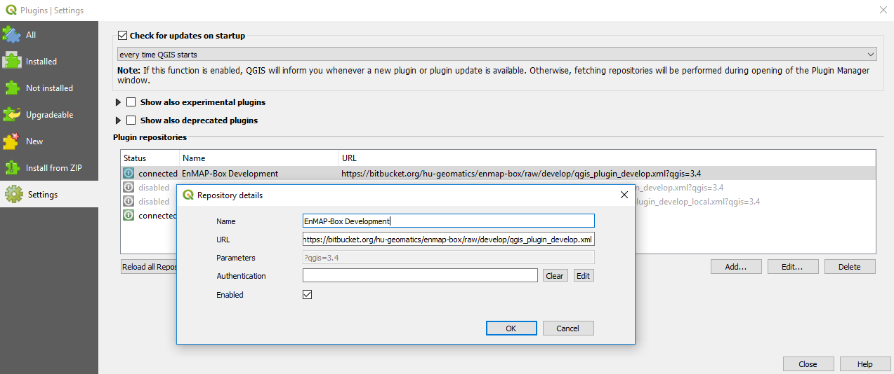
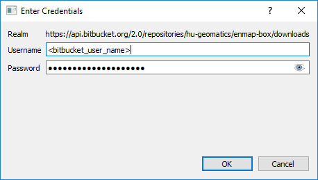

.. _dev_build_enmapbox_plugin:

Build and publish the EnMAP-Box
###############################

Prerequisites
=============

Compile Resource Files
-----------------------
If Qt resource files have changed, e.g. because you changed icons or added new ones, they can be (re)compiled into
corresponding python modules (``*.py``):

.. code-block:: python

    import guimake
    guimake.compileResourceFiles()

Compiling single resource files can be done by:

.. code-block:: python

    import guimake
    path = r'<my_resourcefile>.qrc'
    guimake.compileResourceFile(path)

Compiling resources files in the QGIS respository and writing them into the ``qgisresources/`` folder (see :ref:`dev_enmapox_repo_structure`) can be done with:

.. code-block:: python

    import guimake
    guimake.compileQGISResourceFiles()

.. note::

    Why to compile the QGIS resource files? Because this allows you to use them inside PyCharm.

Update external developments
----------------------------

The EnMAP-Box repository source code includes source code that is maintained in other `external` repositories.
These locations and how its code is copied into the EnMAP-Box repository is described in ``make/updateexternals.py``.

To update code developed in an external location, e.g. call:

.. code-block:: python

    import updateexternals
    updateexternals.updateRemotes('qps')
    updateexternals.updateRemotes('hub-datacube')
    updateexternals.updateRemotes('hub-workflow')
    updateexternals.updateRemotes('enmapboxapplications')
    updateexternals.updateRemotes('enmapboxgeoalgorithms')

.. note:: add/modify remote sources with ``RemoteInfo.create`` to specify other external git repository sources
          to be part of EnMAP-Box Source code

Build the EnMAP-Box Plugin
==========================

Building the EnMAP-Box plugin is done by creating a zip file the QGIS Plugin Manager uses to install the EnMAP-Box
from. This requires:

1. to have development specific python packages installed (see :ref:`dev_install_dependencies`)

1. to use the EnMAP-Box code from the `EnMAP-Box repository` instead of that from your local QGIS
active profile folder (see :ref:`dev_install_add_enmapbox_code`).

Calling:

.. code-block:: batch

    import deploy  #from enmap-box/make/deploy.py
    deploy.build()

will create or update:

* ``deploy/enmapboxplugin/`` which contains the plugin code + additional files
* ``deploy/enmapboxplugin.3.3.20190214T1125.develop.zip`` - just ``deploy/enmapboxplugin`` as zip file
* ``deploy/qgis_plugin_develop_local.xml`` QGIS Plugin Repository XML to be used for lcoal testing
* a ``deploy/qgis_plugin_develop.xml`` QGIS Plugin Repository XML to be published on https://bitbucket.org/hu-geomatics/enmap-box

.. note::

    The ``<subsubversion>`` consists of ``<date>T<time>.<active branch>`` and is generated automatically.

    This helps to generate, test and differentiate between EnMAP-Box versions of different development steps.

To test if and how the compiled EnMAP-Box plugin runs within the QGIS Desktop application:

1. Start QGIS,
2. Open the QGIS Plugin Manager
3. Install from ZIP with the created ZIP file
4. Restart QGIS to account for activate changes in python code

Alternatively, open the QGIS Python shell and run the code that was printed during the build process. It installs the
EnMAP-Box Plugin and restarts QGIS. The restart is required to account for code changes in modules that have already been loaded
to the QGIS python::

    ### To update/install the EnMAP-Box, run this command on your QGIS Python shell:
    from pyplugin_installer.installer import pluginInstaller
    pluginInstaller.installFromZipFile(r"C:\Users\<user_name>\<my_repositories>\enmap-box\deploy\enmapboxplugin.3.3.20190214T1125.develop.zip")
    #### Close (and restart manually)
    QProcess.startDetached(QgsApplication.arguments()[0], [])
    QgsApplication.quit()
    ## press ENTER

Publish the EnMAP-Box
=====================

EnMAP-Box development snapshots like the ``enmapboxplugin.3.3.20190214T1125.develop.zip`` are published to
https://bitbucket.org/hu-geomatics/enmap-box/downloads/ , from where users can download and installed them using the QGIS Plugin Manager.

To simplify the installation process, the QGIS plugin repository XML under https://bitbucket.org/hu-geomatics/enmap-box/raw/develop/qgis_plugin_develop.xml
can be added to the list of QGIS Plugin repositories (see :ref:`usr_installation_enmapbox`)

This way QGIS will inform users about new versions, which can be install with one mouse-click.

Uploading ``enmapbox3.*.zip`` to the download page and pushing ``deploy/qgis_plugin_develop.xml`` to the Bitbucket server
can be done by:

.. code-block:: python

    import deploy
    deploy.uploadDeveloperPlugin()

Of course this requires user credentials with writing access to the bitbucket server:

    Dialog to ask for Bitbucket server access.

