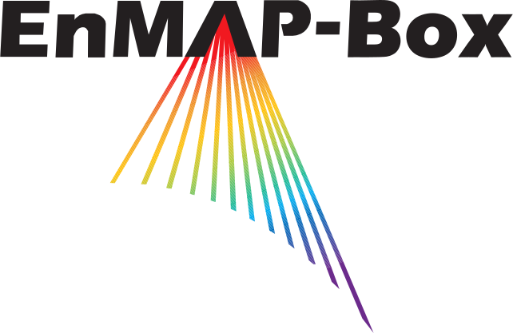

=====
About
=====

The EnMAP-Box is a free and open source plug-in for `QGIS <https://www.qgis.org/en/site/#>`_.
It is designed to process imaging spectroscopy data and
particularly developed to handle data from the upcoming `EnMAP <http://www.enmap.org/>`_ sensor. The two main goals of
the development are to provide
**(i)** state-of-the-art applications for the processing of high dimensional spectral and temporal remote sensing data and
**(ii)** a graphical user interface (GUI) that enhances the GIS oriented visualization capabilities in QGIS by applications
for visualization and exploration of multi-band remote sensing data and spectral libraries.
Therefore, the algorithms provided in the EnMAP-Box will be of high value for many other, especially multi- and hyperspectral EO missions.

The EnMAP-Box plug-in bridges and combines efficiently all advantages of QGIS (e.g. for visualization, vector data processing),
packages like GDAL (for data IO or working with virtual raster files) and abundant
libraries for Python (e.g. scikit-learn for EO data classification and PyQtGraph for fast and interactive chart drawing).
The plug-in consists of a **(i)** graphical user interface for hyperspectral data visualization and e.g. spectral library management,
**(ii)** a set of algorithms, and **(iii)** a high-level application programming interface (:ref:`EnMAP API <API - Quick Start>`).

|
|

