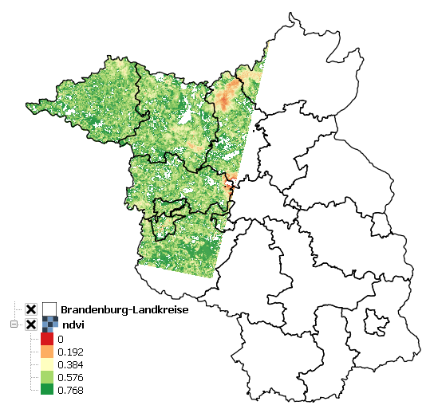

==========================================
Welcome to the HUB-Datacube documentation!
==========================================

The HUB-Datacube (HUBDC) offers a high level interface for integrating heterogeneous raster and vector datasets
into a user-defined reference pixel grid, resulting in an analysis-ready datacube.

Please provide feedback to `Andreas Rabe`_ (andreas.rabe\@geo.hu-berlin.de),
or open an issue on `Bitbucket`_.

.. _Andreas Rabe: https://www.geographie.hu-berlin.de/de/Members/rabe_andreas
.. _Bitbucket: https://bitbucket.org/hu-geomatics/hub-datacube/issues/new

Setting up
==========

Install the latest release with pip::

    python -m pip install https://bitbucket.org/hu-geomatics/hub-datacube/get/master.tar.gz

Or manually `download a release <https://bitbucket.org/hu-geomatics/hub-datacube/downloads/?tab=tags>`_
from Bitbucket.

Example
=======

.. literalinclude:: examples/example.py

See :doc:`ApplierExamples` for more information.

.. toctree::
   :maxdepth: 1
   :caption: User Guides:
   :glob:

   ApplierExamples.rst

.. toctree::
   :maxdepth: 2
   :caption: API Reference:
   :glob:

   hubdc_applier.rst
   hubdc_core.rst
   hubdc_testdata.rst
   indices.rst

.. codeauthor:: Andreas Rabe <andreas.rabe@geo.hu-berlin.de>

.. sectionauthor:: Andreas Rabe <andreas.rabe@geo.hu-berlin.de>
