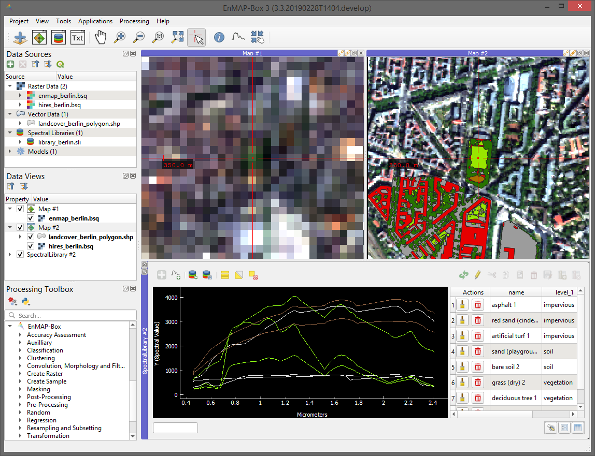

..  EnMAP-Box 3 documentation master file, created by
    sphinx-quickstart on Fri Jan 19 05:59:30 2018.
    You can adapt this file completely to your liking, but it should at least
    contain the root `toctree` directive.

#########################
EnMAP-Box 3 Documentation
#########################

**Welcome to the EnMAP-Box 3 Documentation!**

The EnMAP-Box is a python plugin for `QGIS <https://www.qgis.org/en/site/#>`_, designed to process and visualise
hyperspectral remote sensing data. This documentation will provide you with general information about
the software and the corresponding satellite mission, a user guide for ordinary users as well as developers and
step-by-step tutorials which exemplify the software's capabilities.

**Related websites**

- Environmental Mapping and Analysis Program (EnMAP): `www.enmap.org <http://www.enmap.org/>`_
- Bitbucket source code repository: `www.bitbucket.org/hu-geomatics/enmap-box <https://bitbucket.org/hu-geomatics/enmap-box>`_
- Humboldt-University zu Berlin, Geomatics lab: `www.hu-geomatics.de <https://www.geographie.hu-berlin.de/en/professorships/geomatics>`_

**Image credits:**

- Logo background (left to right): ESA adapted - Amsterdam, ESA adapted - Uruguay River Wetlands, EUSI/ESA adapted - Algerian Sands, ESA adapted - Kenya,

|
|

**This documentation is structured as follows:**

.. toctree::
   :caption: EO Symposium Cologne

   eo_symposium.rst

.. toctree::
    :maxdepth: 2
    :caption: General

    general/about.rst
    general/faq_trouble.rst
    general/contact.rst

..  toctree::
    :maxdepth: 2
    :caption: User Section

    usr_section/usr_installation.rst
    usr_section/usr_gettingstarted.rst
    usr_section/usr_cookbook/usr_cookbook.rst
    usr_section/usr_manual/usr_manual.rst
    usr_section/application_tutorials/index.rst

..  toctree::
    :maxdepth: 2
    :caption: Developer Section

    dev_section/dev_installation.rst
    dev_section/dev_enmapboxrepository
    dev_section/dev_publish_enmapbox.rst
    dev_section/dev_cookbook/dev_cookbook.rst
    dev_section/dev_guide.rst
    dev_section/api/modules.rst
    dev_section/programming_tutorials/index.rst

Indices and tables
------------------

* :ref:`genindex`
* :ref:`modindex`
* :ref:`search`

