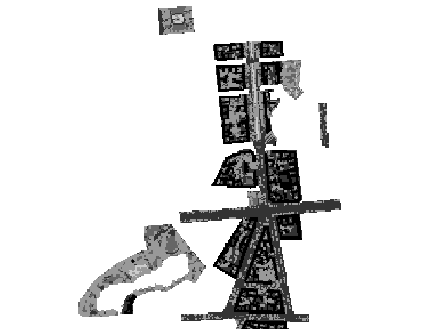
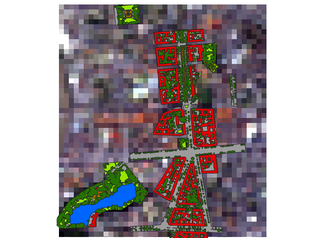

=====================
HUB Datacube Cookbook
=====================

General
=======

Is HUB Datacube installed
-------------------------

Imports HUB Datacube and exits the program if the modules are not found.

.. literalinclude:: ../examples/general/import_hubdc.py

Is the testdata installed
-------------------------

In this guide we use the EnMAP-Box testdata (https://bitbucket.org/hu-geomatics/enmap-box-testdata).

.. literalinclude:: ../examples/general/import_testdata.py

Is QGIS installed (optional)
----------------------------

We use QGIS 3 map canvas for quick looks (https://qgis.org).

.. literalinclude:: ../examples/general/import_qgis.py

Check versions installed
------------------------

.. literalinclude:: ../examples/general/version.py
   :start-after: START
   :end-before: END

.. literalinclude:: ../examples/general/version.txt

Raster dataset
==============

Find API reference here: :class:`hubdc.core.RasterDataset`

Open a raster dataset from file
-------------------------------

.. literalinclude:: ../examples/rasterdataset/open_from_file.py
   :start-after: START
   :end-before: END

Prints something like:

.. literalinclude:: ../examples/rasterdataset/open_from_file.txt

Open a raster dataset from GDAL dataset
---------------------------------------

.. literalinclude:: ../examples/rasterdataset/open_from_gdal.py
   :start-after: START
   :end-before: END

Prints something like:

.. literalinclude:: ../examples/rasterdataset/open_from_gdal.txt

Close a raster dataset
----------------------

Closing a raster dataset is useful in the middle of a script, to recover the resources held by accessing the dataset,
remove file locks, etc. It is not necessary at the end of the script,
as the Python garbage collector will do the same thing automatically when the script exits.

.. literalinclude:: ../examples/rasterdataset/close_raster.py
   :start-after: START
   :end-before: END

Prints:

.. literalinclude:: ../examples/rasterdataset/close_raster.txt

Get raster metadata
-------------------

.. literalinclude:: ../examples/rasterdataset/get_raster_metadata.py

Prints::

    All domains:
    {'IMAGE_STRUCTURE':
        {
        'INTERLEAVE': 'BAND'
        },
     'ENVI':
        {
        'bands': '177',
        'band names': ['band 8', 'band 9', 'band 10', 'band 11', 'band 12', 'band 13', 'band 14', 'band 15', 'band 16', 'band 17', 'band 18', 'band 19', 'band 20', 'band 21', 'band 22', 'band 23', 'band 24', 'band 25', 'band 26', 'band 27', 'band 28', 'band 29', 'band 30', 'band 31', 'band 32', 'band 33', 'band 34', 'band 35', 'band 36', 'band 37', 'band 38', 'band 39', 'band 40', 'band 41', 'band 42', 'band 43', 'band 44', 'band 45', 'band 46', 'band 47', 'band 48', 'band 49', 'band 50', 'band 51', 'band 52', 'band 53', 'band 54', 'band 55', 'band 56', 'band 57', 'band 58', 'band 59', 'band 60', 'band 61', 'band 62', 'band 63', 'band 64', 'band 65', 'band 66', 'band 67', 'band 68', 'band 69', 'band 70', 'band 71', 'band 72', 'band 73', 'band 74', 'band 75', 'band 76', 'band 77', 'band 91', 'band 92', 'band 93', 'band 94', 'band 95', 'band 96', 'band 97', 'band 98', 'band 99', 'band 100', 'band 101', 'band 102', 'band 103', 'band 104', 'band 105', 'band 106', 'band 107', 'band 108', 'band 109', 'band 110', 'band 111', 'band 112', 'band 113', 'band 114', 'band 115', 'band 116', 'band 117', 'band 118', 'band 119', 'band 120', 'band 121', 'band 122', 'band 123', 'band 124', 'band 125', 'band 126', 'band 127', 'band 144', 'band 145', 'band 146', 'band 147', 'band 148', 'band 149', 'band 150', 'band 151', 'band 152', 'band 153', 'band 154', 'band 155', 'band 156', 'band 157', 'band 158', 'band 159', 'band 160', 'band 161', 'band 162', 'band 163', 'band 164', 'band 165', 'band 166', 'band 167', 'band 168', 'band 195', 'band 196', 'band 197', 'band 198', 'band 199', 'band 200', 'band 201', 'band 202', 'band 203', 'band 204', 'band 205', 'band 206', 'band 207', 'band 208', 'band 209', 'band 210', 'band 211', 'band 212', 'band 213', 'band 214', 'band 215', 'band 216', 'band 217', 'band 218', 'band 219', 'band 220', 'band 221', 'band 222', 'band 223', 'band 224', 'band 225', 'band 226', 'band 227', 'band 228', 'band 229', 'band 230', 'band 231', 'band 232', 'band 233', 'band 234', 'band 235', 'band 236', 'band 237', 'band 238', 'band 239'],
        'byte order': '0',
        'coordinate system string': ['PROJCS["UTM_Zone_33N"', 'GEOGCS["GCS_WGS_1984"', 'DATUM["D_WGS_1984"', 'SPHEROID["WGS_1984"', '6378137.0', '298.257223563]]', 'PRIMEM["Greenwich"', '0.0]', 'UNIT["Degree"', '0.0174532925199433]]', 'PROJECTION["Transverse_Mercator"]', 'PARAMETER["False_Easting"', '500000.0]', 'PARAMETER["False_Northing"', '0.0]', 'PARAMETER["Central_Meridian"', '15.0]', 'PARAMETER["Scale_Factor"', '0.9996]', 'PARAMETER["Latitude_Of_Origin"', '0.0]', 'UNIT["Meter"', '1.0]]'],
        'data ignore value': '-99',
        'data type': '2',
        'description': ['EnMAP02_Berlin_Urban_Gradient_2009.bsq', 'http://doi.org/10.5880/enmap.2016.008', 'spectral and spatial subset'],
        'file compression': '1',
        'file type': 'ENVI Standard',
        'fwhm': ['0.005800', '0.005800', '0.005800', '0.005800', '0.005800', '0.005800', '0.005800', '0.005800', '0.005800', '0.005800', '0.005900', '0.005900', '0.006000', '0.006000', '0.006100', '0.006100', '0.006200', '0.006200', '0.006300', '0.006400', '0.006400', '0.006500', '0.006600', '0.006600', '0.006700', '0.006800', '0.006900', '0.006900', '0.007000', '0.007100', '0.007200', '0.007300', '0.007300', '0.007400', '0.007500', '0.007600', '0.007700', '0.007800', '0.007900', '0.007900', '0.008000', '0.008100', '0.008200', '0.008300', '0.008400', '0.008400', '0.008500', '0.008600', '0.008700', '0.008700', '0.008800', '0.008900', '0.008900', '0.009000', '0.009100', '0.009100', '0.009200', '0.009300', '0.009300', '0.009400', '0.009400', '0.009500', '0.009500', '0.009600', '0.009600', '0.009600', '0.009600', '0.009700', '0.009700', '0.009700', '0.011800', '0.011900', '0.012100', '0.012200', '0.012400', '0.012500', '0.012700', '0.012800', '0.012900', '0.013100', '0.013200', '0.013300', '0.013400', '0.013500', '0.013600', '0.013700', '0.013800', '0.013900', '0.014000', '0.014000', '0.014100', '0.014100', '0.014200', '0.014200', '0.014300', '0.014300', '0.014300', '0.014400', '0.014400', '0.014400', '0.014400', '0.014400', '0.014400', '0.014400', '0.014400', '0.014400', '0.014400', '0.013700', '0.013600', '0.013600', '0.013500', '0.013500', '0.013400', '0.013400', '0.013300', '0.013200', '0.013200', '0.013100', '0.013100', '0.013000', '0.012900', '0.012900', '0.012800', '0.012800', '0.012700', '0.012700', '0.012600', '0.012500', '0.012500', '0.012400', '0.012400', '0.012300', '0.010900', '0.010800', '0.010800', '0.010700', '0.010700', '0.010600', '0.010600', '0.010500', '0.010500', '0.010400', '0.010400', '0.010400', '0.010300', '0.010300', '0.010200', '0.010200', '0.010100', '0.010100', '0.010100', '0.010000', '0.010000', '0.009900', '0.009900', '0.009900', '0.009800', '0.009800', '0.009700', '0.009700', '0.009700', '0.009600', '0.009600', '0.009600', '0.009500', '0.009500', '0.009400', '0.009400', '0.009400', '0.009300', '0.009300', '0.009300', '0.009200', '0.009200', '0.009100', '0.009100', '0.009100'],
        'header offset': '0',
        'interleave': 'bsq',
        'lines': '400',
        'samples': '220',
        'sensor type': 'Unknown',
        'wavelength': ['0.460000', '0.465000', '0.470000', '0.475000', '0.479000', '0.484000', '0.489000', '0.494000', '0.499000', '0.503000', '0.508000', '0.513000', '0.518000', '0.523000', '0.528000', '0.533000', '0.538000', '0.543000', '0.549000', '0.554000', '0.559000', '0.565000', '0.570000', '0.575000', '0.581000', '0.587000', '0.592000', '0.598000', '0.604000', '0.610000', '0.616000', '0.622000', '0.628000', '0.634000', '0.640000', '0.646000', '0.653000', '0.659000', '0.665000', '0.672000', '0.679000', '0.685000', '0.692000', '0.699000', '0.706000', '0.713000', '0.720000', '0.727000', '0.734000', '0.741000', '0.749000', '0.756000', '0.763000', '0.771000', '0.778000', '0.786000', '0.793000', '0.801000', '0.809000', '0.817000', '0.824000', '0.832000', '0.840000', '0.848000', '0.856000', '0.864000', '0.872000', '0.880000', '0.888000', '0.896000', '0.915000', '0.924000', '0.934000', '0.944000', '0.955000', '0.965000', '0.975000', '0.986000', '0.997000', '1.007000', '1.018000', '1.029000', '1.040000', '1.051000', '1.063000', '1.074000', '1.086000', '1.097000', '1.109000', '1.120000', '1.132000', '1.144000', '1.155000', '1.167000', '1.179000', '1.191000', '1.203000', '1.215000', '1.227000', '1.239000', '1.251000', '1.263000', '1.275000', '1.287000', '1.299000', '1.311000', '1.323000', '1.522000', '1.534000', '1.545000', '1.557000', '1.568000', '1.579000', '1.590000', '1.601000', '1.612000', '1.624000', '1.634000', '1.645000', '1.656000', '1.667000', '1.678000', '1.689000', '1.699000', '1.710000', '1.721000', '1.731000', '1.742000', '1.752000', '1.763000', '1.773000', '1.783000', '2.044000', '2.053000', '2.062000', '2.071000', '2.080000', '2.089000', '2.098000', '2.107000', '2.115000', '2.124000', '2.133000', '2.141000', '2.150000', '2.159000', '2.167000', '2.176000', '2.184000', '2.193000', '2.201000', '2.210000', '2.218000', '2.226000', '2.234000', '2.243000', '2.251000', '2.259000', '2.267000', '2.275000', '2.283000', '2.292000', '2.300000', '2.308000', '2.315000', '2.323000', '2.331000', '2.339000', '2.347000', '2.355000', '2.363000', '2.370000', '2.378000', '2.386000', '2.393000', '2.401000', '2.409000'],
        'wavelength units': 'Micrometers',
        'y start': '24',
        'z plot titles': ['wavelength [!7l!3m]!N', 'reflectance [*10000]']
        }
    }

    ENVI domain:
    {
    'bands': '177',
    ...
    'z plot titles': ['wavelength [!7l!3m]!N', 'reflectance [*10000]']
    }

    ENVI wavelength:
    [0.46, 0.465, 0.47, 0.475, 0.479, 0.484, 0.489, 0.494, 0.499, 0.503, 0.508, 0.513, 0.518, 0.523, 0.528, 0.533, 0.538, 0.543, 0.549, 0.554, 0.559, 0.565, 0.57, 0.575, 0.581, 0.587, 0.592, 0.598, 0.604, 0.61, 0.616, 0.622, 0.628, 0.634, 0.64, 0.646, 0.653, 0.659, 0.665, 0.672, 0.679, 0.685, 0.692, 0.699, 0.706, 0.713, 0.72, 0.727, 0.734, 0.741, 0.749, 0.756, 0.763, 0.771, 0.778, 0.786, 0.793, 0.801, 0.809, 0.817, 0.824, 0.832, 0.84, 0.848, 0.856, 0.864, 0.872, 0.88, 0.888, 0.896, 0.915, 0.924, 0.934, 0.944, 0.955, 0.965, 0.975, 0.986, 0.997, 1.007, 1.018, 1.029, 1.04, 1.051, 1.063, 1.074, 1.086, 1.097, 1.109, 1.12, 1.132, 1.144, 1.155, 1.167, 1.179, 1.191, 1.203, 1.215, 1.227, 1.239, 1.251, 1.263, 1.275, 1.287, 1.299, 1.311, 1.323, 1.522, 1.534, 1.545, 1.557, 1.568, 1.579, 1.59, 1.601, 1.612, 1.624, 1.634, 1.645, 1.656, 1.667, 1.678, 1.689, 1.699, 1.71, 1.721, 1.731, 1.742, 1.752, 1.763, 1.773, 1.783, 2.044, 2.053, 2.062, 2.071, 2.08, 2.089, 2.098, 2.107, 2.115, 2.124, 2.133, 2.141, 2.15, 2.159, 2.167, 2.176, 2.184, 2.193, 2.201, 2.21, 2.218, 2.226, 2.234, 2.243, 2.251, 2.259, 2.267, 2.275, 2.283, 2.292, 2.3, 2.308, 2.315, 2.323, 2.331, 2.339, 2.347, 2.355, 2.363, 2.37, 2.378, 2.386, 2.393, 2.401, 2.409]

Set raster metadata
-------------------

.. literalinclude:: ../examples/rasterdataset/set_raster_metadata.py
   :start-after: START
   :end-before: END

Prints:

.. literalinclude:: ../examples/rasterdataset/set_raster_metadata.txt

Get raster band
---------------

.. literalinclude:: ../examples/rasterdataset/get_raster_band.py
   :start-after: START
   :end-before: END

Prints:

.. literalinclude:: ../examples/rasterdataset/get_raster_band.txt

Read raster data
----------------

.. literalinclude:: ../examples/rasterdataset/read_raster_data.py
   :start-after: START
   :end-before: END

Prints:

.. literalinclude:: ../examples/rasterdataset/read_raster_data.txt

Write raster data
-----------------

.. warning::

    todo

Loop through all raster bands
-----------------------------

.. literalinclude:: ../examples/rasterdataset/loop_raster_bands.py
   :start-after: START
   :end-before: END

Prints:

.. literalinclude:: ../examples/rasterdataset/loop_raster_bands.txt

Convert a vector to a raster
----------------------------

.. literalinclude:: ../examples/rasterdataset/vector_to_raster.py
   :start-after: START
   :end-before: END

Clip a raster with a vector
---------------------------

Clip a raster with the extent from a vector.

.. literalinclude:: ../examples/rasterdataset/clip_raster_with_vector.py
   :start-after: START
   :end-before: END

Note that the result raster grid is snapped to the original raster grid to prevent subpixel shifts.
Because of this, some vector geometries may slightly lap over the grid borders.

Calculate zonal statistics
--------------------------

Calculates statistics on values (i.e. mean value) of a raster band within the zones given by a vector attribute.

In this example we use the **level_3_id** attribute as zones.

.. literalinclude:: ../examples/rasterdataset/zonal_statistics.py
   :start-after: START
   :end-before: END

Prints:

.. literalinclude:: ../examples/rasterdataset/zonal_statistics.txt

Create raster from array
------------------------

.. literalinclude:: ../examples/rasterdataset/raster_from_array.py
   :start-after: START
   :end-before: END

Create memory raster
--------------------

Copy a raster into memory.

.. literalinclude:: ../examples/rasterdataset/create_memory_raster.py

Replace no data value of raster with new value
----------------------------------------------

.. literalinclude:: ../examples/rasterdataset/replace_raster_ndv.py

Raster band dataset
===================

Get raster band information
---------------------------

.. literalinclude:: ../examples/rasterdataset/raster_band_information.py
   :start-after: START
   :end-before: END

Prints:

.. literalinclude:: ../examples/rasterdataset/raster_band_information.txt

Set raster band category names and colors
-----------------------------------------

.. literalinclude:: ../examples/rasterband/set_raster_band_categories.py
   :start-after: START
   :end-before: END

Prints:

.. literalinclude:: ../examples/rasterband/set_raster_band_categories.txt

.. raw:: html
   :file: ../examples/rasterband/set_raster_band_categories.html

VectorData
==========

Find API reference here: :class:`hubdc.core.VectorDataset`

.. warning::

    todo

Grid
====

Create grid
-----------

.. literalinclude:: ../examples/grid/create_grid.py
   :start-after: START
   :end-before: END

Prints:

.. literalinclude:: ../examples/grid/create_grid.txt

Get grid information
--------------------

.. literalinclude:: ../examples/grid/get_grid_information.py
   :start-after: START
   :end-before: END

Prints:

.. literalinclude:: ../examples/grid/get_grid_information.txt

Subset grid by pixel offset and size
------------------------------------

.. literalinclude:: ../examples/grid/subset_grid.py
   :start-after: START
   :end-before: END

Prints:

.. literalinclude:: ../examples/grid/subset_grid.txt

Create systematic subgrids (tiling scheme)
------------------------------------------

.. literalinclude:: ../examples/grid/tiling_scheme.py
   :start-after: START
   :end-before: END

Prints:

.. literalinclude:: ../examples/grid/tiling_scheme.txt

Anchor a grid to a point
------------------------

.. literalinclude:: ../examples/grid/anchor_grid.py
   :start-after: START
   :end-before: END

Prints:

.. literalinclude:: ../examples/grid/anchor_grid.txt

Get grid coordinates
--------------------

.. literalinclude:: ../examples/grid/get_grid_coord.py
   :start-after: START
   :end-before: END

Prints:

.. literalinclude:: ../examples/grid/get_grid_coord.txt

Extent
======

Create extent
-------------

.. literalinclude:: ../examples/extent/create_extent.py
   :start-after: START
   :end-before: END

Prints:

.. literalinclude:: ../examples/extent/create_extent.txt

Get extent information
----------------------

.. warning::

    todo

Geometric calculation
---------------------

.. warning::

    todo

RasterDriver
============

Create raster driver
--------------------

.. literalinclude:: ../examples/rasterdriver/create_rasterdriver.py
   :start-after: START
   :end-before: END

Prints:

.. literalinclude:: ../examples/rasterdriver/create_rasterdriver.txt

Specify GeoTiff creation options
--------------------------------

.. literalinclude:: ../examples/rasterdriver/specify_gtiff_options.py
   :start-after: START
   :end-before: END

Prints:

.. literalinclude:: ../examples/rasterdriver/specify_gtiff_options.txt

Projection
==========

Create projection
-----------------

.. literalinclude:: ../examples/projection/create_projection.py
   :start-after: START
   :end-before: END

Prints:

.. literalinclude:: ../examples/projection/create_projection.txt

Reproject point, geometry or extent
-----------------------------------

.. literalinclude:: ../examples/projection/reproject_geometry.py
   :start-after: START
   :end-before: END

Prints:

.. literalinclude:: ../examples/projection/reproject_geometry.py

Get projection
--------------

.. literalinclude:: ../examples/projection/get_projection.py

Reproject a vector dataset
--------------------------

.. literalinclude:: ../examples/projection/reproject_vector.py

Reproject a raster dataset
--------------------------

.. literalinclude:: ../examples/projection/reproject_raster.py

Export projection
-----------------

.. literalinclude:: ../examples/projection/export_projection.py
   :start-after: START
   :end-before: END

Prints:

.. literalinclude:: ../examples/projection/export_projection.txt

MapViewer
=========

The map viewer is an interactive application for exploring maps.

View single map layer
---------------------

Shortcuts for initialising a map viewer directly from a raster or vector dataset.

Multi band raster
~~~~~~~~~~~~~~~~~

.. literalinclude:: ../examples/mapviewer/view_single_map.py
   :start-after: START1
   :end-before: END1

    Layer with MultiBandColorRenderer

Single band raster
~~~~~~~~~~~~~~~~~~

.. literalinclude:: ../examples/mapviewer/view_single_map.py
   :start-after: START2
   :end-before: END2

    Layer with SingleBandGrayRenderer

Vector
~~~~~~

.. literalinclude:: ../examples/mapviewer/view_single_map.py
   :start-after: START3
   :end-before: END3

    Layer with ...

Paletted raster
~~~~~~~~~~~~~~~

.. literalinclude:: ../examples/mapviewer/view_single_map.py
   :start-after: START4
   :end-before: END4

.. figure:: ../examples/mapviewer/view_single_map4.png

    Layer with PalettedRasterRenderer

Add multiple map layer
----------------------

.. literalinclude:: ../examples/mapviewer/view_multi_map.py
   :start-after: START
   :end-before: END

    MapViewer with multiple map layer

Set viewer extent and projection
--------------------------------

.. literalinclude:: ../examples/mapviewer/set_extent.py
   :start-after: START1
   :end-before: END1

.. literalinclude:: ../examples/mapviewer/set_extent.py
   :start-after: START2
   :end-before: END2

Rendering configuration
-----------------------

MultiBandColorRenderer
~~~~~~~~~~~~~~~~~~~~~~

.. literalinclude:: ../examples/mapviewer/rendering_MultiBandColorRenderer.py
   :start-after: START
   :end-before: END

SingleBandGrayRenderer
~~~~~~~~~~~~~~~~~~~~~~

.. literalinclude:: ../examples/mapviewer/rendering_QgsSingleBandGrayRenderer.py
   :start-after: START
   :end-before: END

PalettedRasterRenderer
~~~~~~~~~~~~~~~~~~~~~~

.. warning::

   todo

SingleSymbolRenderer
~~~~~~~~~~~~~~~~~~~~

.. warning::

   todo

CategorizedSymbolRenderer
~~~~~~~~~~~~~~~~~~~~~~~~~

.. warning::

   todo

Save map viewer content to PNG file
-----------------------------------

.. literalinclude:: ../examples/mapviewer/save_view.py

