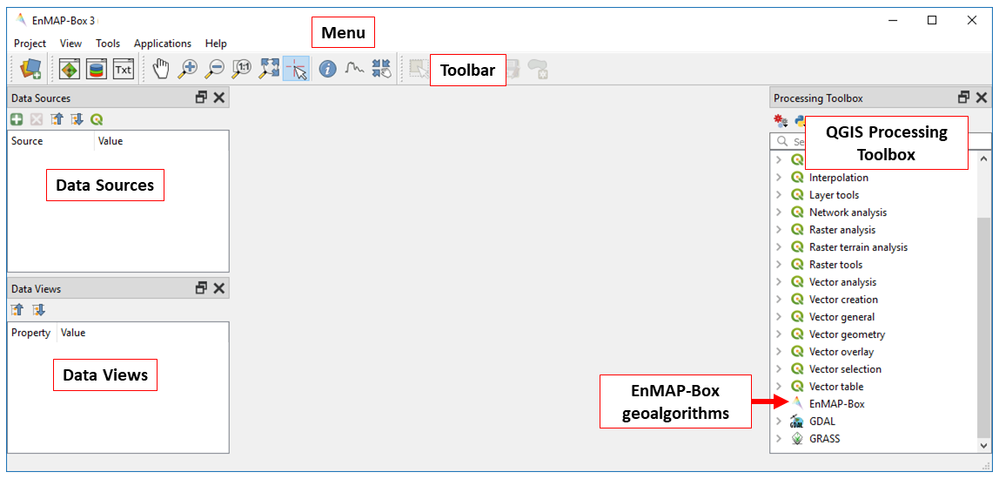
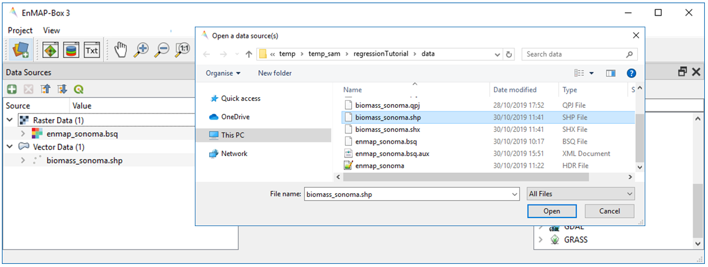
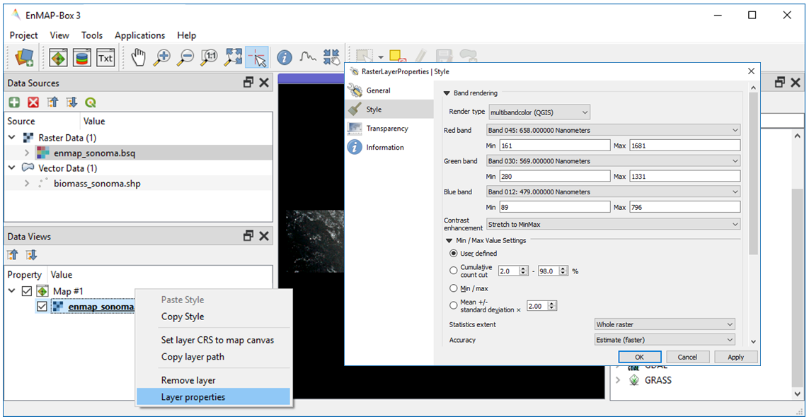

.. include:: /icon_links.rst

Regression-based mapping of forest aboveground biomass
######################################################

**Authors:** Sam Cooper, Akpona Okujeni & Sebastian van der Linden

**Contributions from:** Fabian Thiel, Patrick Hostert, Clemens Jaenicke, Benjamin Jakimow, Andreas Rabe

**Date: 05/11/2019**

Introduction
************

1. Background
=============

Forest aboveground biomass (AGB) is a measure of the living and dead plant material in a given area. As such, it is
often used for forest management, assessing fire potential, and is an important metric used in modelling carbon and
nutrient cycles. AGB can be directly measured at a plot level by harvesting and weighing vegetation, but this is both
an expensive and highly invasive process. Through the use of statistical modelling and remotely sensed imagery, AGB can
be mapped across broad, spatially continuous areas using only a small number of directly measured biomass plots.

This practical focuses on regression-based modeling of forest biomass using the EnMAP-Box. A hyperspectral image mosaic
from the EnMAP sensor (here simulated from AVIRIS imagery) and a corresponding vector dataset containing aboveground
biomass estimates are used for this tutorial. The aim is to provide an introduction into the functionality of the
EnMAP-Box, as well as hands-on training for implementing regression-based mapping.

2. Requirements
===============

This practical requires at least version 3.5.20191101T1710.master of the EnMAP-Box 3. There might be some minor
changes for higher versions (e.g., changed menu labels, added parameter options, etc.).

3. Further reading
==================

We recommend [1]_ and [2]_ for a comprehensive overview of imaging spectroscopy of terrestrial ecosystems, and [3]_ for
an overview of remote sensing of forest aboveground biomass.

.. [1] Foerster, S., Guanter, L., Lopez, T., Moreno, J., Rast, M., Schaepman, M.E. (2019) Exploring the Earth System with Imaging Spectroscopy. Springer International Publishing
.. [2] Thenkabail, P. S., & Lyon, J. G. (2016). Hyperspectral remote sensing of vegetation. CRC press.
.. [3] Lu, D., Chen, Q., Wang, G., Liu, L., Li, G., & Moran, E. (2016). A survey of remote sensing-based aboveground biomass estimation methods in forest ecosystems. International Journal of Digital Earth, 9(1), 63-105.

4. Data
=======

You can download the data for this exercise here:
https://box.hu-berlin.de/f/c3ead66ee0444ec895ff/?dl=1
The practical dataset contains a hyperspectral image mosaic in Sonoma County, California, USA, as well as a shapefile
containing point based biomass estimates sampled from an existing LiDAR derived biomass map [4]_.

.. csv-table::
   :header-rows: 1
   :delim: ;
   :widths: auto

   Data type; Filename; Description
   Raster; :file:`enmap_sonoma.bsq`; Simulated spaceborne hyperspectral data from the EnMAP sensor with a spatial resolution of 30m, 195 bands, and 1000x200 pixels.
   Vector; :file:`biomass_sonoma.shp*`; 3000 biomass reference points sampled from an existing LiDAR derived biomass map [4]_

.. [4] Dubayah, R.O., A. Swatantran, W. Huang, L. Duncanson, H. Tang, K. Johnson, J.O. Dunne, and G.C. Hurtt. 2017. CMS: LiDAR-derived Biomass, Canopy Height and Cover, Sonoma County, California, 2013. ORNL DAAC, Oak Ridge, Tennessee, USA. https://doi.org/10.3334/ORNLDAAC/1523

Exercise A: Introduction to the EnMAP-Box - Remote sensing of terrestrial ecosystems
************************************************************************************

.. admonition:: Description

   This exercise introduces basic functionalities of the EnMAP-Box for this tutorial. You will get to know the graphical
   user interface and will learn how to load data, visualize raster and vector data, and use the basic navigation tools.
   Additionally, you will learn to work with multiple map views and how to visualize image spectra using Spectral
   Library Windows.

   Duration: 45 min

1. Start the EnMAP-Box
======================

* Start QGIS and click the |enmapbox| icon in the toolbar to open the EnMAP-Box. The GUI of the EnMAP-Box consists of
  a Menu and a Toolbar, panels for Data Sources and Data Views, and the QGIS Processing Toolbox including the EnMAP-Box algorithms.

2. Load data
============

* To load new datasets into the EnMAP-Box, click the |mActionDataSourceManager| icon and navigate to the file directory
  containing your data. Select :file:`biomass_sonoma.shp` from the Open data source dialogue and select Open.
* Alternatively, the EnMAP-Box offers simple drag & drop capabilities to load data from an external file manager
  (e.g. Windows File Explorer). Open :file:`enmap_sonoma.bsq` by dragging and dropping the file from your file manager
  into the :guilabel:`Data Sources` panel.
* All data currently open in the EnMAP-Box will appear in the :guilabel:`Data Sources` panel.

3. Visualize raster data
========================

* The EnMAP-Box offers Map Views (Map #) for visualizing raster and vector data. Click the icon to open a
  new Map View and drag enmap_sonoma.bsq from the Data Sources panel into Map #1.
* In addition to a new Map View opening, a corresponding Data View entry is created in the Data View panel
  which shows all data currently loaded in a given Map View.
* By default, the first three bands are assigned to the RGB channels when displaying a new raster dataset.
  To assign a custom RGB combination to a raster image, right click on the dataset in the Data Views panel,
  select Layer Properties and navigate to Style in the RasterLayerProperties window. Set Render type to multibandcolor
  and select bands to display in the red, green and blue color channels. Common combinations are listed below.

.. csv-table::
   :header-rows: 1

   Combination, Red, Green, Blue
   TrueColor, 658 nm, 569 nm, 479 nm
   nIR, 847 nm, 658 nm, 569 nm
   swIR, 847 nm,1645 nm, 658 nm

* Display enmap_sonoma.bsq as true color composite. Under Min/Max Value Settings, select the radio button for
  Cumulative count cut, leaving the default stretch at 2-98%. Select OK.

