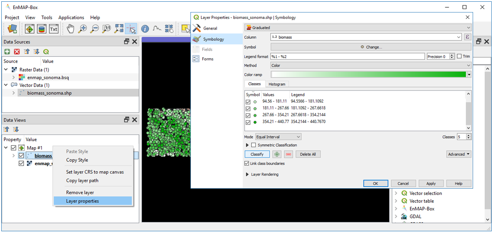
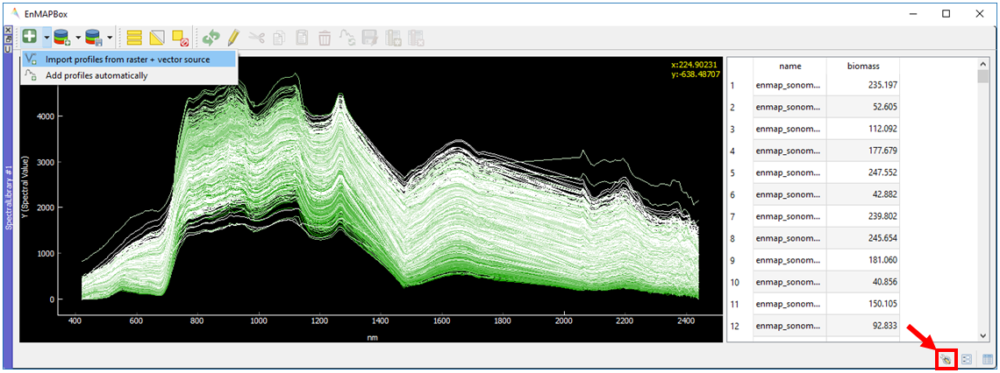
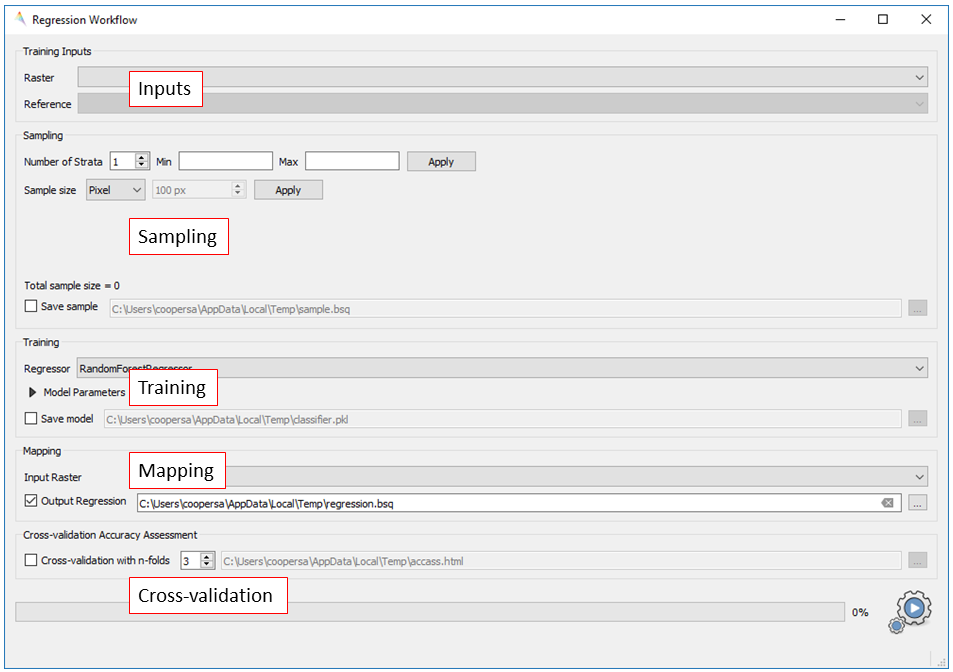
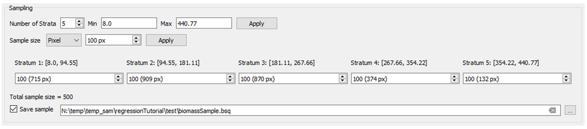
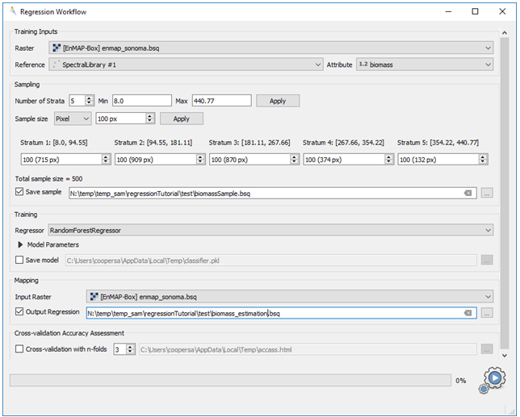
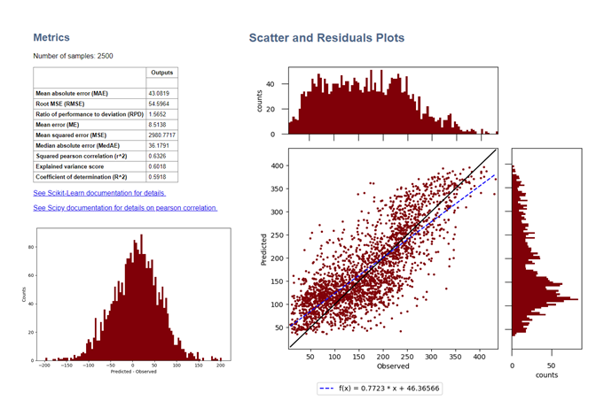
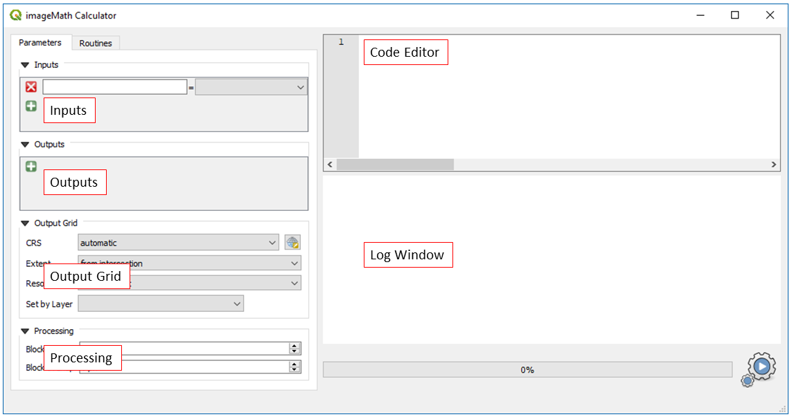
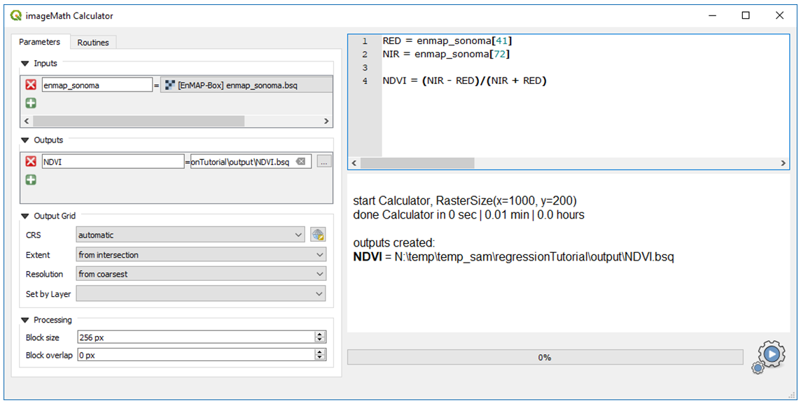
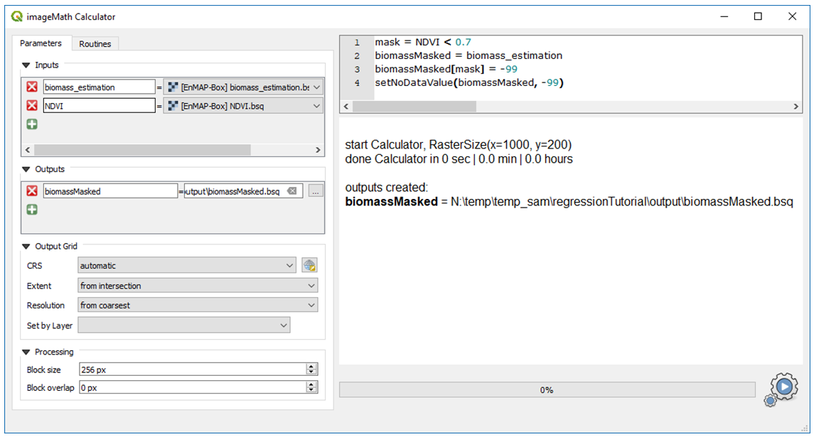

.. include:: /icon_links.rst

Regression-based mapping of forest aboveground biomass
######################################################

**Authors:** Sam Cooper, Akpona Okujeni & Sebastian van der Linden

**Contributions from:** Fabian Thiel, Patrick Hostert, Clemens Jaenicke, Benjamin Jakimow, Andreas Rabe

**Date: 05/11/2019**

Introduction
************

1. Background
=============

Forest aboveground biomass (AGB) is a measure of the living and dead plant material in a given area. As such, it is
often used for forest management, assessing fire potential, and is an important metric used in modelling carbon and
nutrient cycles. AGB can be directly measured at a plot level by harvesting and weighing vegetation, but this is both
an expensive and highly invasive process. Through the use of statistical modelling and remotely sensed imagery, AGB can
be mapped across broad, spatially continuous areas using only a small number of directly measured biomass plots.

This practical focuses on regression-based modeling of forest biomass using the EnMAP-Box. A hyperspectral image mosaic
from the EnMAP sensor (here simulated from AVIRIS imagery) and a corresponding vector dataset containing aboveground
biomass estimates are used for this tutorial. The aim is to provide an introduction into the functionality of the
EnMAP-Box, as well as hands-on training for implementing regression-based mapping.

2. Requirements
===============

This practical requires at least version 3.5.20191101T1710.master of the EnMAP-Box 3. There might be some minor
changes for higher versions (e.g., changed menu labels, added parameter options, etc.).

3. Further reading
==================

We recommend [1]_ and [2]_ for a comprehensive overview of imaging spectroscopy of terrestrial ecosystems, and [3]_ for
an overview of remote sensing of forest aboveground biomass.

.. [1] Foerster, S., Guanter, L., Lopez, T., Moreno, J., Rast, M., Schaepman, M.E. (2019) Exploring the Earth System with Imaging Spectroscopy. Springer International Publishing
.. [2] Thenkabail, P. S., & Lyon, J. G. (2016). Hyperspectral remote sensing of vegetation. CRC press.
.. [3] Lu, D., Chen, Q., Wang, G., Liu, L., Li, G., & Moran, E. (2016). A survey of remote sensing-based aboveground biomass estimation methods in forest ecosystems. International Journal of Digital Earth, 9(1), 63-105.

4. Data
=======

You can download the data for this exercise here:
https://box.hu-berlin.de/f/c3ead66ee0444ec895ff/?dl=1

The practical dataset contains a hyperspectral image mosaic in Sonoma County, California, USA, as well as a shapefile
containing point based biomass estimates sampled from an existing LiDAR derived biomass map [4]_.

.. csv-table::
   :header-rows: 1
   :delim: ;
   :widths: auto

   Data type; Filename; Description
   Raster; :file:`enmap_sonoma.bsq` [*]_; Simulated spaceborne hyperspectral data from the EnMAP sensor with a spatial resolution of 30m, 195 bands, and 1000x200 pixels.
   Vector; :file:`biomass_sonoma.shp` [*]_; 3000 biomass reference points sampled from an existing LiDAR derived biomass map [4]_

.. [*] ENVI Standard Band Sequential (BSQ)

.. [*] ESRI shapefile (SHP)

.. [4] Dubayah, R.O., A. Swatantran, W. Huang, L. Duncanson, H. Tang, K. Johnson, J.O. Dunne, and G.C. Hurtt. 2017. CMS: LiDAR-derived Biomass, Canopy Height and Cover, Sonoma County, California, 2013. ORNL DAAC, Oak Ridge, Tennessee, USA. https://doi.org/10.3334/ORNLDAAC/1523

|

Exercise A: Introduction to the EnMAP-Box - Remote sensing of terrestrial ecosystems
************************************************************************************

.. admonition:: Description

   This exercise introduces basic functionalities of the EnMAP-Box for this tutorial. You will get to know the graphical
   user interface and will learn how to load data, visualize raster and vector data, and use the basic navigation tools.
   Additionally, you will learn to work with multiple map views and how to visualize image spectra using Spectral
   Library Windows.

   Duration: 45 min

1. Start the EnMAP-Box
======================

* Start QGIS and click the |enmapbox| icon in the toolbar to open the EnMAP-Box. The GUI of the EnMAP-Box consists of
  a **Menu** and a **Toolbar**, panels for **Data Sources** and **Data Views**, and the **QGIS Processing Toolbox**
  including the EnMAP-Box algorithms.

.. image:: img/Slide1_BoxScreenCap.PNG

2. Load data
============

* To load new datasets into the EnMAP-Box, click the |mActionDataSourceManager| icon and navigate to the file directory
  containing your data. Select :file:`biomass_sonoma.shp` from the Open data source dialogue and select Open.
* Alternatively, the EnMAP-Box offers simple drag & drop capabilities to load data from an external file manager
  (e.g. Windows File Explorer). Open :file:`enmap_sonoma.bsq` by dragging and dropping the file from your file manager
  into the :guilabel:`Data Sources` panel.
* All data currently open in the EnMAP-Box will appear in the :guilabel:`Data Sources` panel.

  .. image:: img/Slide2_DataLoaded.PNG

3. Visualize raster data
========================

* The EnMAP-Box offers **Map Views** (Map #) for visualizing raster and vector data. Click the |viewlist_mapdock| icon to open a
  new Map View and drag :file:`enmap_sonoma.bsq` from the :guilabel:`Data Sources` panel into Map #1.
* In addition to a new Map View opening, a corresponding Data View entry is created in the :guilabel:`Data Views` panel
  which shows all data currently loaded in a given Map View.
* By default, the first three bands are assigned to the RGB channels when displaying a new raster dataset.
  To assign a custom RGB combination to a raster image, right click on the dataset in the :guilabel:`Data Views` panel,
  select :guilabel:`Layer Properties` and navigate to :guilabel:`Style` in the :guilabel:`RasterLayerProperties` window.
  Set Render type to multibandcolor and select bands to display in the red, green and blue color channels.
  Common combinations are listed below.

  .. csv-table::
     :header-rows: 1

     Combination, Red, Green, Blue
     TrueColor, 658 nm, 569 nm, 479 nm
     nIR, 847 nm, 658 nm, 569 nm
     swIR, 847 nm,1645 nm, 658 nm

* Display :file:`enmap_sonoma.bsq` as true color composite. Under :guilabel:`Min/Max Value Settings`, select the radio button for
  :guilabel:`Cumulative count cut`, leaving the default stretch at 2-98%. Select :guilabel:`OK`.

  .. image:: img/Slide3_RasterSymbology.PNG

4. Basic navigation tools
=========================

* The Toolbar offers common navigation tools for exploring visualized datasets. Make yourself familiar with the
  following navigation tools: |navtools| Note that the mouse wheel can be used alternatively for zooming
  (roll mouse wheel forward/backward) and panning (press and hold mouse wheel).

5. Multiple map views
=====================

* Close Map #1 from the previous exercise by using the |cl_mv| icon on the blue Map #1 title bar.
* The EnMAP-Box enables users to work with multiple Map Views, which can be flexibly organized and geospatially linked.
  Open two new Map Views. Note two Data View entries appear corresponding to the open Map Views
* To change the arrangement of Map Views, click and hold on the blue Map #2 title bar and drag it to the right edge of
  Map #1. A transparent blue rectangle appears indicating the docking position once you stop holding the mouse button.
  Release the mouse button to move the map to that position.

.. tip::

   You may also undock map views from the EnMAP-Box window by selecting |float_window| from the blue Map title bar.
   To re-dock a Map View, click and drag the blue Map title bar to an open Map View already docked in the EnMAP-Box window.

.. image:: img/Slide4_MovingMultipleViews.PNG

* Display :file:`enmap_sonoma.bsq` as a true color composite Map #1 and as an RGB composite of your choice in Map #2.
  Move the map views to best fit the orientation of the data.

.. tip::

   When loading a raster image to a map view, you may also right click the filename in the :guilabel:`Data Sources` panel and select
   either :guilabel:`Open in existing map` or :guilabel:`Open in new map`. If the raster image has wavelength information associated with it, you
   may also select a predefined composite from the context menu.

* For geospatial linking, click on :guilabel:`View` in the Menu and select :guilabel:`Set Map Linking`. In the :guilabel:`Map Linking` window,
  select the |link_mapscale_center| :guilabel:`Link Map Scale and Center` option and close the dialog.
  You may also right click a map window you wish to link and select :guilabel:`Link with other maps`

.. image:: img/Slide5_LinkingMultipleViews.PNG

6. Visualize vector data
========================

* Close Map #2 from the previous step
* Load :file:`biomass_sonoma.shp` to Map #1.
* To change the order of stacked layers, go to the :guilabel:`Data Views` panel and drag one layer on top or below
  another one. Arrange the layer stack so that :file:`biomass_sonoma.shp` is displayed on top of :file:`enmap_sonoma.bsq`.
* By default, vector files are displayed with a single uniform symbol. To change this symbology, right
  click on :file:`biomass_sonoma.shp` in the :guilabel:`Data Views` panel, select :guilabel:`Layer Properties` and navigate to :guilabel:`Symbology`
  in the LayerProperties window. You can now change the symbology in accordance to the QGIS functionality. 
  Select “Graduated” from the dropdown menu, and select “biomass” in Column and “Color” in Method. 
  Press :guilabel:`Classify` and then :guilabel:`OK` to display the relative biomass values associated with each point.
  Explore the different ways you can display this information using the QGIS symbology functionality.

* Use the |metadata| tool on the toolbar to view displayed raster and vector data. When activated,
  a new Cursor Location Values window will open displaying data from the selected pixel or
  feature. Note: |select_location| Identify Cursor Info must be activated to access this tool.

7. Extract & visualize image spectra
===================================

* The EnMAP-Box offers **Spectral Library Windows** (SpectralLibrary #) for visualizing spectra and handling
  their metadata. A detailed introduction to the Spectral Library Window can be found in
  :ref:`Exercises B and C of the Regression-based unmixing tutorial <tut_urban_unmixing>`.
* This tool may also be used to extract and visualize spectra which are spatially associated with vector
  data open in the EnMAP-Box, i.e., the biomass reference points. To do this, open a new Spectral Library
  window by selecting the |viewlist_spectrumdock| icon on the toolbar.
* Next, select **Import profiles from raster + vector sources** from the dropdown menu by the |plus_green| icon in
  SpectralLibrary #1 and select the appropriate raster and vector sources. A spectral library is
  automatically built based on the geographic location of each point in the vector file. The associated
  attribute information is displayed in the table on the right.
* Change the spectral profile colors to reflect the biomass values associated with them.
  Do this by selecting |system| in lower right corner of the Spectral Library Viewer. Then use the QGIS
  symbology functionality to change the color scheme of the spectral profiles to reflect the
  associated biomass values in the attribute table (see Exercise A6 if needed).
* In the Exercise B, you will learn how to create and apply regression models based on this
  information to predict biomass across the whole image.

.. admonition:: Learning Activities

   * **A1**: What land cover types are present in the imagery? How are the biomass training plots distributed throughout the scene?
   * **A2**: What different information can you see when switching from a true color composite to a NIR false color composite?
   * **A3**: Compare spectra from high biomass plots and low biomass plots. What differences can you see?

|

Exercise B: Regression based mapping - estimating biomass
*********************************************************

.. admonition:: Description

   One of the strengths of remote sensing comes from its ability to take high-quality point measurements of a
   variable of interest and building statistical models with which wall to wall maps of this variable can
   be created. One of the most common ways of doing this is to create regression models based on the optical
   properties of the training data and applying it to large scale imagery. This exercise…

   * Introduces a regression-based mapping approach for taking point measurements of biomass and generating
     spatial biomass estimates using an input raster of hyperspectral imagery.
   * Demonstrates the ‘Regression-based mapping’ application of the EnMAP-Box.
   * Demonstrate accuracy assessment of our biomass estimates using the EnMAP-Box algorithms.

   Duration: 20 min

1. Start the Application
========================

* Close all opened Map and Spectral Library Windows. For this exercise you must have
  :file:`enmap_sonoma.bsq` and :file:`biomass_sonoma.shp` open in the :guilabel:`Data Sources` panel.
* Click on :guilabel:`Applications` in the Menu and select :guilabel:`Regression Workflow`. The graphical widget of the
  Regression Workflow consists of sections for specifying Inputs, for setting Sampling schemes,
  for selecting the regression algorithm used for model Training, and for specifying the
  Mapping and Cross-validation parameters.

2. Inputs
=========

* The first step in the Regression Workflow is defining the inputs. This includes a Raster dataset as
  well as a Reference vector file with attributes containing a variable of interest to map, in our case, biomass.
* Select the following inputs:

  * :guilabel:`Raster`: :file:`biomass_sonoma.bsq`
  * :guilabel:`Reference`: :file:`biomass_sonoma.bsq`
  * :guilabel:`Attribute`: biomass

3. Stratified Sampling
======================

* In the case of uneven distribution of training data, you may choose to subset your training data
  by stratifying the variable of interest and sampling from within each stratum. By default, the
  :guilabel:`Number of Strata` is set to one and the :guilabel:`Sample Size` is set to 100%, meaning that all training data is used.
* As our training data is not evenly distributed across the range of observed biomass, we will
  implement an equalized sampling scheme to ensure an appropriate model fit.

* Change the :guilabel:`Number of Strata` to ``5`` and click :guilabel:`Apply`. You will see five strata appear below,
  showing the minimum and maximum biomass values, the number of samples which will be drawn, and the
  total number of samples in each strata in parentheses.
* Change the :guilabel:`Sample Size` to ``10%`` and click :guilabel:`Apply`. You will now see the number of samples drawn from each
  strata automatically update to include 10% of the total size of each strata. To set an equalized
  sampling scheme, select :guilabel:`Pixel` from the dropdown menu and sample 100 pixels per strata. You can
  also manually define the sample size if desired. For now, sample 100 pixels for each of 5 strata.
* Select the option to |cb1| :guilabel:`Save Sample` and define an output file name and location. This saves a raster
  containing the biomass samples used to train the model, as well as a complementary raster of
  the samples left out of the training. We can later use these complementary samples for validation of the model.

4. Regression Algorithm
=======================

* Next, we must define a regression method. The EnMAP-Box makes use of the
  scikit-learn library (see https://scikit-learn.org/stable/index.html) to implement several
  state-of-the-art algorithms offered in the :guilabel:`Regressor` drop menu. Note that the different algorithms
  lead to varying accuracies and processing times. Advanced Model Parameters may also be set here. Refer
  to the scikit-learn documentation for more information.
* Select ``RandomForestRegressor`` (default, due to the low processing time), and use the default model parameters.

5. Mapping
==========

* The Input Raster is by default the same as the raster used to generate training spectra. However, if you wish
  to apply the model to another image you may specify this here.
* Select :guilabel:`Output Regression`, and in the adjacent box specify a file location and name to which
  you will save the biomass estimation.

6. Cross-validation Accuracy Assessment
=======================================

* If you lack independent validation data, you may selected to run cross-validation of the dataset with a
  desired number of folds. Leave this unchecked.

.. attention::

   Note that the cross-validation is conducted only on the training sample defined in the sampling panel.
   Future versions will also allow users to validate models based on the withheld samples.

7. Run the application
======================

* Click on the |action| button to run the application. The outputs appear in the :guilabel:`Data Sources` panel.

8. Visualize biomass results
============================

* Open :file:`enmap_sonoma.bsq` as an RGB composite of your choice (refer to Exercise A3 if needed)
* Open the :file:`biomass_prediction.bsq` in a new Map View and link to the Map #1 (refer to Exercise A5 if needed).

9. Validation of biomass maps
=============================

* When generating the biomass regression model, we withheld a number of samples, :file:`biomassSample_compliment.bsq`,
  which we will now use to validate the biomass predictions. Open and link these withheld samples in a new
  Map View. Compare the biomass values in the withheld samples to the model predicted biomass estimates.
  We will use these reference values to statistically evaluate our biomass predictions.
* In the :guilabel:`Processing Toolbox`, go to :menuselection:`EnMAP-Box --> Accuracy Assessment --> Regression Performance`.
  Run the Regression Performance algorithm with the following inputs:

  * :guilabel:`Prediction`: :file:`biomass_estimation.bsq`
  * :guilabel:`Reference`: :file:`biomassSample_compliment.bsq`

* After selecting :guilabel:`Run`, an HTML report with scatterplots and statistical measures will open in your
  default browser. Make yourself familiar with the HTML report.

Learning Activities
===================

.. admonition:: Learning Activities

  * **B1**: What general trends do you see in the biomass estimations? How do these
  * **B2**: How do the biomass estimates compare to the withheld samples? How do they compare to the training samples?
  * **B3**: Discuss the accuracy results, both in terms of the statistical measures, as well as the form of the scatterplot.

|

Exercise C: Introduction to ImageMath - Creating an NDVI mask
*************************************************************

.. admonition:: Description

   In this exercise, you will learn how to use the ImageMath tool to calculate NDVI and generate a
   tree mask based on NDVI thresholding. You will then assess the biomass prediction from Exercise B using the new tree mask.
   Duration: 30 min

1. ImageMath introduction
=========================

* The ImageMath tool in the EnMAP-Box allows users to apply a mathematical operation, python function, or user defined function an image.
* For this exercise, you will need :file:`biomass_estimation.bsq` and :file:`enmap_sonoma.bsq` from the previous exercises
  open in the :guilabel:`Data Sources` panel.
* Open the ImageMath application by going to :guilabel:`Applications` then selecting |numpy| :guilabel:`ImageMath`
* The ImageMath Calculator consists of several panels:

  * :guilabel:`Inputs`: defines input variables and variable names
  * :guilabel:`Outputs`: defines output variable names and locations to be saved to.
  * :guilabel:`Code editor`: Text editor in which programmatic manipulation of the input datasets can be defined using Python scripting syntax.
  * :guilabel:`Output Grid`: Allows users to manually set output grid following calculations done in the editor.
  * :guilabel:`Processing`: Allows users to select block sizes for processing large datasets with limited memory
  * :guilabel:`Log Window`: Displays the status (and error messages) of executed code
  * Additionally, a tab for :guilabel:`Routines` allows users to select a number of common python-based tools for manipulating spatial datasets with linked documentation.

.. attention::

   Input and output variable names in the **Editor** must exactly match corresponding names defined in the **Inputs** and **Outputs** panels.

.. |numpy| image:: /../../enmapbox/coreapps/enmapboxapplications/imagemathapp/icons/numpy.png
   :height: 26px

2. Calculate NDVI
=================

* The Normalized Difference Vegetation Index (NDVI) is a commonly used vegetation index that is correlated with
  both vegetation cover and biomass. The formula for NDVI is:

  .. math::

     NDVI = \frac{NIR-Red}{NIR+Red}

  where NIR is the near-infrared band reflectance (~850nm) and Red is the red band reflectance (~660nm).
  We will now calculate NDVI from the EnMAP imagery using the ImageMath tool.

* In the :guilabel:`Inputs` panel, select :file:`enmap_sonoma.bsq` from the dropdown menu. The variable name is automatically taken
  from the filename, but may be changed if desired. Note: if you wish to process multiple rasters with different
  grids, you can also define a resampling method from the dropdown menu and the grid to be sampled to in the
  Output Grid panel.
* In the :guilabel:`Editor panel`, define the RED and NIR bands in our imagery. These correspond to bands 42 and 73
  in our imagery, respectively, and we can define them using python indexing syntax (i.e. 0 indexed array slicing):

  .. code-block:: python

     RED = enmap_sonoma[41]
     NIR = enmap_sonoma[72]

  Next, we define the formula we wish to run:

  .. code-block:: python

     NDVI = (NIR - RED)/(NIR + RED)

  In the :guilabel:`Outputs` panel, define the output variable name as ``NDVI``, and select an output file
  path and file name (e.g. :file:`C:\Users\USERNAME\Desktop\NDVI.bsq`). Note, if you leave the file name black, the output
  variable will be saved to memory.
  Finally, click on the |action| button to run the script.

* A new raster dataset :file:`NDVI.bsq` will appear in the :guilabel:`Data Sources` panel.
  Open this in a new Map Viewer and link to the biomass estimates (see Exercise A5).

3. Create and apply a mask
==========================

* As the biomass map was only trained using forested biomass plots, only limited inference can be
  made of the non-forest biomass estimates. We will therefore apply a forest mask to our biomass map.
  Because non-woody vegetation in our imagery is largely senesced (i.e. not green), we can create a proxy
  forest mask using a simple NDVI threshold.
* Open the ImageMath tool and set :file:`NDVI.bsq` and :file:`biomass_estimation.bsq` as the input files.
* Enter the following code into the Console to create a mask for all pixels with and NDVI below a threshold
  of 0.7 and apply it to the NDVI image:

  .. code-block:: python

     mask = NDVI < 0.7
     biomassMasked = biomass_estimation
     biomassMasked[mask] = -99
     setNoDataValue(biomassMasked, -99)

* Line by line, this script:

  1. Creates a binary array “mask” of 1 (True) and 0 (False) for each value less than 0.7
  2. Copies the biomass values to a new array
  3. Steps through each value in the new array and sets the value to -99 if the masked value is 1 (i.e. if the NDVI is less than 0.7).
  4. Sets the no data value for the masked array to -99. This helps the EnMAP-Box to automatically display the data correctly.

* Set ``biomassMasked`` as the output and define the path to your working directory. Run the script by clicking |action|

4. Visualize the masked raster
==============================

* Open an RGB composite of :file:`enmap_sonoma.bsq` in Map #1 and open and link the masked biomass image in a new
  Map window. Refer to Exercise A5 if needed.

Learning Activities
===================

.. admonition:: Learning Activities

   * **D1**: Why was it necessary to mask the biomass results?
   * **D2**: What are the limitations of using NDVI to create the forest mask? Was 0.7 a ‘good’ threshold? Why or why not?

Additional Exercises
********************

.. admonition:: Learning Activities

   * **AE1**: Use the **ImageStatistics** tool in the :guilabel:`Tools` menu to look at the band statistics for the biomass predictions
     both with and without the tree mask applied.
   * **AE2**: Use the **Scatterplot** tool in the :guilabel:`Tools` menu to explore the relationship between NDVI and biomass.
   * **AE3**: Because we randomly subsetted the training data prior to model training, the performance of the model
     has an element of uncertainty to it. To better understand this, rerun the regression workflow 3-5 times.
     Then use the **ImageMath** tool to calculate the average estimate and variance. How does running the regression
     in such an ensemble approach affect the results? What is the spatial pattern of variation in estimates?
   * **AE4**: Rerun regression (Exercise B) using NDVI as the input rather than the hyperspectral imagery.
