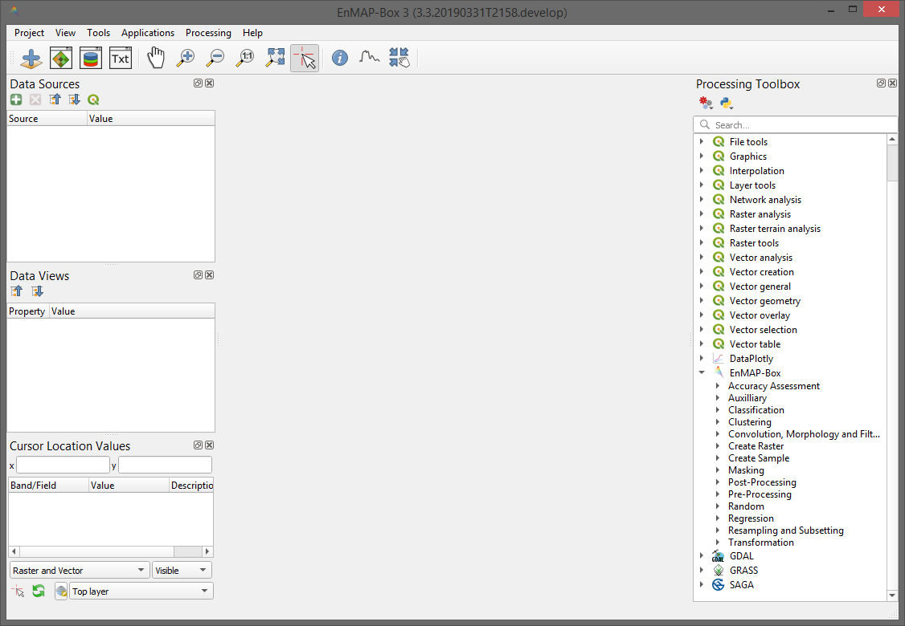

 .. include:: /icon_links.rst

.. _getting_started:

###############
Getting Started
###############

.. admonition:: Info

    This section is aimed at users with no previous EnMAP-Box experience. You will get a brief introduction into the
    main functionalities by performing an image classification based on point reference data using the Classification Workflow
    application.

Launching the EnMAP-Box
#######################

Once you successfully :ref:`installed <usr_installation>` the EnMAP-Box, you can access the plugin via the |enmapbox| icon
in the QGIS Toolbar. Furthermore, the EnMAP-Box :ref:`Processing Algorithms` should also appear in the QGIS Processing Toolbox.

    The Graphical User Interface (GUI) of the EnMAP-Box on first open

Loading Testdata
################

* Go to :menuselection:`Project --> Load Example Data` to load example datasets into you project (on first open, you will be asked whether
  to download the dataset, confirm with :guilabel:`OK`). The following datasets
  will be added (now they are listed in the :guilabel:`Data Sources` window):

  * :file:`enmap_berlin.bsq`
  * :file:`hires_berlin.bsq`
  * :file:`landcover_berlin_point.shp`
  * :file:`landcover_berlin_polygon.shp`
  * :file:`library_berlin.sli`

.. tip::

   Have a look at the section :ref:`Test dataset <test_dataset>` for further information on the dataset. In this section we will
   mainly work with :file:`enmap_berlin.bsq` and :file:`landcover_berlin_point.shp`

First Steps in the GUI
######################

By default the example data is loaded into a single Map View. Let's rearrange those for better visualisation and in order
to get to know the GUI functionalities:

* Click the |viewlist_mapdock| :superscript:`Open a map window` button to add a second map view. The window appears
  below the first map window.
* We want to arrange the windows so that they are next to each other (horizontally). Click and hold on the blue area
  of :guilabel:`Map #2` and drag it to the right of :guilabel:`Map #1` (see figure below). The translucent blue rectangle indicates where the
  map window will be docked once you stop holding the left mouse button.

  .. image:: ../img/mapviewshift.png

* Now, in the :guilabel:`Data Views` window, expand the :guilabel:`Map #1` list, so that you can see the individual layers. Select
  :file:`hires_berlin.bsq` and drag the layer into :guilabel:`Map #2` (you can drag them directly into the map views or the respective menu item under :guilabel:`Data Views`).
  You can remove :file:`library_berlin.sli` and :file:`landcover_berlin_polygon.shp`, since they are not needed here. Right-click on the layer
  in the Data Views panel and select :guilabel:`Remove Layer`.
* In the next step we link both map views, so that zoom and center are synchronized between both. Go to :menuselection:`View --> Set Map Linking` and
  select |link_all_mapscale_center| :superscript:`Link map scale and center`.
* Move the map (using |mActionPan| or holding mouse wheel) and see how both map views are synchronized.

Image Classification
####################

* Go to :menuselection:`Applications --> Classification Workflow` to open the Classification Workflow application.
* At the top, choose :file:`enmap_berlin.bsq` as :guilabel:`Raster` and :file:`landcover_berlin_point.shp` as :guilabel:`Reference`.
  Select ``level_2_id`` as :guilabel:`Attribute`. After selection of the attribute the class names and colors become visible in the :guilabel:`Sampling` submenu.

  .. image:: ../img/classwf1.png

* Here you can alter the class colors and the class names or change the size of your sample. But for this tutorial use
  the default settings (sample size at 100%).

..  .. tip::

..     Find more information on the Classification Workflow application in the :ref:`User Manual <classification_workflow>`

* As :guilabel:`Classifier` choose RandomForestClassifier (which is the default setting)
* In the :guilabel:`Model Parameters` text field add the parameter ``n_estimators = 300``. This will increase the number of trees
  in the random forest. We alter this parameter here, because the scikit-learn default is 10, which is quite low.
  So the text field should look like this:

  .. code-block:: python

      from sklearn.ensemble import RandomForestClassifier
      estimator = RandomForestClassifier(n_estimators = 300)

* Under :guilabel:`Mapping` you have to specify the raster which will be classified. We will choose the same raster we took the samples from,
  so select :file:`enmap_berlin.bsq` as :guilabel:`Raster`.
* Make sure to check |cb1| the :guilabel:`Classification` output. Specify an output path and filename by pressing :guilabel:`...` or
  use the default, which will save the output to a temporary location.
* Also select |cb1| to perform a :guilabel:`Cross-validation with n-folds`. You can leave the number of folds at 3. Specify
  output path for the HTML report or use default (temporary directory).

  .. image:: ../img/classwf2.png

* Click the run button |action| to start the classification.
* Once the process has finished, the classification image will be listed in the :guilabel:`Data Sources` panel (if not, open it again via |add_datasource|).
  Also, the HTML report of the accuracy assessment will open automatically in the default web browser.

  .. figure:: ../img/screenshot_aareport.png

     Screenshot of the Classification Performance HTML report

* Now visualize the classification result side-by-side with the initial image. Therefore, right-click into :guilabel:`Map #2` and
  select :menuselection:`--> Clear`. Drag the classification image from the :guilabel:`Data Sources` panel into :guilabel:`Map #2`

  .. figure:: ../img/screenshot_class_result.png

     Screenshot of the Map Views: EnMAP image on the left and classification result on the right
