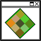
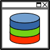

###############
Getting Started
###############

.. admonition:: Info

    This section is aimed at users with no previous EnMAP-Box experience. You will get a brief introduction into the
    main functionalities, i.e. you will
        * Load some testdata
        * Get to know the GUI (especially using multiple map views)
        * View and extract spectral profiles from a hyperspectral image
        * Use a Processing Algorithm

Launching the EnMAP-Box
#######################

Once you successfully :ref:`installed <usr_installation>` the EnMAP-Box, you can access the plugin via the |enmapicon| icon
in the QGIS Toolbar. Furthermore, the EnMAP-Box :ref:`Processing Algorithms` should also appear in the QGIS Processing Toolbox.

.. figure:: ../img/ebx_firstopen.png

    The Graphical User Interface (GUI) of the EnMAP-Box on first open

.. |enmapicon| image:: ../../../enmapbox/gui/ui/icons/enmapbox.svg
    :width: 30px

Loading Testdata
################

* Go to :menuselection:`Project --> Load Example Data` to load example datasets into you project. The following datasets
  will be added (now they are listed in the ``Data Sources`` window):
    * EnMAP_BerlinUrbanGradient.bsq
    * HighResolution_BerlinUrbanGradient.bsq
    * LandCov_BerlinUrbanGradient.shp

* By default the example data is loaded into a single Map View. Let's rearrange those for better visualisation and in order
  to get to know the GUI functionalities:
    * Click the |openmapwindow| :superscript:`Open a map window` button to add a second map view. The window appears
      below the first map window.
    * We want to arrange the windows so that they are next to each other (horizontally). Click and hold on the blue area
      of Map #2 and drag it to the right of Map #1 (see figure below). The translucent blue rectangle indicates where the
      map window will be docked once you stop holding the left mouse button.

      .. image:: ../img/mapviewshift.png

    * Now, in the ``Data Views`` window, expand the Map #1 list, so that you can see the individual layers. Select
      *HighResolution_BerlinUrbanGradient.bsq* and *LandCov_BerlinUrbanGradient.shp* (hold :guilabel:`Strg` and click on layers)
      and drag them into Map #2 (you can drag them directly into the map views or the respective menu item under ``Data Views``).
    * In the next step we link both map views, so that zoom and center are synchronized between both. First, click the |linkbasic|
      button in the Map #1 window. Now three options become selectable in Map #2: Select |linkscalecenter|, which will link both,
      zoomlevel and map center.
    * Right-click into one of the map views and select **Show Crosshair**. Repeat this also for the other map view.
    * Move the map (using |pan| or holding mouse wheel) and see how both map views are synchronized. Also mind how the link
      you just created is listed also in the respective map properties under ``Data Views``.

* Next click on |openspeclib| :superscript:`Open a spectral library window`.

    * In Map #1 (EnMAP image), navigate to a pixel which is mostly covered by vegetation (use the higher resolution image in Map #2
      to identify such a pixel)
    * Click on |selectpixelprofile| :superscript:`Select pixel profile from map` and then click on this vegetated pixel in Map #1.
    * Click |profile2speclib| to add this spectrum to the spectral library.
    * Now select another pixel profile, e.g. red roof to have a direct comparison.

|

    Now your EnMAP-Box project might look something like this...

.. |linkbasic| image:: ../../../enmapbox/gui/ui/icons/link_basic.svg
    :width: 30px

.. |pan| image:: ../../../enmapbox/gui/ui/icons/mActionPan.svg
    :width: 30px

.. |selectpixelprofile| image:: ../../../enmapbox/gui/ui/icons/pickrasterspectrum.svg
    :width: 30px
.. |profile2speclib| image:: ../../../enmapbox/gui/ui/icons/profile2speclib.svg
    :width: 30px

|
|

Hello World for Processing Algorithms
#####################################

Up to now we mainly had a glimpse at the GUI of the EnMAP-Box. Let's take a look at the Processing Algorithms.

* In the Processing Toolbox panel, go to :menuselection:`EnMAP-Box --> Create Raster --> Classification from Vector` and double-click
  on the algorithm (alternatively you might directly type "Classification from Vector" into the search bar to find the algorithm).
* Mind the help sidebar on the right of the window, where the algorithm and each of its parameters are described.
* In the algorithm window, set the following parameters:

    * ``PixelGrid``: EnMAP_BerlinUrbanGradient.bsq
    * ``Vector``: LandCov_BerlinUrbanGradient.shp
    * ``Class id attribute``: Level_2_ID
    * ``Class Definition``:

      .. code-block:: batch

          ClassDefinition(classes=6, names=['Roof', 'Pavement', 'Low vegetation', 'Tree', 'Soil', 'Other'], colors=['#e60000', '#9c9c9c', '#98e600', '#267300', '#a87000', '#f5f57a'])

    * ``Minimal overall coverage``: 0.9
    * ``Minimal dominant coverage``: 0.7
    * ``Oversampling factor``: 2
    * Click **Run in Background**

* Under ``Data Sources`` you should now find the layer *outClassification.bsq*

    * Drag it onto Map #2 (i.e. where your vector layer is), and compare the vector dataset with the classification you
      just derived from it.
    * You might want to activate/deactivate the top layer in the ``Data Views`` panel, in order
      to switch back and forth between both layers.
    * Are all pixels that were covered by the vector layer assigned a class? Or are some labeled as *unclassified*?
    * You might want to have a look at the help window again, especially at the parameters *Minimal overall coverage*
      and *Minimal dominant class coverage*, and see if you find out why not all pixels are included, given the settings we used.

|

.. hint::

   Have a look at the :ref:`User Guide <usr_guide>` section for more specific usage examples.