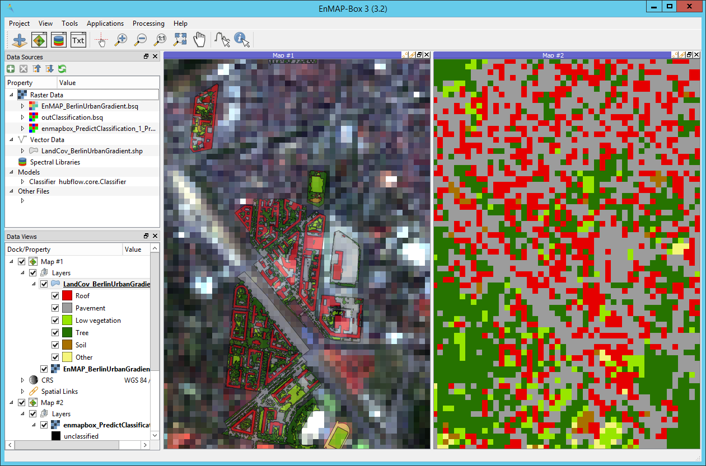

.. |openmapwindow| image:: ../../../enmapbox/gui/ui/icons/viewlist_mapdock.svg
    :width: 30px
.. |linkbasic| image:: ../../../enmapbox/gui/ui/icons/link_basic.svg
    :width: 30px
.. |linkscalecenter| image:: ../../../enmapbox/gui/ui/icons/link_mapscale_center.svg
    :width: 30px

.. _usr_guide:

==========
User Guide
==========

.. _image_classification:

Image Classification
====================

.. note:: In this guide you will learn how to perform a supervised image classification and validation using the EnMAP-Box and the
          test dataset that comes with it. The input image is a simulated EnMAP image acquired over the city of Berlin
          and a detailed vector dataset with the classes Roof, Pavement, Low vegetation, Tree, Soil and Other will be used as reference.

          .. figure:: ../img/graphical_model_classification.png

             Graphical model of the classification workflow presented in the steps below. See this :ref:`Section <graphical_modeler>`
             for more details on using the graphical modeler for automating EnMAP-Box workflows.

Load data / preprocessing
-------------------------

1. Go to :menuselection:`Project --> Load Example data`. When clicking for the first time, the software will ask you whether you want
   to download the data, confirm this, and then you should see the following datasets in your ``Data Sources`` panel.
     * EnMAP_BerlinUrbanGradient.bsq
     * HighResolution_BerlinUrbanGradient.bsq *(not needed here)*
     * LandCov_BerlinUrbanGradient.shp
     * SpecLib_BerlinUrbanGradient.sli *(not needed here)*

   .. attention:: Before fitting a classifier, you have to convert the vector reference dataset into a raster with the same
                  resolution as the image to be classified. See next step...

2. In the Processing Toolbox panel, go to :menuselection:`EnMAP-Box --> Create Raster --> Classification from Vector` and double-click
   on the algorithm (alternatively you might directly type 'Classification from Vector' into the search bar to find the algorithm).
     * Mind the help sidebar on the right of the window, where the algorithm and each of its parameters are described.
     * In the algorithm window, set the following parameters (most are default):

       * ``PixelGrid``: EnMAP_BerlinUrbanGradient.bsq
       * ``Vector``: LandCov_BerlinUrbanGradient.shp
       * ``Class id attribute``: Level_2_ID
       * ``Class Definition``:

        .. code-block:: batch

            ClassDefinition(classes=6, names=['Roof', 'Pavement', 'Low vegetation', 'Tree', 'Soil', 'Other'], colors=['#e60000', '#9c9c9c', '#98e600', '#267300', '#a87000', '#f5f57a'])

       * ``Minimal overall coverage``: 0.0
       * ``Minimal dominant coverage``: 0.0
       * ``Oversampling factor``: 1
       * Click **Run in Background**
       |

      .. note:: Those default settings might not always be a good choice, e.g. if you desire to use more pure pixels for
                the reference dataset, consider changing ``Minimal overall coverage`` and ``Minimal dominant coverage``,
                e.g. to 0.9 and 0.7, respectively, with an ``Oversampling factor`` of 2.

Fit classifier
--------------

3. Now we fit a random forest classifier. In the Processing Toolbox go to :menuselection:`EnMAP-Box --> Classification --> Fit RandomForestClassifier`.
   As ``Raster`` select *EnMAP_BerlinUrbanGradient.bsq*, as ``Classification`` select the image you just created in the previous step. In the ``Code``
   window change

   .. code-block:: python

      estimator = RandomForestClassifier()

   to

   .. code-block:: python

      estimator = RandomForestClassifier(n_estimators=100)

  This will increase the number of trees the random forest uses to 100. The default is at 10, which is a bit low. Specify the
  output path for the .pkl file and click **Run in Background**.

Predict image
-------------

4. Finally, to classify the image go to :menuselection:`EnMAP-Box --> Classification --> Predict Classification`.
   Select *EnMAP_BerlinUrbanGradient.bsq* as input ``Raster`` and the .pkl file from the previous step as ``Classifier``.
   Specify the output path and click **Run in Background**.

   Screenshot showing the classification result in the right Map View and the underlying EnMAP image & vector reference in left Map View.

Accuracy Assessment
-------------------

5. Go to :menuselection:`EnMAP-Box --> Accuracy Assessment --> Classification Performance`. Select the predicted image from
   step 4 as ``Prediction`` and the rasterized reference dataset from step 2 as ``Reference``. Specify the output path
   for the ``HTML Report`` or save to temporary file and select **Run in Background**.

   Now a HTML report should anatomically open. If not, open the .html file manually or in QGIS go to :menuselection:`View --> Panels --> Results Viewer`.

   .. figure:: ../img/screenshot_aareport.png

      Exemplary screenshot of a accuracy assessment HTML report

   .. important:: In this example we used the same dataset for training the classifier and assessing the accuracy of our
                  prediction, which is not good practise and results in exaggerated accuracies. One solution to this is to
                  split the reference dataset into a training and validation part. See the following section on how to do this
                  using the EnMAP-Box...

Splitting the reference data
----------------------------

.. note::
          Here we will repeat the classification process, but this time we are going to split the reference dataset into a training and
          a validation sample:

          .. figure:: ../img/split_training_reference.png

                      **left:** Rasterized vector reference dataset, **middle:** subset for training, **right:** subset for validation

* Select the algorithm :menuselection:`Random --> Random Points from Classification`. Under ``Classification`` select the
  rasterized reference dataset from step 2. For ``Number of Points per Class`` enter 0.3, which will randomly draw 30% of
  pixels from each class and return them as a point vector dataset.
* Go to :menuselection:`Masking --> Apply Mask to Raster`. Select the reference classification as ``Raster`` and the
  created point vector dataset as ``Mask``. Save the output with a useful name, such as *training.tif*.
  Then repeat this step with the same inputs, but this time use the ``Invert Mask`` setting and save your image as
  *validation.tif* or similar.
* Now repeat the classification workflow above starting from step 4. Only this time, use the training subset in step 4 as
  input under ``Labels`` for *Fit RandomForestClassifier*. Use the validation subset in step 5 as ``Reference`` in *Classification Performance*.

Image Regression
================

.. _graphical_modeler:

Graphical Modeler
=================

.. note:: This section demonstrates how to use the Graphical Modeler in QGIS with EnMAP-Box processing algorithms
          in order to automate common workflows. More specifically, this example is based on the previous
          :ref:`guide on image classification <image_classification>`. Instead of manually clicking our way through the
          classification workflow, we will build a model which combines all the steps and can potentially be reused and
          generalized for further applications of image classification. It is highly recommended to have a look at the
          image classification guide before proceeding.

          You can find general information on the Graphical Modeler in the `QGIS documentation <https://docs.qgis.org/2.8/en/docs/user_manual/processing/modeler.html>`_.

#. Start the EnMAP-Box and load the test dataset under :menuselection:`Project --> Load example data`.
#. In the menubar go to :menuselection:`Processing --> Graphical Modeler`. In the Modeler you have two major
   items or building blocks, which are the ``Inputs`` and ``Alogrithms``. The latter basically lists all algorithms
   available in the QGIS Processing Toolbox and the first lists all available types of inputs, which can be used by the
   processing algorithms.
#. For image classification we need at least an input raster and a reference dataset. Mind that in case of the EnMAP-Box testdata
   the reference dataset is a polygon shapefile. Under ``Inputs`` search for *Raster Layer* and select it (double-click or drag-and-drop).
   As ``Parameter Name`` you can for example choose *input_image*. Mind how this input graphically appears in the main window.
   Now again, look for *Vector Layer*, double-click, and assign a name, e.g. *reference_polygon*.

   .. note:: You can of course change the ``Parameter name`` as you wish, but it might be easier to follow this guide when you use the suggestions.

#. Add a *Vector Field* input to the model. Enter *reference_field* as ``Parameter name`` and *reference_polygon* as ``Parent layer``.
   Furthermore, add a *String input*, name it *cd_text* and deselect the ``Mandatory`` option. We are going to need those
   inputs for the following algorithm.
#. Now we need the *Classification from Vector* algorithm in order to rasterize the reference dataset. Find it in the
   ``Algorithms`` tab and select it.  Now enter the following parameters:
    * ``Pixel grid``: input_image
    * ``Vector``: reference_polygon
    * ``Class id attribute``: reference_field
    * ``Class Definition``: cd_text
    * ``Minimal overall coverage``: 0.0
    * ``Minimal dominant coverage``: 0.0
    * ``Oversampling factor``: 1

#. Now add the *Fit RandomForestClassifier* algorithm to your model. In the dialog, select *input_image* as ``Raster`` and
   under ``Labels`` select *'Output Classification' from algorithm 'Classification from Vector'*. Leave the rest at default
   and click :guilabel:`OK`.

#. In the next step select the *Predict Classification* Algorithm. Under ``Raster`` select *input_image* and under ``Classifier``
   select *'Output Classifier' from algorithm 'Fit RandomForestClassifier'*. Enter a name under ``Output Classification``, e.g.
   *predicted_image*. Confirm with :guilabel:`OK`.
#. The model is already able to run and perform an image classification, but we will add the generation of an Accuracy Assessment.
   Look for the Algorithm *Classification Performance* and select it. Choose *'Output Classification' from algorithm 'Predict Classification'* as
   ``Prediction`` and *'Output Classification' from algorithm 'Classification from Vector'* as ``Reference``. Specify a name
   under ``HTML Report``, for example *accuracy_assessment*.

#. Under ``Model properties`` you can specify a name and a group for your model and save it.
#. Click the run button or press F5 to test your model. Use the following settings:

    * input_image: EnMAP_BerlinUrbanGradient.bsq
    * reference_polygon: LandCov_BerlinUrbanGradient.shp
    * reference_field: Level_2_ID
    * cd_text:

      .. code-block:: batch

         ClassDefinition(classes=6, names=['Roof', 'Pavement', 'Low vegetation', 'Tree', 'Soil', 'Other'], colors=['#e60000', '#9c9c9c', '#98e600', '#267300', '#a87000', '#f5f57a'])

   .. figure:: ../img/screenshot_graphical_model.png

      Screenshot of the final model and the resulting processing algorithm dialog (lower left)

#. After saving, your model will also appear in the Processing toolbox:

   .. image:: ../img/screenshot_toolbox_models.PNG

.. admonition:: Final remarks

   * Mind that this example was quite specific to the EnMAP test dataset. You might want to alter the model in a way that it
     is more generalizable or fitting for your specific use cases.
   * Also, consider extending the model inputs to have even more parameters to select from, e.g. by using the Number input type
     to make the parameter *Minimal overall coverage* from the algorithm *Classification from Vector* directly specifiable as a parameter
     in your model dialog.

Spectral Library Import
=======================

