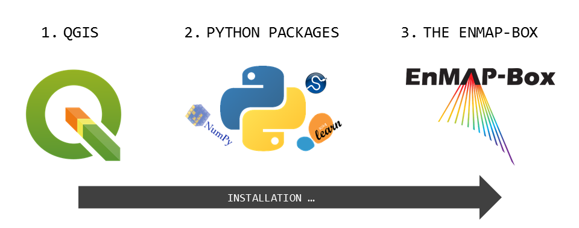

.. include:: /icon_links.rst

.. _usr_installation:

Installation
============

.. |download_link| raw:: html

   <a href="https://plugins.qgis.org/plugins/enmapboxplugin/" target="_blank">https://plugins.qgis.org/plugins/enmapboxplugin/</a>

.. |developer_qgis_plugin_repo| raw:: html

    <a href="https://bytebucket.org/hu-geomatics/enmap-box/wiki/qgis_plugin_develop.xml" target="_blank">https://bytebucket.org/hu-geomatics/enmap-box/wiki/qgis_plugin_develop.xml</a>

.. |icon| image:: ../img/icon.png
   :width: 30px
   :height: 30px

.. |osgeoicon| image:: ../img/OSGeo4W.ico
   :width: 30px
   :height: 30px

.. |osgeoinstaller| image:: ../img/osgeoinstaller.png

The **EnMAP-Box** is a plugin for **QGIS** and requires additional **python packages** that need to be installed independent from QGIS.

..       * :ref:`Windows <install-packages-windows>`
..       * :ref:`Linux <install-packages-linux>`
..       * :ref:`Mac <install-packages-mac>`

....

|

1. Install QGIS
---------------

Install QGIS version 3.16 or higher to run the EnMAP-Box. You can `get QGIS here <https://www.qgis.org/en/site/forusers/download.html>`_.
Additional information on the installation process is provided in the `QGIS Documentation <https://www.qgis.org/en/site/forusers/alldownloads.html>`_.

In case you already have QGIS installed, you can skip this step.

.. .. tip::

..    The installation of additional python packages can be cumbersome, in particular on windows and macOS.
..    You might therefore consider to
..    :ref:`install QGIS in a conda/anaconda environment <dev_installation_create_conda_qgis>`.

....

|

.. _install-python-packages:

2. Install required python packages
-----------------------------------

The EnMAP-Box core plugin requires the following python packages:

* `numpy <http://www.numpy.org/>`_
* `scipy <https://www.scipy.org>`_
* `scikit-learn <http://scikit-learn.org/stable/index.html>`_
* `matplotlib <https://matplotlib.org/>`_
* `astropy <http://docs.astropy.org>`_ (**optional**, relevant e.g. for certain filtering algorithms)

Follow the platform specific installation instructions below in order to install these packages.

.. note::

   Starting with version 3.6 the EnMAP-Box starts without previously installing the required Python packages.
   If needed, these can be installed ad-hoc to the user directory using the Package Installer (:menuselection:`Project --> Package Installer`)
   in order to make the plugin run.

   **However, we still recommend to install the packages as described below!**

   .. image:: /img/package_installer.png

.. _install-packages-windows:

Windows
~~~~~~~

1. Close QGIS, if it is open.

2. Start the OSGeo4W Shell |osgeoicon| with admin rights.

   * Open the start menu :menuselection:`QGIS 3.xx --> OSGeo4W Shell --> Right-Click --> Run as administrator`

     .. image:: ../img/open_osgeoshell.png
        :width: 500px

     .. hint::

        If you used the OSGeo4W Installer to install QGIS, the OSGeo4W Shell will be listed under *OSGeo4W* in the Start Menu

3. Activate the Python 3 environment by entering:

   .. code-block:: batch

      call py3_env.bat

   .. image:: ../img/shell_callpy3env.png

|

4. Install required python packages by entering:

   .. code-block:: batch

      python3 -m pip install -r https://bitbucket.org/hu-geomatics/enmap-box/raw/develop/requirements.txt

   Now all packages will be installed automatically. After completion, the shell should show something like this:

   .. image:: ../img/shell_install_output.png

   If the package installation was successful, you can close the shell. The required packages are installed now and
   you can continue to start/install the EnMAP-Box.

   |

   .. error::

      In case you run into problems because pip is not available in your python environment
      (error message ``C:/.../python3.exe: No module named pip`` or similar), :ref:`follow these steps... <faq_no_pip>`

.. 5. **Optionally**, also install astropy using pip in the OSGeo4W Shell:

..    .. code-block:: batch

..      python3 -m pip install astropy

.. _install-packages-linux:

|

Linux
~~~~~

#. Open the terminal and install all missing packages using pip:

   .. code-block:: batch

      python3 -m pip install -r https://bitbucket.org/hu-geomatics/enmap-box/raw/develop/requirements.txt

   .. error::

      See :ref:`FAQ <faq_requirements>` if you run into problems installing the packages.

.. _install-packages-mac:

|

Mac
~~~

#. Open the terminal and install all missing packages using pip:

.. code-block:: batch

   python3 -m pip install -r https://bitbucket.org/hu-geomatics/enmap-box/raw/develop/requirements.txt

.. caution::

   Starting with QGIS 3.16 the `packaging mechanism changed <https://www.lutraconsulting.co.uk/blog/2020/10/01/qgis-macos-package/>`_,
   so you might have to use this command instead::

   /Applications/QGIS.app/Contents/MacOS/bin/pip3 install -r https://bitbucket.org/hu-geomatics/enmap-box/raw/develop/requirements.txt

.. error::

   See :ref:`FAQ <faq_requirements>` if you run into problems installing the packages.

....

.. _usr_installation_enmapbox:

3. Install or update the EnMAP-Box
----------------------------------

Install from QGIS plugin repository
~~~~~~~~~~~~~~~~~~~~~~~~~~~~~~~~~~~

#. Open QGIS and go to :menuselection:`Plugins --> Manage and Install Plugins --> All`
#. In the search bar enter ``enmap`` or ``EnMAP-Box 3``
#. Now the EnMAP-Box should be listed in the plugin list:

   .. figure:: ../img/pluginmanager_all.PNG

   Select it and click :guilabel:`Install plugin` (or :guilabel:`Upgrade` in case you update to a new version)
#. Start the EnMAP-Box via the |icon| icon or from the menubar :menuselection:`Raster --> EnMAP-Box`

.. admonition:: Experimental version

   It is also possible to install the most recent develop version of the EnMAP-Box. To do so, make sure that the option
   |cb1| **Show also experimental plugins** is activated in the plugin manager settings. Once activated, there is an additional button
   :guilabel:`Install Experimental Plugin` in the plugin manager.

   .. image:: /img/experimental_install.png

   .. warning::

      As the *experimental* tag suggests, this version comes with the newest features and developments, but might also be prone to bugs and crashes.

Install older version
~~~~~~~~~~~~~~~~~~~~~

#. Go to the QGIS Python Plugins Repository |download_link|
#. Click on the **Versions** tab to see all available version.
#. Click on the desired version and on the next page click |download|
#. It is recommended to uninstall previous EnMAP-Box versions (delete folder manually, or in QGIS via
   :menuselection:`Plugins --> Manage and Install Plugins --> Installed --> EnMAP-Box 3 --> Uninstall plugin`)
#. Open :menuselection:`Plugins --> Manage and Install Plugins --> Install from ZIP`.
#. Press :guilabel:`...` and select the downloaded zip file
   (:file:`enmapboxplugin.3.x.YYYYMMDDTHHMM.QGIS3.zip`) and click :guilabel:`Install plugin`.
#. Start the EnMAP-Box via the |icon| icon or from the menubar :menuselection:`Raster --> EnMAP-Box`.

|

