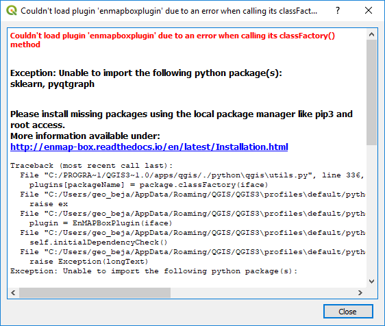

Installation
============

.. |icon| image:: ../img/icon.png
   :width: 30px
   :height: 30px

.. note:: * The EnMAP-Box plugin requires QGIS Version 3.0 or higher
          * You can get QGIS `here <https://www.qgis.org/en/site/forusers/download.html>`_

.. important:: :ref:`Additional python packages <Package requirements>` are needed and some of them are not delivered with the standard QGIS python environment,
               hence they have to be installed. Follow platform-specific advices below.

1. Download the latest EnMAP-Box from `<https://bitbucket.org/hu-geomatics/enmap-box/downloads/>`_.
2. Start QGIS 3 and open Plugins > Manage and Install Plugins > Install from ZIP.
3. Select the downloaded *enmapboxplugin.3.x.YYYYMMDDTHHMM.QGIS3.zip* and start *Install plugin*.
4. Start the EnMAP-Box via the |icon| icon. In case of missing requirements you should see an error message like

    |missing_package_warning|

    In that case please read the next section to install missing packages.

Install package requirements
----------------------------

The python packages listed in Table XXX need to be available in the QGIS python for running the EnMAP-Box. Depending on your operating system you might need to install them with different installers.

=============================================================== ========= ============ ================= =================
Package                                                         Notes     Windows      Linux             macOS
                                                                          (OSGeo4W)    (apt-get)
=============================================================== ========= ============ ================= =================
`scipy <https://www.scipy.org>`_                                OS        python-scipy python-scipy      pip
`setuptools <https://pypi.python.org/pypi/setuptools>`_         OS        setuptools   python-setuptools pip
`matplotlib <https://matplotlib.org/>`_                         OS        pip          pip               pip
`pyqtgraph <https://pypi.python.org/pypi/pip>`_                 pip       pip          pip               pip
`scikit-learn <https://pypi.python.org/pypi/pip>`_              pip       pip          pip               pip
=============================================================== ========= ============ ================= =================

    * *OSGeo4W* = package name to be installed using the OSGeo4W installer for QGIS on windows systems.
    * *Linux* = package name to be installed using apt-get on Linux (tested on Ubuntu).
    * *default* = usually already installed with QGIS
    * *OS* = platform-specific installation, see columns for Windows / Linux / macOS
    * *pip* = can be installed with `pip <https://pip.pypa.io>`_
      (the `preferred installer <https://packaging.python.org/guides/tool-recommendations/>`_ to install python packages).

Windows
~~~~~~~

#. Close QGIS, if it has been opened.

#. Start the OSGeo4W Shell with admin rights.
   Either open the windows start Menu > QGIS 3.0 > OSGe4W Shell or navigate into the QGIS root folder and call ``C:\Program Files\QGIS 3.0\OSgeo4W.bat``. Don't forget to use the context menu option "Start as Administrator".

#. Activate the Python 3 Environment calling:

    .. code-block:: batch

        call py3_env.bat

#. To install packages like ``setup-tools``, ``scipy`` or ``matplotlib``, call ``setup`` and start the OSGeo4W installer. Then

    * Advanced Installation

    * Installation from Internet

    * default OSGeo4W root directory

    * local temp directory

    * direct connection

    * Downloadsite: ``http://download.osgeo.ogr``

    Now use the textbox to filter, select and finally install the following packages:

    .. code-block:: batch

                  python-setuptools
                  python-numpy
                  python-pip
                  python-scipy
                  matplotlib

#. To install other packages, like ``pyqtgraph`` and ``sklearn`` use ``pip``

    .. code-block:: batch

        python3 -m pip install pyqtgraph
        python3 -m pip install sklearn

    Alternatively you unzip the EnMAP-Box plugin zip and call:

    .. code-block:: batch

       python3 -m pip install -r C:\Downloads\enmapboxplugin.3.X.YYYYTMMDDHHMM.QGIS3\enmapboxplugin\requirements.txt

Linux
~~~~~

.. todo:: Linux installation of a recent QGIS 3 version (not tested yet)

Mac
~~~

#. Open the terminal and install all missing packages using pip:

    .. code-block:: bash

        python3 -m pip install scipy
        python3 -m pip install matplotlib
        python3 -m pip install sklearn
        python3 -m pip install pyqtgraph

    Alternatively use the ``pip -r option:

    .. code-block:: bash

        python3 -m pip install ~/Downloads/enmapboxplugin.3.X.YYYYTMMDDHHMM.QGIS3\enmapboxplugin\requirements.txt``

