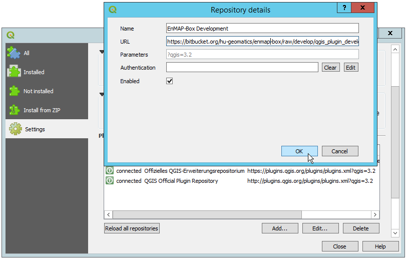

.. _usr_installation:

Installation
============

.. |download_link| raw:: html

   <a href="https://bitbucket.org/hu-geomatics/enmap-box/downloads/" target="_blank">HERE</a>

.. |download_link2| raw:: html

   <a href="https://bitbucket.org/hu-geomatics/enmap-box/downloads/" target="_blank">https://bitbucket.org/hu-geomatics/enmap-box/downloads/</a>

.. |icon| image:: ../img/icon.png
   :width: 30px
   :height: 30px

.. |osgeoicon| image:: ../img/OSGeo4W.ico
   :width: 30px
   :height: 30px

.. |osgeoinstaller| image:: ../img/osgeoinstaller.png

.. important::

     * The EnMAP-Box plugin requires **QGIS Version 3.0** or higher

      **AND**

     * **Additional python packages** are needed and some of them are not delivered with the standard QGIS python environment,
       hence they have to be installed manually.

       Follow installation instructions depending on your operating system:

       * :ref:`Windows <install-packages-windows>`
       * :ref:`Linux <install-packages-linux>`
       * :ref:`Mac <install-packages-mac>`

....

|

Install QGIS (if required)
--------------------------
The EnMAP-Box is a plugin for QGIS and therefore QGIS version 3 or higher has to be installed. In case you have not installed
it yet, you can get QGIS `here <https://www.qgis.org/en/site/forusers/download.html>`_.

For additional information on the installation you might want to have a look at the
`QGIS Documentation <https://www.qgis.org/en/site/forusers/alldownloads.html>`_.

....

|

.. _install-python-packages:

Install python packages (if required)
-------------------------------------

The EnMAP-Box requires the following python packages in order to run:

* `scipy <https://www.scipy.org>`_
* `setuptools <https://pypi.python.org/pypi/setuptools>`_
* `matplotlib <https://matplotlib.org/>`_
* `pyqtgraph <http://pyqtgraph.org/>`_
* `scikit-learn <http://scikit-learn.org/stable/index.html>`_
* `astropy <http://docs.astropy.org>`_ (**optional**, relevant e.g. for certain filtering algorithms)

Most of them do not come with the default QGIS installation. Follow the platform-specific installation instructions
below in order to install them, in case you have not done so already.

.. _install-packages-windows:

Windows
~~~~~~~

#. Close QGIS, if it has been opened.

#. Start the OSGeo4W Shell |osgeoicon| with admin rights.

   * :menuselection:`Start Menu --> QGIS 3.xx --> OSGeo4W Shell --> Right-Click --> Run as administrator`

     .. image:: ../img/open_osgeoshell.png
        :width: 500px

     .. hint::

        If you used the OSGeo4W Installer to install QGIS, the OSGeo4W Shell will be listed under *OSGeo4W* in the Start Menu

#. Activate the Python 3 Environment calling:

    .. code-block:: batch

        call py3_env.bat

    .. image:: ../img/shell_callpy3env.png

#. To install packages like *setup-tools*, *scipy* or *matplotlib*, start the OSGeo4W installer by calling

    .. code-block:: batch

        setup

    .. image:: ../img/shell_setup.png

    |
    Which should open up the following dialog:

    .. image:: ../img/osgeosetup.png

    |
    .. tip::

       Visit `OSGeo FAQ page <https://trac.osgeo.org/osgeo4w/wiki/FAQ>`_ for information on the installer.

    Now navigate through the first pages of the dialog, by selecting the following settings (see animated Figure below for help):

    * Advanced Installation :guilabel:`Next`

    * Installation from Internet :guilabel:`Next`

    * default OSGeo4W root directory :guilabel:`Next`

    * local temp directory :guilabel:`Next`

    * direct connection :guilabel:`Next`

    * Select downloadsite ``http://download.osgeo.ogr`` :guilabel:`Next`

    |
    Then use the textbox to filter, select and install the following packages:

    * setuptools
    * python3-numpy
    * python3-pip
    * python3-scipy
    * python3-matplotlib

    Click on the |osgeoinstaller| symbol once, which should usually change the *Skip* setting to installing the most recent
    version. Only **AFTER** having selected **ALL** required packages, click :guilabel:`Next`.

    .. figure:: ../img/osgeoinstall.gif

         Animated walkthrough for the OSGeo4W Setup

#. Install the remaining python packages using ``pip`` in the OSGeo4W Shell

    .. code-block:: batch

        python3 -m pip install pyqtgraph
        python3 -m pip install scikit-learn
        python3 -m pip install astropy

    .. image:: ../img/shell_pipinstall.png

.. _install-packages-linux:

|

Linux
~~~~~

.. note:: Tested on Ubuntu 18.04

#. Open the terminal and install all missing packages using pip:

    .. code-block:: bash

        python3 -m pip install scipy
        python3 -m pip install matplotlib
        python3 -m pip install scikit-learn
        python3 -m pip install pyqtgraph
        python3 -m pip install astropy

.. _install-packages-mac:

|

Mac
~~~

#. Open the terminal and install all missing packages using pip:

    .. code-block:: bash

        python3 -m pip install scipy
        python3 -m pip install matplotlib
        python3 -m pip install scikit-learn
        python3 -m pip install pyqtgraph
        python3 -m pip install astropy

....

|

Install or update the EnMAP-Box
-------------------------------

Install from Repository (recommended)
~~~~~~~~~~~~~~~~~~~~~~~~~~~~~~~~~~~~~

#. Open QGIS and open *Plugins > Manage and Install Plugins > Settings*
#. Add https://bytebucket.org/hu-geomatics/enmap-box/wiki/qgis_plugin_develop.xml as additional plugin repository
   (scroll down and click on :guilabel:`Add...`)
#. Restart QGIS or click :guilabel:`Reload all repositories` to get aware of EnMAP-Box updates
#. Now the EnMAP-Box should be listed in the plugin list, where you can select it and click :guilabel:`Install plugin`
   (or :guilabel:`Upgrade plugin` in case you update to a new version)

   Adding a custom repository in the QGIS plugins menu

Install from ZIP
~~~~~~~~~~~~~~~~

#. Download the latest EnMAP-Box from |download_link2|.
#. It is recommended to uninstall previous EnMAP-Box versions (delete folder manually, or in QGIS via *Plugins* > *Manage and Install Plugins*
   > *Installed* > *EnMAP-Box 3* > *Uninstall plugin*)
#. Open *Plugins* > *Manage and Install Plugins* > *Install from ZIP*.
#. Select the downloaded *enmapboxplugin.3.x.YYYYMMDDTHHMM.QGIS3.zip* and click :guilabel:`Install plugin`.

   .. image:: ../img/installfromzip.png

   .. caution::
      This may take a few moments!

#. Start the EnMAP-Box via the |icon| icon or from the menubar *Raster* > *EnMAP-Box*.

