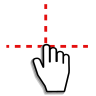
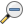
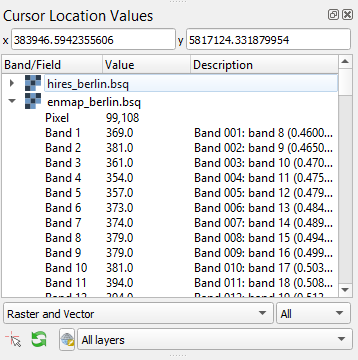

.. toolbar buttons
.. |add_datasource| image:: ../../../enmapbox/gui/ui/icons/add_datasource.svg
   :width: 27px
.. |viewlist_mapdock| image:: ../../../enmapbox/gui/ui/icons/viewlist_mapdock.svg
   :width: 27px
.. |viewlist_spectrumdock| image:: ../../../enmapbox/gui/ui/icons/viewlist_spectrumdock.svg
   :width: 27px
.. |viewlist_textview| image:: ../../../enmapbox/gui/ui/icons/viewlist_textview.svg
   :width: 27px

.. |mActionZoomIn| image:: ../../../enmapbox/gui/ui/icons/mActionZoomIn.svg
   :width: 27px

.. |mActionPan| image:: ../../../enmapbox/gui/ui/icons/mActionPan.svg
   :width: 27px
.. |pickrasterspectrum| image:: ../../../enmapbox/gui/speclib/icons/pickrasterspectrum.svg
   :width: 27px

.. || image:: ../../../enmapbox/gui/ui/icons/
   :width: 27px

.. Data Sources Panel
.. |mActionAdd| image:: ../../../enmapbox/gui/ui/icons/mActionAdd.svg
   :width: 27px

.. |mActionCollapseTree| image:: ../../../enmapbox/gui/ui/icons/mActionCollapseTree.svg
   :width: 27px
.. |mActionExpandTree| image:: ../../../enmapbox/gui/ui/icons/mActionExpandTree.svg
   :width: 27px
.. |mActionRefresh| image:: ../../../enmapbox/gui/ui/icons/mActionRefresh.svg
   :width: 27px
.. |mIconRasterLayer| image:: ../../../enmapbox/gui/ui/icons/mIconRasterLayer.svg
   :width: 27px
.. |mIconLineLayer| image:: ../img/mIconLineLayer.svg
   :width: 27px
.. |speclib| image:: ../../../enmapbox/gui/speclib/icons/speclib.svg
   :width: 27px

.. scatterplot tool
.. |action| image:: ../img/action.svg
   :width: 40px

.. |reset_plot| image:: ../img/pyqtgraph_reset.png
   :width: 15px

.. cursorlocationvalues
.. |select_crs| image:: ../img/mActionSetProjection.svg
   :width: 27px

###########
User Manual
###########

The GUI
#######

Toolbar
=======

In the toolbar you can find the most common tasks. See table below for information on different buttons and their functionality.

.. list-table::
   :widths: auto
   :header-rows: 1

   * - Button
     - Button Name
     - Description
   * - |add_datasource|
     - Adds a data source
     - | Here you can add data from different sources,
       | e.g. raster and vector
   * - |viewlist_mapdock|
     - Open a map window
     - Opens a new Map Window
   * - |viewlist_spectrumdock|
     - | Open a spectral
       | library window
     - Opens a new spectral library window
   * - |viewlist_textview|
     - Open a text window
     - | Opens a new text window, you can for example
       | use it to store metadata, take notes etc.
   * - |mActionZoomPoint|
     - Move to point
     - | This tool will move the center of the map
       | view to the pixel you click on
   * - |mActionZoomIn|
     - Zoom In
     - | Increases the zoom level. You can also scroll
       | the mouse wheel forward.
   * - |mActionZoomOut|
     - Zoom Out
     - | Decreases the zoom level. You can also scroll
       | the mouse wheel backwards.
   * - |mActionZoomActual|
     - | Zoom to native
       | resolution
     - Zoom to the native resolution
   * - |mActionZoomFullExtent|
     - Zoom to full extent
     - | Changes the zoom level so that the image
       | is displayed in full extent
   * - |mActionPan|
     - Pan Map
     - Moves the map. Can also be achieved by holding the mouse wheel
   * - |pickrasterspectrum|
     - | Select pixel profiles
       | from map
     - | Opens spectral library window (if not opened yet) and
       | plots the spectral profile of the selected pixel
   * - |mActionIdentify|
     - Identify
     - | Cursor Location Values. Shows pixel values of
       | all layers at the selected position.

Data Sources
============

The Data Sources panel lists the data in your current project, comparable to the Layers panel in QGIS. The following data types and their
corresponding metadata are available:

* |mIconRasterLayer| Raster Data

  * **File size**: Metadata on resolution and extent of the raster
  * **CRS**: Shows Coordinate Reference System (CRS) information
  * **Bands**: Information on overall number of bands as well as band-wise metadata such as name, class or wavelength (if available)

    .. note::

       Depending on the type, raster layers will be listed with different icons:

       * |mIconRasterImage| for default raster layers (continuous value range)
       * |mIconRasterMask| for mask raster layers
       * |mIconRasterClassification| for classification raster layers

       Also see section on :ref:`data types <processing_data_types>` for further information.

* |mIconLineLayer| Vector Data

  * **File size**: Shows the file size and extent of the vector layer
  * **CRS**: Shows Coordinate Reference System (CRS) information
  * **Features**: Information on number of features and geometry types
  * **Fields**: Attribute information, number of fields as well as field names and corresponding datatype
  |

* |speclib| Spectral Libraries

  * **File size**: Size of the file on hard disk
  * **Profiles**: Shows the number of spectra in the library
  |

* Models

**Buttons of the Data Sources panel:**

.. list-table::
   :widths: auto
   :align: left
   :header-rows: 1

   * - Button
     - Description
   * - |mActionAdd|
     - | This button lets you add data from different sources,
       | e.g. raster and vector.
       | Same function as |add_datasource|.
   * - |mActionRemove|
     - | Remove layers from the Data Sources panel. First
       | select one or more and then click the remove button.
   * - |mActionCollapseTree|
     - | Collapses the whole menu tree, so that only
       | layer type groups are shown.
   * - |mActionExpandTree|
     - | Expands menu tree to show all branches.
   * - |mActionRefresh|
     - Synchronizes Data Sources with QGIS.

.. tip::

   * If you want to remove all layers of a type at once (e.g. Raster Data), :menuselection:`right-click on Raster Data --> Clear`
   * The EnMAP-Box also **supports Tile-/Web Map Services** (e.g. Google Satellite or OpenStreetMap) as a raster layer. Just add them to
     your QGIS project as you normally would, and then click the |mActionRefresh| :superscript:`Synchronize Data Sources with QGIS`
     button. Now they should appear in the data source panel and can be added to a Map View.

Data Views
==========

The Data Views panel organizes the different windows and their content.

.. figure:: ../img/example_data_views.png

   Example of how different window types and their contents are organized in the Data Views panel. In this case there
   are two Map Windows and one Spectral Library Window in the project.

Map Window |viewlist_mapdock|
~~~~~~~~~~

.. can display raster and vector data (+ layer styling as is QGIS)
.. a variety of alignment options (maybe show animated gif)

**Linking**

**Crosshair**

Spectral Library Window |viewlist_spectrumdock|
~~~~~~~~~~~~~~~~~~~~~~~

Text Window |viewlist_textview|
~~~~~~~~~~~

Processing Toolbox
==================

The processing toolbox is basically the same panel as in QGIS, i.e. it is mirrored into the EnMAP-Box GUI. Here you can find all the
processing algorithms that come with the EnMAP-Box listed under *EnMAP-Box*. In case it is closed/not visible you can open
it via :menuselection:`View --> Panels --> QGIS Processing Toolbox`.

See `QGIS Documentation - The toolbox <https://docs.qgis.org/2.18/en/docs/user_manual/processing/toolbox.html>`_ for further information.

Cursor Location Values
======================

This tools lets you inspect the values of a layer or multiple layers at the location where you click in the map view. To select a location (e.g. pixel or feature)
select the :guilabel:`Select Cursor Location` or the |mActionIdentify| :superscript:`Identify` button and click somewhere in the map view.

* The Cursor Location Value panel should open automatically and list the information for a selected location. The layers will be listed in the order they appear in the Map View.
  In case you do not see the panel, you can open it via :menuselection:`View --> Panels --> Cursor Location Values`.

* By default, raster layer information will only be shown for the bands which are mapped to RGB. If you want to view all bands, change the ``RGB`` setting
  to ``All`` (right dropdown menu). Also, the first information is always the pixel coordinate (column, row).
* You can select whether location information should be gathered for ``All layers`` or only the ``Top layer``. You can further
  define whether you want to consider ``Raster and Vector`` layers, or ``Vector only`` and ``Raster only``, respectively.
* Coordinates of the selected location are shown in the ``x`` and ``y`` fields. You may change the coordinate system of the displayed
  coordinates via the |select_crs| :superscript:`Select CRS` button (e.g. for switching to lat/long coordinates).

|
|
|

Tools
######

Scatter Plot
============

The Scatter Plot tool allows you to plot the values of two bands against each other. You can specify the following settings:

 * **Band X:** Choose the raster (first dropdown menu) and the band (second dropdown menu) to be plotted on the X-axis.
   ``Min`` and ``Max`` depict the limits of the axis. By default, Min and Max will be automatically derived. You can also
   manually specify the limits of the axis by entering another value.
 * **Band Y:** Same as above, just for the Y-axis.
 * **Mask (optional):** You can specify a mask here, so that pixels which are covered by the mask will not be included in the
   scatterplot.
 * **Accuracy:** Can either be set to *Estimated (faster)* or *Actual (slower)*. Defines whether to use a subset of pixels for calculation
   or all of them.
 * **Number of Bins:** Defines the number of bins in x and y direction.

After you entered all settings, click the |action| button to create the plot.

.. figure:: ../img/scatterplot_tool.png

   Screenshot of the Scatter Plot Tool

**Scatterplot Navigation**

* The plot window is interactive, which means you can zoom in and out using the mouse.
* Reset the plot window to the default zoom level by clicking the |reset_plot| button in the lower left of the plot window.
* Right-clicking inside the plot offers you several additional options.
* Change the color scheme of the plot by right-clicking into the color bar on the right.

**ROI**

The ROI option allows you to select a rectangular region in the scatterplot, for which the density distribution will be
displayed in a second plot window below.

* Click the :guilabel:`ROI` button to open up the ROI functionality. Mind how a small rectangle |roi| appears at the bottom left of the plot
  (usually between the values 0 and 10, depending on your axis scaling you have to zoom in order to see it properly). Clicking and holding the circle
  allows you to change the rotation of the rectangle, while clicking and holding the square you can change the size of it.
* Close the ROI mode by clicking on the :guilabel:`ROI` button again.

.. _metadata_editor:

Metadata editor
===============

Reclassify
==========

Raster Builder
==============

Applications
############

ImageMath
=========

Image Statistics
================

Synthmix Regression Mapper
==========================

.. _classification_workflow:

Classification Workflow
=======================

EO Time Series Viewer
=====================

Please visit `Read the Docs - EO Time Series Viewer <https://eo-time-series-viewer.readthedocs.io/en/latest/>`_ for more information.

Agricultural Applications
=========================

IVVRM
~~~~~

**Interactive Visualization of Vegetation Reflectance Models:**

|
|
|

.. _processing_data_types:

Processing Data Types
#####################

Raster
======

* Can be any `GDAL readable raster format <https://www.gdal.org/formats_list.html>`_

.. Any GDAL readable raster
.. no data wert wichtig (band-wise) -> hinweis auf metadata editor: auslesen und ändern dieses wertes

.. warning:: If no nodata value is defined, GDAL will automatically assume 0, which might lead to artifacts at the image edges.
             Therefore always specify the nodata value, band-wise if necessary. You might use the :ref:`Metadata Editor <metadata_editor>` for this.

Vector
======

* Can be any `OGR readable vector format <https://www.gdal.org/ogr_formats.html>`_
* A vector layer is a list of features, where every feature consists of a geometry and attributes
.. Layer from any OGR readable vector dataset
.. brief intro into vector layer (geometry + attribute) = feature
.. Layer besteht aus liste von features, jedes feature geometry + attributes
.. screenshot_ layer+ attributtabelle

.. figure:: ../img/example_vectordata.png

   Example of the vector dataset :ref:`landcover_berlin_polygon.shp <shp_berlingradient>` from the test dataset with
   geometries (i.e. polygon) and corresponding attribute table.

Mask
====

Any GDAL/OGR readable raster or vector file can be interpreted as a boolean mask.

    * In case of a raster, all pixels that are equal to the no data value (default is 0) are interpreted as False, all other pixels as True.
      Multiband rasters are first evaluated band wise. The final mask for a given pixel is True, if all band wise masks for that pixel are True.

    .. list-table::
       :name: rastermasks
       :align: left
       :header-rows: 1

       * - Image
         - Mask Layer (Raster)
         - Binary Mask
       * - |mask_image|
         - |hires|
         - |mask_raster|

    * In case of a vector, all pixels covered by features are interpreted as True, all other pixels as False. This means:

      * ... for point features: If point falls inside the pixel, it is mapped to True
      * ... for line features: If pixel is on line render path, it is mapped to True
      * ... for polygon features: If the center of the pixel is within the polygon, the pixel is mapped to True

    .. list-table::
       :name: vectormasks
       :align: left
       :header-rows: 1

       * - Image
         - Mask Layer (Vector)
         - Binary Mask
       * - |mask_image|
         - |poly|
         - |mask_poly|
       * - |mask_image|
         - |points|
         - |mask_point|
       * - |mask_image|
         - |line|
         - |mask_line|

.. |mask_poly| image:: ../img/mask_examples/mask_poly.png
.. |points| image:: ../img/mask_examples/points.png

.. |line| image:: ../img/mask_examples/line.png
.. |mask_line| image:: ../img/mask_examples/mask_line.png
.. |hires| image:: ../img/mask_examples/hires.png

Classification
==============

* A classification is a representation of a map holding categorical information.
* 0 will be implicitly assumed as nodata value
* Metadata for class names and colors are saved in the ENVI metadata domain (``class names``, ``class lookup``). If those
  parameters are not defined, classes will be numbered consecutively and random colors will be used.
* The class *unclassified* is always expected to be 0 and will be treated as nodata.

  .. figure:: ../img/classification_metadata.png

     Example of the metadata of a classification image viewed in the :ref:`Metadata Editor <metadata_editor>`

.. figure:: ../img/example_classification.png
   :height: 440px

   Example of a classification image with corresponding classes, derived from the EnMAP test dataset

.. is a representation of a map holding categorical information
.. screenshot + tabelle mit required metadata

.. 1 kanal rasterbild (minimalanforderung)
.. optional: metadaten für klassennamen und farben (in der ENVI Metadatendomäne [key: class names, class lookup]
.. wenn nicht gesetzt, werden klassen durchnummeriert und farben random gesetzt
.. wenn float datensatz: verhalten unklar (TODO), möglichkeit: wenn float, fehlermeldung, oder wenn ganzzahl trotzdem als classification?
.. ABER wenn float und metadaten gesetzt -> OK
.. als no data wert wird implizit immer 0 angenommen
.. unclassified klasse ist immer ID0 und wird immer als nodata behandelt

Regression
==========

* A regression is a representation of a map holding quantitative information.
* The number of bands and the band names are dependent on the number of response variables.
* The nodata value has to be defined
* Band names are stored in the GDAL band descriptions

.. is a representation of a map holding quantitative information
.. multiband raster, bandnames sind namen der targets variables
.. muss zwingend nodata wert gesetzt haben
.. band namen sind gdal band descriptions (auch ersichtlich in metadtane editor)

Fraction
========

* Special form of regression, where the quantitative information is representing class fractions (relative coverage of a class inside a pixel).
* Optional: Metadata for class names and colors are stored in the ENVI metadata domain (``class names``, ``class lookup``).
  In this case there is no *unclassified* class (compared to Classification)

  .. figure:: ../img/fraction_metadata.png

     Example of the metadata of a fraction image viewed in the :ref:`Metadata Editor <metadata_editor>`

.. muss zwingend nodata wert gesetzt haben
..  bedingungen regression
.. optional: metadaten für klassennamen und farben (in der ENVI Metadatendomäne [key: class names, class lookup]
.. beachten: hier keine unclassified klasse! (vgl. classification)

.. figure:: ../img/example_fraction.png
   :height: 440px

   Example of a fraction image holding class fraction information visualized in RGB,
   where *R = percent impervious*, *G = percent low vegetation* and *B = percent tree*

Spectral Library
================

.. screenshot von der tetslibrary im speclib viewer

.. Auxillary -> Import Library

.. für csv files und hdr beispiel code block von testdaten

Labelled Spectral Library
=========================

The labelled spectral library extents the default .sli format by adding additional information to the spectra (e.g., class labels, class colors).
This information is stored by adding a .csv and .json file to the default spectral library, so that the labelled spectral library consists of

* .sli file (ENVI standard)
* .hdr file (ENVI standard)
* .csv file (containing the additional information)

  * should be comma-separated csv
  * should have same basename as .sli file
  * first row stores the headers, where the first element has to be the spectra names as specified in the .hdr file:
  .. code-block:: csv

     spectra names, attribute1, attribute2

  * Example from the EnMAP-Box test dataset:

    .. figure:: ../img/speclib_csv_example.png
       :width: 100%

* .json file (class name and class color information)

  * should have same basename as .sli file
  * class name and color information has to be provided for every attribute in the csv:
  .. code-block:: json

    {
        "attribute_name": {
          "names":  ["name1", "name2", "name3", "name4"],
          "colors": [[230, 0, 0],  [56, 168, 0], [168, 112, 0], [0,100,255]]
        }
    }
  * The keys ``names`` and ``colors`` should not be altered. But change ``attibute_name`` according to your data.
  * Example from the EnMAP-Box test dataset:

    .. figure:: ../img/speclib_json_example.png
       :width: 100%

.. aufbau: .sli + .hdr + csv

.. hdr: (ENVI standard) wichtig wavelength information

.. csv header names referenzieren zu spectra names in hdr datei

.. zweite csv:
.. classification case: Klassenname; KLassenname (rgb tuple) ,basename.attributname.classdef.csv

.. regression case: klasse + farbtuple + nodata wert  , basename.attributname.regrdef.csv

Models
======

* Certain algorithms produce output files with model information stored as **.pkl** file (e.g. algorithms starting with *Fit ...*)
* There 4 kinds of model files: **Classifiers**, **Clusterers**, **Regressors** and **Transformers**.
* The content of those files can be inspected in the Data Sources panel

.. note::

   You can generate example model files which are based on the EnMAP-Box test dataset. In the processing algorithms under
   *EnMAP-Box -> Auxilliary* you can find one algorithm for each kind of model file:
     * Create Test Classifier (RandomForest)
     * Create Clusterer (KMeans)
     * Create Regressor (RandomForest)
     * Create Transformer (PCA)

.. Erwähnen dass manche Algorithmen Regressoren;Klassifikatoren etc. generieren

.. jede kategorie anlegen unterübschrift, screenshot (random forest als beispiel, clusterer kmeans, transformer pca)

|
|
|

.. include:: ../geoalgorithms/ga.rst

.. _test_dataset:

Test dataset
############

.. note::

   For opening the test dataset go to the menubar :menuselection:`Project --> Load Example Data`

   .. image:: ../img/gui_loadexampledata.png

   If you try to open the test dataset for the first time, you will be asked to download the data from the repository:

   .. figure:: ../img/gui_downloadtestdata.png

   After you downloaded the dataset, you can also use the processing algorithm *Open Test Maps* (in *Auxillary*) to open the dataset.

**EnMAP (30m; 177 bands):**

File name: *enmap_berlin.bsq*

Simulated EnMAP data (based on 3.6m HyMap imagery) acquired in August 2009 over south eastern part of Berlin. It has a spectral resolution of 177 bands and a spatial resolution of 30m.

**HyMap (3.6m; Blue, Green, Red bands)**

File name: *hires_berlin.bsq*

HyMap image acquired in August 2009 over south eastern part of Berlin. This dataset was reduced to 3 bands for true color display. The spatial resolution is 3.6m.

**LandCover Vector Layer (Polygon):**

File name: *landcover_berlin_polygon.shp*

Polygon shapefile containing land cover information on three classification levels. Derived from very high resolution aerial imagery and cadastral datasets.

 * Level 1 classes: Impervious, Vegetation, Soil, Water
 * Level 2 classes: Impervious, Low Vegetation, Soil, Tree, Water
 * Level 3 classes: Roof, Pavement, Low Vegetation, Soil, Tree, Water

**LandCover Vector Layer (Point):**

File name: *landcover_berlin_point.shp*

Point shapefile containing land cover information on two classification levels.

 * Level 1 classes: Impervious, Vegetation, Soil, Water
 * Level 2 classes: Impervious, Low Vegetation, Soil, Tree, Water

**Spectral Library:**

File name: *library_berlin.sli*

Spectral library with 75 spectra (material level, level 2 and level 3 class information)

.. figure:: ../img/testdata_speclib.PNG
   :width: 100%

   library_berlin.sli opened in the EnMAP-Box Spectral Library Window

