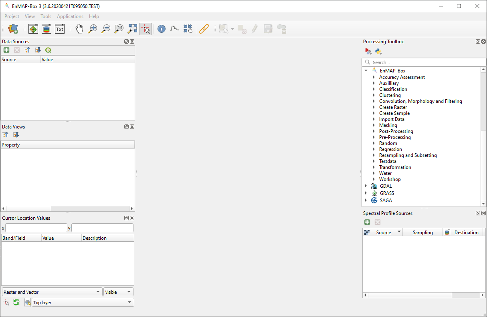
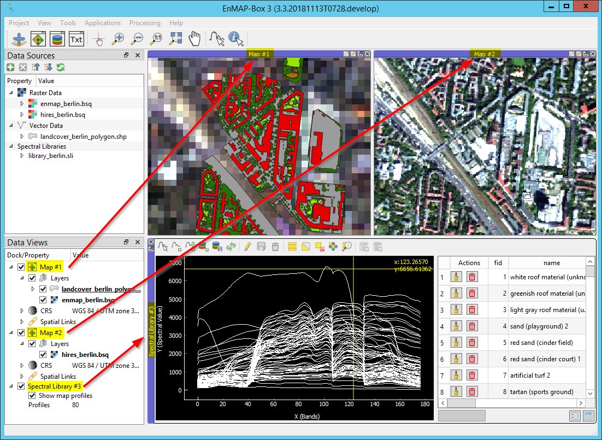
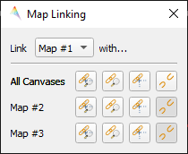

.. include:: /icon_links.rst

.. _gui:

The GUI
*******

Toolbar
=======

In the toolbar you can find the most common tasks. See table below for information on different buttons and their functionality.

.. list-table::
   :widths: auto
   :header-rows: 1

   * - Button
     - Button Name
     - Description
   * - |mActionDataSourceManager|
     - Adds a data source
     - | Here you can add data from different sources,
       | e.g. raster and vector
   * - |viewlist_mapdock|
     - Open a map window
     - Opens a new Map Window
   * - |viewlist_spectrumdock|
     - | Open a spectral
       | library window
     - Opens a new spectral library window
   * - |viewlist_textview|
     - Open a text window
     - | Opens a new text window, you can for example
       | use it to store metadata, take notes etc.
   * - |mActionPan|
     - Pan Map
     - | Moves the map. Can also be
       | achieved by holding the mouse wheel
   * - |mActionZoomIn|
     - Zoom In
     - | Increases the zoom level. You can also scroll
       | the mouse wheel forward.
   * - |mActionZoomOut|
     - Zoom Out
     - | Decreases the zoom level. You can also scroll
       | the mouse wheel backwards.
   * - |mActionZoomActual|
     - | Zoom to native
       | resolution
     - Zoom to the native resolution
   * - |mActionZoomFullExtent|
     - Zoom to full extent
     - | Changes the zoom level so that the image
       | is displayed in full extent
   * - |select_location|
     - Identify
     - | Identify loactions on the map where you click.
       | Use the three options on the right to specify
       | what to identify
   * - |mActionIdentify|
     - Identify cursor location value
     - | Cursor Location Values. Shows pixel values of
       | all layers at the selected position.
   * - |profile|
     - | Select pixel profiles
       | from map
     - | Opens spectral library window (if not opened yet) and
       | plots the spectral profile of the selected pixel
   * - |pan_center|
     - Center map on clicked location
     - | This tool will move the center of the map
       | view to the pixel you click on
   * - |link_basic|
     - | Specify the linking between
       | different maps
     - Opens the Map Linking Dialog

Data Sources
============

The Data Sources panel lists the data in your current project, comparable to the Layers panel in QGIS. The following data types and their
corresponding metadata are available:

* |mIconRasterLayer| Raster Data

  * **File size**: Metadata on resolution and extent of the raster
  * **CRS**: Shows Coordinate Reference System (CRS) information
  * **Bands**: Information on overall number of bands as well as band-wise metadata such as name, class or wavelength (if available)

    .. note::

       Depending on the type, raster layers will be listed with different icons:

       * |mIconRasterImage| for default raster layers (continuous value range)
       * |mIconRasterMask| for mask raster layers
       * |mIconRasterClassification| for classification raster layers

       Also see section on :ref:`data types <processing_data_types>` for further information.

* |mIconLineLayer| Vector Data

  * **File size**: Shows the file size and extent of the vector layer
  * **CRS**: Shows Coordinate Reference System (CRS) information
  * **Features**: Information on number of features and geometry types
  * **Fields**: Attribute information, number of fields as well as field names and corresponding datatype

* |speclib| Spectral Libraries

  * **File size**: Size of the file on hard disk
  * **Profiles**: Shows the number of spectra in the library

* |processingAlgorithm| Models

|

**Buttons of the Data Sources panel:**

.. list-table::
   :widths: auto
   :align: left
   :header-rows: 1

   * - Button
     - Description
   * - |mActionAdd|
     - | This button lets you add data from different sources,
       | e.g. raster and vector.
       | Same function as |add_datasource|.
   * - |mActionRemove|
     - | Remove layers from the Data Sources panel. First
       | select one or more and then click the remove button.
   * - |mActionCollapseTree|
     - | Collapses the whole menu tree, so that only
       | layer type groups are shown.
   * - |mActionExpandTree|
     - | Expands menu tree to show all branches.
   * - |qgis_icon|
     - Synchronizes Data Sources with QGIS.

.. tip::

   * If you want to remove all layers at once, right-click in the Data Sources panel and and select :guilabel:`Remove all DataSources`
   * The EnMAP-Box also supports Tile-/Web Map Services (e.g. Google Satellite or OpenStreetMap) as a raster layer. Just add them to
     your QGIS project as you normally would, and then click the |qgis_icon| :superscript:`Synchronize Data Sources with QGIS`
     button. Now they should appear in the data source panel and can be added to a Map View.

Data Views
==========

The Data Views panel organizes the different windows and their content.
You may change the name of a Window by double-clicking onto the name in the list.

**Buttons of the Data Views panel:**

.. list-table::
   :widths: auto
   :align: left
   :header-rows: 1

   * - Button
     - Description
   * - |mActionCollapseTree|
     - | Collapses the whole menu tree, so that only
       | layer type groups are shown.
   * - |mActionExpandTree|
     - | Expands menu tree to show all branches.

   Example of how different window types and their contents are organized in the Data Views panel. In this case there
   are two Map Windows and one Spectral Library Window in the project.

|

Map Window |viewlist_mapdock|
~~~~~~~~~~

The map window allows you to visualize raster and vector data. It is interactive, which means you can move the content or
zoom in/out.

* In order to add a new Map Window click the |viewlist_mapdock| :superscript:`Open a Map Window` button. Once you added a
  Map Window, it will be listed in the ``Data Views`` panel.
* Add layers by either drag-and-dropping them into the Map Window (from the Data Sources list) or right-click onto
  the layer :menuselection:`--> Open in existing map...`
* You can also directly create a new Map Window and open a layer by right-clicking the layer :menuselection:`--> Open in new map`

.. can display raster and vector data (+ layer styling as is QGIS)
.. a variety of alignment options (maybe show animated gif)

Linking
^^^^^^^

You can link multiple Map Windows with each other, so that the contents are synchronized. The following options are
available:

* |link_mapscale_center| Link map scale and center
* |link_mapscale| Link map scale
* |link_center| Link map center

In order to link Map Windows, go to :menuselection:`View --> Set Map Linking` in the menu bar, which will open the following dialog:

Here you can specify the above mentioned link options between the Map Windows. You may either specify linkages between pairs
or link all canvases at once (the :guilabel:`All Canvases` option is only specifiable when the number of Map Windows is > 2). Remove
created links by clicking |link_open|.

.. raw:: html

   
<video width="550px" controls><source src="../../_static/maplinking.webm" type="video/webm">Your browser does not support HTML5 video.</video>
   
<i>Demonstration of linking two Map Windows</i>

Crosshair
^^^^^^^^^

* Activate the crosshair by right-clicking into a Map Window and select :menuselection:`Crosshair --> Show`
* You can alter the style of the crosshair by right-clicking into a Map Window and select :menuselection:`Crosshair --> Style`

  .. image:: ../../img/crosshair_style.png

|

Spectral Library Window |viewlist_spectrumdock|
~~~~~~~~~~~~~~~~~~~~~~~

The Spectral Library Window can be used to visualize, collect and label spectra. It directly interacts with the Map Window(s), which
means spectra can be directly collected from an image. Furthermore, external libraries (ENVI Spectral Library) can be imported.

* Add a new Spectral Library Window using the |viewlist_spectrumdock| :sup:`Add Spectral Library Window` button in the toolbar or from the menu bar
  :menuselection:`View --> Add Spectral Library Window`

* You can import and open existing libraries using the |speclib_add| :sup:`Import Spectral Library` button

   Spectral Library Window with several collected and labeled spectra

**Buttons of the Spectral Library Window:**

.. list-table::
   :widths: auto
   :align: left
   :header-rows: 1

   * - Button
     - Description
   * - |plus_green|
     - | Adds currently overlaid profiles
       | to the spectral library
   * - |profile_add_auto|
     - | Activate to add profiles automatically
       | into the spectral library
   * - |speclib_add|
     - | Import Spectral Library
   * - |speclib_save|
     - | Save Spectral Library
   * - |mActionSelectAll|
     - | Selects all elements in
       | the spectral library
   * - |mActionInvertSelection|
     - | Inverts the current selection
   * - |mActionDeselectAll|
     - | Remove selection (deselect everything)
   * - |mActionReload|
     - | Reload the table
   * - |mActionToggleEditing|
     - | Toggle editing mode
   * - |mActionEditCut|
     - | Cut selected rows to clipboard
   * - |mActionEditCopy|
     - | Copy selected rows to clipboard
   * - |mActionEditPaste|
     - | Paste features from clipboard
   * - |mActionDeleteSelected|
     - | Delete selected features
   * - |mActionSaveAllEdits|
     - | Save edits
   * - |mActionNewAttribute|
     - | Add New field
   * - |mActionDeleteAttribute|
     - | Delete field
   * - |system|
     - | Enter the Spectral Library Layer Properties
   * - |mActionFormView|
     - | Switch to form view
   * - |mActionOpenTable|
     - | Switch to table view

**Collecting spectra:**

* Make sure to enable the |profile| button in the menu bar and open a raster you want to collect spectra
  from in a Map Window.
* Click in a desired location in the Map Window. The pixels spectral profile at this location will now be shown in
  the plot in the Library Window. Mind that this will only visualize the spectrum, but nothing is saved at this point.
* To add/save a selected spectrum to the library, click the |plus_green| button. Mind the new table entry on the right of the window.
  If spectra should be directly added to the library while a pixel is selected/clicked, enable the |profile_add_auto| button.

.. tip::

   Have a look at the :ref:`Spectral Profile Sources <spectral_profile_sources>` window for more advanced settings for
   collecting spectra.

**Managing spectra:**

* You can add additional fields to the table, for example in order to add information to every spectrum
  (id, name, classification label, ...). To do so, enable the editing mode by clicking the |mActionToggleEditing|
  :sup:`Toggle Editing Mode` button. Now you can use the |mActionNewAttribute| :sup:`New field` button to add a new field (mind the type!).
  After the new field is added, click inside a cell to alter/add its content. To delete a field use the |mActionDeleteAttribute| :sup:`Delete Field` button.

  .. figure:: ../../img/speclib_add_field.png

     Example: Add a new text field (maximum 100 characters)

* Location of spectra (if available) can be visualized as a point layer by right-clicking into a map window, and selecting :guilabel:`Add Spectral Library`
* Spectra can be selected in the table and in the plot window itself. Selected spectra will be highlighted (blue background
  in the table; thicker line in the plot window). Hold the :kbd:`Shift` key to select multiple spectra. A selection can be removed
  by clicking the |mActionDeselectAll| :sup:`Deselect All` button.
* Remove spectra using the |mActionDeleteSelected| :sup:`Remove Spectrum` button.
* You can save the collected spectra using the  |speclib_save| :sup:`Save Profiles in spectral library` button.

**Colorize spectra by attribute:**

* Open the Spectral Library Properties using the |system| button on the lower right.
* Switch to the |symbology| :guilabel:`Symbology` tab and select the :guilabel:`Categorized` renderer at the top
* In the :guilabel:`Column` droplist select the desired column and click :guilabel:`Classify`

  .. image:: ../../img/speclib_properties.png

* Confirm with :guilabel:`Apply` and close the window.

Text Window |viewlist_textview|
~~~~~~~~~~~

.. _spectral_profile_sources:

Spectral Profile Sources
========================

This menu manages the connection between raster sources and spectral library windows.

.. csv-table::
   :header-rows: 1
   :widths: auto

   Button, Description
   |plus_green|,  add a new profile source entry
   |cross_red|, remove selected entries

* In the **Source** column you can specify a source raster dataset. Double-clicking in the cell will open up a
  dropdown menu where you can select from all loaded raster datasets.
* **Sampling**: Here you can choose how spectra are sampled. Double-click into the cell to open the dropdown menu,
  where you have several options available:

  * SingleProfile: Extracts the spectral signature of the pixel at the selected location
  * Sample3x3: Extracts spectral signatures of the pixel at the selected location and its adjacent pixels in a 3x3 neighborhood.
  * Sample5x5: Extracts spectral signatures of the pixel at the selected location and its adjacent pixels in a 5x5 neighborhood.
  * Sample3x3Mean: Extracts the mean spectral signature of the pixel at the selected location and its adjacent pixels in a 3x3 neighborhood.
  * Sample5x5Mean: Extracts the mean spectral signature of the pixel at the selected location and its adjacent pixels in a 5x5 neighborhood.

* **Destination**: Into which spectral library should the extracted spectra be imported. Double-click to open the dropdown menu.
* **Scale**: Scale factor for on-the-fly conversion (e.g. if your raster is scaled between 0-10000 but you want to store values
  between 0 and 1 in the spectral library)

.. _processing_toolbox:

Processing Toolbox
==================

The processing toolbox is basically the same panel as in QGIS, i.e. it is mirrored into the EnMAP-Box GUI. Here you can find all the
processing algorithms that come with the EnMAP-Box listed under *EnMAP-Box*. In case it is closed/not visible you can open
it via :menuselection:`View --> Panels --> QGIS Processing Toolbox`.

.. image:: ../../img/processing_toolbox.png

See `QGIS Documentation - The toolbox <https://docs.qgis.org/3.4/en/docs/user_manual/processing/toolbox.html>`_ for further information.

Cursor Location Values
======================

This tools lets you inspect the values of a layer or multiple layers at the location where you click in the map view. To select a location (e.g. pixel or feature)
use the |select_location| :superscript:`Select Cursor Location` button and click somewhere in the map view.

* The Cursor Location Value panel should open automatically and list the information for a selected location. The layers will be listed in the order they appear in the Map View.
  In case you do not see the panel, you can open it via :menuselection:`View --> Panels --> Cursor Location Values`.

.. figure:: ../../img/cursorlocationvalues.png

* By default, raster layer information will only be shown for the bands which are mapped to RGB. If you want to view all bands, change the :guilabel:`Visible` setting
  to :guilabel:`All` (right dropdown menu). Also, the first information is always the pixel coordinate (column, row).
* You can select whether location information should be gathered for :guilabel:`All layers` or only the :guilabel:`Top layer`. You can further
  define whether you want to consider :guilabel:`Raster and Vector` layers, or :guilabel:`Vector only` and :guilabel:`Raster only`, respectively.
* Coordinates of the selected location are shown in the :guilabel:`x` and :guilabel:`y` fields. You may change the coordinate system of the displayed
  coordinates via the |mActionSetProjection| :superscript:`Select CRS` button (e.g. for switching to lat/long coordinates).

