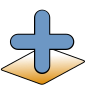
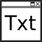
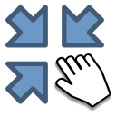
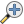
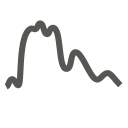
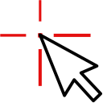
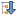
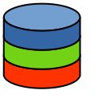
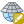

.. toolbar buttons

.. |viewlist_mapdock| image:: ../../../../enmapbox/gui/ui/icons/viewlist_mapdock.svg
   :width: 27px
.. |viewlist_spectrumdock| image:: ../../../../enmapbox/gui/ui/icons/viewlist_spectrumdock.svg
   :width: 27px

.. |mActionZoomOut| image:: ../../../../enmapbox/gui/ui/icons/mActionZoomOut.svg
   :width: 27px
.. |mActionZoomActual| image:: ../../../../enmapbox/gui/ui/icons/mActionZoomActual.svg
   :width: 27px
.. |mActionZoomFullExtent| image:: ../../../../enmapbox/gui/ui/icons/mActionZoomFullExtent.svg
   :width: 27px

.. |mActionIdentify| image:: ../../../../enmapbox/gui/ui/icons/mActionIdentify.svg
   :width: 27px

.. || image:: ../../../enmapbox/gui/ui/icons/
   :width: 27px

.. Data Sources Panel

.. |mActionRemove| image:: ../../../../enmapbox/gui/ui/icons/mActionRemove.svg
   :width: 27px
.. |mActionCollapseTree| image:: ../../../../enmapbox/gui/ui/icons/mActionCollapseTree.svg
   :width: 27px

.. |mIconLineLayer| image:: ../../img/mIconLineLayer.svg
   :width: 27px

.. |mIconRasterImage| image:: ../../../../enmapbox/gui/ui/icons/mIconRasterImage.svg
   :width: 27px
.. |mIconRasterMask| image:: ../../../../enmapbox/gui/ui/icons/mIconRasterMask.svg
   :width: 27px
.. |mIconRasterClassification| image:: ../../../../enmapbox/gui/ui/icons/mIconRasterClassification.svg
   :width: 27px

.. scatterplot tool
.. |action| image:: ../../img/action.svg
   :width: 40px
.. |reset_plot| image:: ../../img/pyqtgraph_reset.png
   :width: 15px

.. cursorlocationvalues

The GUI
*******

.. figure:: ../../img/manual_gui.png
   :width: 100%

1. Toolbar
==========

In the toolbar you can find the most common tasks. See table below for information on different buttons and their functionality.

.. list-table::
   :widths: auto
   :header-rows: 1

   * - Button
     - Button Name
     - Description
   * - |add_datasource|
     - Adds a data source
     - | Here you can add data from different sources,
       | e.g. raster and vector
   * - |viewlist_mapdock|
     - Open a map window
     - Opens a new Map Window
   * - |viewlist_spectrumdock|
     - | Open a spectral
       | library window
     - Opens a new spectral library window
   * - |viewlist_textview|
     - Open a text window
     - | Opens a new text window, you can for example
       | use it to store metadata, take notes etc.
   * - |mActionPan|
     - Pan Map
     - | Moves the map. Can also be
       | achieved by holding the mouse wheel
   * - |mActionZoomIn|
     - Zoom In
     - | Increases the zoom level. You can also scroll
       | the mouse wheel forward.
   * - |mActionZoomOut|
     - Zoom Out
     - | Decreases the zoom level. You can also scroll
       | the mouse wheel backwards.
   * - |mActionZoomActual|
     - | Zoom to native
       | resolution
     - Zoom to the native resolution
   * - |mActionZoomFullExtent|
     - Zoom to full extent
     - | Changes the zoom level so that the image
       | is displayed in full extent
   * - |select_location|
     - Identify
     - | Identify loactions on the map where you click.
       | Use the three options on the right to specify
       | what to identify
   * - |mActionIdentify|
     - Identify cursor location value
     - | Cursor Location Values. Shows pixel values of
       | all layers at the selected position.
   * - |pickrasterspectrum|
     - | Select pixel profiles
       | from map
     - | Opens spectral library window (if not opened yet) and
       | plots the spectral profile of the selected pixel
   * - |pan_center|
     - Center map on clicked location
     - | This tool will move the center of the map
       | view to the pixel you click on

2. Data Sources
===============

The Data Sources panel lists the data in your current project, comparable to the Layers panel in QGIS. The following data types and their
corresponding metadata are available:

* |mIconRasterLayer| Raster Data

  * **File size**: Metadata on resolution and extent of the raster
  * **CRS**: Shows Coordinate Reference System (CRS) information
  * **Bands**: Information on overall number of bands as well as band-wise metadata such as name, class or wavelength (if available)

    .. note::

       Depending on the type, raster layers will be listed with different icons:

       * |mIconRasterImage| for default raster layers (continuous value range)
       * |mIconRasterMask| for mask raster layers
       * |mIconRasterClassification| for classification raster layers

       Also see section on :ref:`data types <processing_data_types>` for further information.

* |mIconLineLayer| Vector Data

  * **File size**: Shows the file size and extent of the vector layer
  * **CRS**: Shows Coordinate Reference System (CRS) information
  * **Features**: Information on number of features and geometry types
  * **Fields**: Attribute information, number of fields as well as field names and corresponding datatype

* |speclib| Spectral Libraries

  * **File size**: Size of the file on hard disk
  * **Profiles**: Shows the number of spectra in the library

* |procalg| Models

|

**Buttons of the Data Sources panel:**

.. list-table::
   :widths: auto
   :align: left
   :header-rows: 1

   * - Button
     - Description
   * - |mActionAdd|
     - | This button lets you add data from different sources,
       | e.g. raster and vector.
       | Same function as |add_datasource|.
   * - |mActionRemove|
     - | Remove layers from the Data Sources panel. First
       | select one or more and then click the remove button.
   * - |mActionCollapseTree|
     - | Collapses the whole menu tree, so that only
       | layer type groups are shown.
   * - |mActionExpandTree|
     - | Expands menu tree to show all branches.
   * - |qgisicon|
     - Synchronizes Data Sources with QGIS.

.. tip::

   * If you want to remove all layers of a type at once (e.g. Raster Data), :menuselection:`right-click on Raster Data --> Clear`
   * The EnMAP-Box also **supports Tile-/Web Map Services** (e.g. Google Satellite or OpenStreetMap) as a raster layer. Just add them to
     your QGIS project as you normally would, and then click the |qgisicon| :superscript:`Synchronize Data Sources with QGIS`
     button. Now they should appear in the data source panel and can be added to a Map View.

3. Data Views
=============

The Data Views panel organizes the different windows and their content.
You may change the name of a Window by double-clicking onto the name in the list.

.. figure:: ../../img/example_data_views.png
   :width: 100%

   Example of how different window types and their contents are organized in the Data Views panel. In this case there
   are two Map Windows and one Spectral Library Window in the project.

Map Window |viewlist_mapdock|
~~~~~~~~~~

The map window allows you to visualize raster and vector data. It is interactive, which means you can move the content or
zoom in/out.

* In order to add a new Map Window click the |viewlist_mapdock| :superscript:`Open a Map Window` button. Once you added a
  Map Window, it will be listed in the ``Data Views`` panel.
* Add layers by either drag-and-dropping them into the Map Window (from the Data Sources list) or right-click onto
  the layer -> *Open in existing map...*
* You can also directly create a new Map Window and open a layer by right-clicking the layer -> *Open in new map*

.. can display raster and vector data (+ layer styling as is QGIS)
.. a variety of alignment options (maybe show animated gif)

Linking
^^^^^^^

You can link multiple Map Windows with each other, so that the contents are synchronized. The following options are
available:

* |linkscalecenter| Link map scale and center
* |linkscale| Link map scale
* |linkcenter| Link map center

In order to link Map Windows, go to :menuselection:`View --> Set Map Linking`, which will open the following dialog:

.. image:: ../../img/map_linking.png

Here you can specify the above mentioned link options between the Map Windows. You may either specify linkages between pairs
or link all canvases at once (the ``All Canvases`` option is only specifiable when the number of Map Windows is > 2). Remove
created links by clicking |unlink|.

**Alternative:** You can also create linkages between Map Windows directly from the Window itself:

.. warning:: Mind that this method might not work on Linux or Mac systems (due to display problems).
             In that case just use :menuselection:`View --> Set Map Linking`.

#. Click the |link| button in the Map Window bar (|mapwindowbar|).
#. Now the linking options/buttons appear the remaining Map Windows:

   .. figure:: ../../img/map_linking2.png
      :width: 100%

#. Select the desired linking type by clicking on the respective button.

|

.. raw:: html

   
<video width="450px" controls><source src="../../_static/maplinking.webm" type="video/webm">Your browser does not support HTML5 video.</video>
   
<i>Demonstration of linking two Map Windows</i>

.. |linkscalecenter| image:: ../../../../enmapbox/gui/ui/icons/link_mapscale_center.svg
   :width: 33px
.. |linkscale| image:: ../../../../enmapbox/gui/ui/icons/link_mapscale.svg
   :width: 33px

.. |link| image:: ../../../../enmapbox/gui/ui/icons/link_basic.svg
   :width: 25px
.. |mapwindowbar| image:: ../../img/mapwindowbar.png

Crosshair
^^^^^^^^^

* Activate the crosshair by right-clicking into a Map Window and select ``Crosshair`` -> ``Show``
* You can alter the style of the crosshair by right-clicking into a Map Window and select ``Crosshair`` -> ``Style``

  .. image:: ../../img/crosshair_style.png

Spectral Library Window |viewlist_spectrumdock|
~~~~~~~~~~~~~~~~~~~~~~~

Text Window |viewlist_textview|
~~~~~~~~~~~

4. Processing Toolbox
=====================

The processing toolbox is basically the same panel as in QGIS, i.e. it is mirrored into the EnMAP-Box GUI. Here you can find all the
processing algorithms that come with the EnMAP-Box listed under *EnMAP-Box*. In case it is closed/not visible you can open
it via :menuselection:`View --> Panels --> QGIS Processing Toolbox`.

See `QGIS Documentation - The toolbox <https://docs.qgis.org/testing/en/docs/user_manual/processing/toolbox.html>`_ for further information.

5. Cursor Location Values
=========================

This tools lets you inspect the values of a layer or multiple layers at the location where you click in the map view. To select a location (e.g. pixel or feature)
select the :guilabel:`Select Cursor Location` or the |mActionIdentify| :superscript:`Identify` button and click somewhere in the map view.

* The Cursor Location Value panel should open automatically and list the information for a selected location. The layers will be listed in the order they appear in the Map View.
  In case you do not see the panel, you can open it via :menuselection:`View --> Panels --> Cursor Location Values`.

.. figure:: ../../img/cursorlocationvalues.png

* By default, raster layer information will only be shown for the bands which are mapped to RGB. If you want to view all bands, change the ``RGB`` setting
  to ``All`` (right dropdown menu). Also, the first information is always the pixel coordinate (column, row).
* You can select whether location information should be gathered for ``All layers`` or only the ``Top layer``. You can further
  define whether you want to consider ``Raster and Vector`` layers, or ``Vector only`` and ``Raster only``, respectively.
* Coordinates of the selected location are shown in the ``x`` and ``y`` fields. You may change the coordinate system of the displayed
  coordinates via the |select_crs| :superscript:`Select CRS` button (e.g. for switching to lat/long coordinates).

