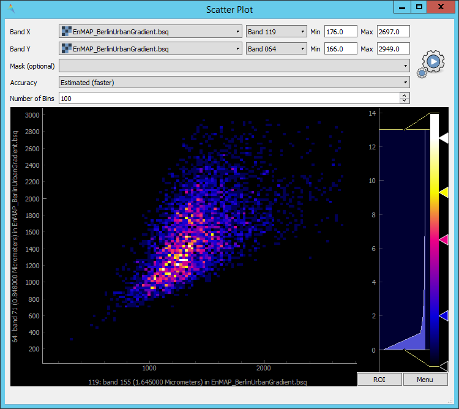

.. include:: /icon_links.rst

.. |reset_plot| image:: ../../img/pyqtgraph_reset.png
   :width: 15px

.. _tools:

Tools
*****

Scatter Plot
============

The Scatter Plot tool allows you to plot the values of two bands against each other. You can specify the following settings:

 * :guilabel:`Band X`: Choose the raster (first dropdown menu) and the band (second dropdown menu) to be plotted on the X-axis.
   ``Min`` and ``Max`` depict the limits of the axis. By default, Min and Max will be automatically derived. You can also
   manually specify the limits of the axis by entering another value.
 * :guilabel:`Band Y`: Same as above, just for the Y-axis.
 * :guilabel:`Mask (optional)`: You can specify a mask here, so that pixels which are covered by the mask will not be included in the
   scatterplot.
 * :guilabel:`Accuracy`: Can either be set to *Estimated (faster)* or *Actual (slower)*. Defines whether to use a subset of pixels for calculation
   or all of them.
 * :guilabel:`Number of Bins`: Defines the number of bins in x and y direction.

After you entered all settings, click the |action| button to create the plot.

   Screenshot of the Scatter Plot Tool

**Scatterplot Navigation**

* The plot window is interactive, which means you can zoom in and out using the mouse.
* Reset the plot window to the default zoom level by clicking the |reset_plot| button in the lower left of the plot window.
* Right-clicking inside the plot offers you several additional options.
* Change the color scheme of the plot by right-clicking into the color bar on the right.

**ROI**

.. |roi| image:: ../../img/pyqtgraph_roi.png
   :height: 27px

The ROI option allows you to select a rectangular region in the scatterplot, for which the density distribution will be
displayed in a second plot window below.

* Click the :guilabel:`ROI` button to open up the ROI functionality. Mind how a small rectangle |roi| appears at the bottom left of the plot
  (usually between the values 0 and 10, depending on your axis scaling you have to zoom in order to see it properly). Clicking and holding the circle
  allows you to change the rotation of the rectangle, while clicking and holding the square you can change the size of it.
* Close the ROI mode by clicking on the :guilabel:`ROI` button again.

.. _metadata_editor:

Metadata editor
===============

Reclassify
==========

The reclassify tool is a convenient graphical user interface for reclassifying classification rasters.

Specify the file you want to reclassify under :guilabel:`Input File`. Either use the dropdown menu to select one of the
layers which are already loaded or use the |mActionAddRasterLayer| button to open the file selection dialog.

Under :guilabel:`Output Classification` you can specify the classification scheme of the output classification which
will be created.

* You can import schemes from existing rasters or text files by clicking the |plus_green| button.
* Use the |classinfo_add| button to manually add classes.
* To remove entries select the respective rows and click the |classinfo_remove| button.
* So save a classification scheme select the desired classes (or use :kbd:`Crtl + A` to select all) and click on the
  |mActionFileSaveAs| button.
* Likewise, you can copy and paste classes by selecting them and clicking the |mActionEditCopy| :sup:`Copy Classes`
  |mActionEditPaste| :sup:`Paste Classes` buttons.

.. image:: /img/reclassifytool1.png

* The table is sorted by the **Label** field in ascending order. The value in **Label** will become the pixel value
  of this class and can not be altered.
* Double-click into the **Name** field in order to edit the class name.
* Double-click into the **Color** field to pick a color.

Under :guilabel:`Class Mapping` you can reassign the old classes (**From**) to values of the new classification scheme (**To**)

.. image:: /img/reclassifytool2.png

Specify the output path for the reclassified image under :guilabel:`Output File`

Click :guilabel:`OK` to run the tool.

Virtual Raster Builder
======================

See https://virtual-raster-builder.readthedocs.io/en/latest/
