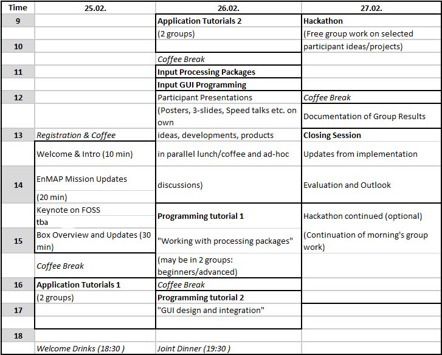
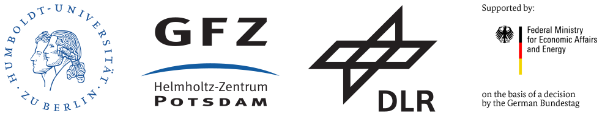

.. _workshop:

EnMAP-Box Workshop 2019
=======================

.. image:: img/workshop_logo.png

Aims and scope
~~~~~~~~~~~~~~

The EnMAP-Box Workshop 2019 contributes to the development of a larger and more advanced community of imaging spectroscopy
data users. The 3-day event introduces participants to (i) basic and advanced work with simulated EnMAP data and
state-of-the-art applications as available in the EnMAP-Box 3 and (ii) the individual development of applications
(with varying levels of complexity) for the processing of imaging spectroscopy data. Participants shall extend their
experience in spectral data analysis and in the implementation of individual approaches using the EnMAP-Box 3 and its
python-based application programming interface. They are given the opportunity to present their existing program code,
analysis approaches or new ideas to the group of participants in an interactive session of day 2 and to then further
elaborate the presented work individually or in groups during a Hackathon on day 3.

The EnMAP-Box 3 is a free and open source software tool provided as a python plug-in for QGIS.

Workshop language is English. There are **no workshop fees**, but participants must cover their own travel and accommodation costs.

Target group
~~~~~~~~~~~~

The EnMAP-Box Workshop 2019 invites doctoral and postdoctoral researchers as well as more experienced researchers.
All participants share the interest in the practical work with imaging spectroscopy data (especially future EnMAP data)
and in the development and implementation of algorithms for this work. The workshop explicitly targets researchers involved
in running or recently finished projects with a link to the EnMAP mission or other imaging spectroscopy data.
Advanced knowledge on optical remote sensing and imaging spectroscopy is mandatory. Participants are expected to
have prior experience in programming for scientific data analysis (e.g. in R, Python, IDL, Matlab). Selected tutorials
of the workshop are offered at two levels of experience to comply with the needs of a variety of participants, including
those who have joined previous EnMAP workshops.

.. _application:

Application procedure
~~~~~~~~~~~~~~~~~~~~~

The workshop is limited to 24 participants who have successfully passed the application procedure. Application deadline
is **extended until 9 January 2019**. Successful applicants are informed by 7 January 2019. During the selection process,
priority may be given depending on the relevance of the applicant’s current work for the EnMAP mission and her/his programming experience.

.. admonition:: Registration

   In order to apply for the workshop, please |reg_mailto| providing the information according the supplied template.
   By sending the email, you confirm that you have noticed the information on data protection regulations provided below [1]_, [2]_ (German only!).

   | *In case the link above does not work for you, please write an email to*
   | enmap@humboldt-innovation.de *and provide us with the following information*:

   .. literalinclude:: workshop_mail.txt
      :language: none

Program (preliminary)
~~~~~~~~~~~~~~~~~~~~~

|

Location
~~~~~~~~

The workshop will take place in **Berlin-Adlershof** in the **Erwin-Schrödinger-Zentrum** and the **Geography Department**.

.. list-table::

   * - | *Erwin Schrödinger-Zentrum*
       | *Rudower Chaussee 26*
       | *12489 Berlin*
     - |map_esz|
   * - | *Geography Department*
       | *(Alfred-Rühl-Haus)*
       | *Rudower Chaussee 16*
       | *12489 Berlin*
     - |map_gi|

.. |map_gi| raw:: html

   <iframe width="380" height="280" frameborder="0" scrolling="no" marginheight="0" marginwidth="0" src="https://www.openstreetmap.org/export/embed.html?bbox=13.532117307186128%2C52.4314660620821%2C13.535952866077425%2C52.43290679910109&amp;layer=mapnik&amp;marker=52.43218643647886%2C13.534035086631775" style="border: 1px solid black"></iframe> <small><a href="https://www.openstreetmap.org/?mlat=52.43219&amp;mlon=13.53404#map=19/52.43219/13.53404">Größere Karte anzeigen</a></small>

.. |map_esz| raw:: html

   <iframe width="380" height="280" frameborder="0" scrolling="no" marginheight="0" marginwidth="0" src="https://www.openstreetmap.org/export/embed.html?bbox=13.529429733753206%2C52.43039488201405%2C13.533265292644503%2C52.431835654049316&amp;layer=mapnik&amp;marker=52.43111527391899%2C13.531347513198853" style="border: 1px solid black"></iframe> <small><a href="https://www.openstreetmap.org/?mlat=52.43112&amp;mlon=13.53135#map=19/52.43112/13.53135">Größere Karte anzeigen</a></small>
|

Organizers
~~~~~~~~~~

Humboldt-Universität zu Berlin for the EnMAP-Core Science Team.

The workshop is part of the scientific preparation program of the EnMAP mission funded under the DLR Space Administration with resources from the German Federal Ministry of Economic Affairs and Energy.

|

Contact
~~~~~~~

| **Dr. Sebastian van der Linden**
| sebastian.linden@geo.hu-berlin.de

|

*Page updated 07.01.2019*

....

.. |reg_mailto| raw:: html

   <a href="mailto:enmap@humboldt-innovation.de?subject=Registration%20for%20EnMAP-Box%20Workshop%202019&amp;body=Hereby%2C%20I%20apply%20for%20participation%20in%20the%20EnMAP-Box%20Workshop%202019.%0A%0AFull%20name%3A%0AHome%20institution%3A%0AWork%20group%3A%0A%0AMSc%0A-%20Awarding%20university%3A%0A-%20MSc%20program%20title%3A%0A-%20Year%3A%0A%0ADoctorate%2FPhD%0A-%20Awarding%20university%3A%0A-%20Dissertation%20title%3A%0A-%20Year%3A%0A%0AProgramming%20language%20you%20use%20most%3A%20...%0ALevel%3A%20...%20(beginner%2Fadvanced%2F%22my%20programs%20are%20used%20by%20colleagues%22)%0A%0AProgramming%20skills%20in%20Python%0ALevel%3A%20...%20(please%20list%20number%20from%20below)%0A%5BSuggested%20levels%3A%20(1)%20I%20have%20never%20programmed%20in%20python%2C%20(2)%20I%20know%20how%20to%20execute%20scripts%2C%20(3)%20I%20know%20how%20to%20write%20my%20own%20scripts%2C%20(4)%20I%20develop%20APIs%20(pure%20python)%2C%20(5)%20I%20develop%20python%20extension%20modules%20in%20lower%20level%20languages%20using%20SWIG%2C%20Cython%2C%20etc.%5D%0A%0AMotivation%3A%0A...%20(max%20150-180%20words%3B%20please%20motivate%20your%20application%20by%20addressing%20the%20relevance%20of%20programming%20and%20multi-%2Fhyperspectral%20data%20analysis%20in%20your%20daily%20work%2C%20and%20by%20referencing%20work%20that%20proves%20your%20experience%20in%20optical%2Fimaging%20spectroscopy%20data%20analysis)%0A%0AProgramming%20project%20for%20workshop%3A%0A...%20(max.%2050%20words%3B%20e.g.%20%22BandComp%3B%20application%20for%20spectral%20subsetting%20of%20(imaging)%20spectroscopy%20data%20using%20different%20similarity%20measures%3B%20band%20pairs%20are%20iteratively%20compared%20and%20selected%22)%0A%0ABy%20sending%20the%20email%2C%20I%20confirm%20that%20I%20have%20noticed%20the%20information%20on%20data%20protection%20regulations%20provided%20at%20https%3A%2F%2Fenmap-box.readthedocs.io%2Fen%2Flatest%2Fworkshop.html%20and%20http%3A%2F%2Fhumboldt-innovation.de%2Fde%2Fimprint.html.">write us an E-Mail</a>

.. [1] Wenn Sie sich über diese E-Mail für diese Veranstaltung anmelden, erhebt die Humboldt-Innovation GmbH dabei die folgenden Daten: Vor- und Nachname, Unternehmen/Institution, Email-Adresse sowie Ort und Zeitpunkt MSc Abschluss, Ort und Zeitpunkt Promotion, sowie Programmierkenntnisse, Die Gründe der Kontaktaufnahme kennen nur Sie; die Reaktion hierauf beschreibt sogleich den Zweck der Verarbeitung. Soweit es um ein konkretes Schuldverhältnis (hier Zuschauervertrag), sei es im Zusammenhang mit der Anbahnung, Durchführung oder Beendigung, geht, ist die Rechtsgrundlage für die Verarbeitung Artikel 6 Absatz 1 lit. b DSGVO. In diesem Fall speichert die Humboldt-Innovation GmbH die Daten bis zum Ende der gesetzlichen Aufbewahrungsfrist. In allen anderen Fällen ist die Rechtsgrundlage Artikel 6 Absatz 1 Satz 1 lit. f DSGVO,  wonach die Verarbeitung personenbezogener Daten auch ohne Einwilligung des Betroffenen möglich ist, wenn die Verarbeitung zur Wahrung der berechtigten Interessen des Verantwortlichen oder eines Dritten erforderlich ist, sofern nicht die Interessen oder Grundrechte und Grundfreiheiten der betroffenen Person, die den Schutz personenbezogener Daten erfordern, überwiegen, insbesondere dann, wenn es sich bei der betroffenen Person um ein Kind handelt. Die Kommunikation außerhalb eines Schuldverhältnisses ist in beiderseitigen Interesse des Anmelders und der Humboldt-Innovation GmbH. Die Humboldt-Innovation GmbH speichert Ihre Daten, bis der aus dem berechtigten Interesse herrührende Zweck erfüllt ist.

.. [2] General data protection regulation of Humboldt-Innovation GmbH: http://humboldt-innovation.de/de/imprint.html