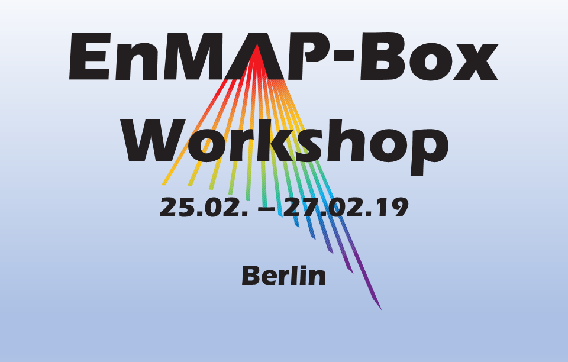
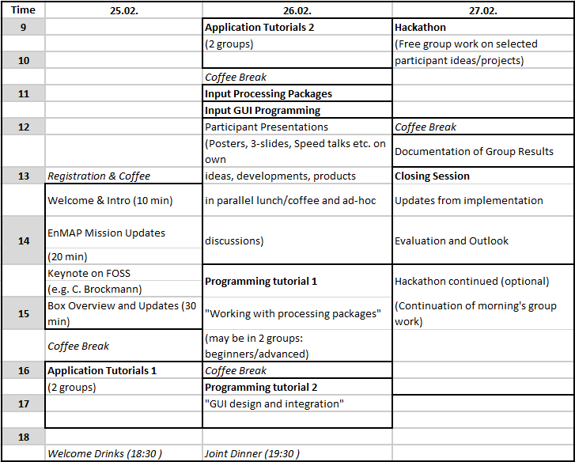

.. _workshop:

EnMAP-Box Workshop 2019
=======================

Aims and scope
~~~~~~~~~~~~~~

The EnMAP-Box Workshop 2019 contributes to the development of a larger and more advanced community of imaging spectroscopy
data users. The 3-day event introduces participants to (i) basic and advanced work with simulated EnMAP data and
state-of-the-art applications as available in the EnMAP-Box 3 and (ii) the individual development of applications
(with varying levels of complexity) for the processing of imaging spectroscopy data. Participants shall extend their
experience in spectral data analysis and in the implementation of individual approaches using the EnMAP-Box 3 and its
python-based application programming interface. They are given the opportunity to present their existing program code,
analysis approaches or new ideas to the group of participants in an interactive session of day 2 and to then further
elaborate the presented work individually or in groups during a Hackathon on day 3.

The EnMAP-Box 3 is a free and open source software tool provided as a python plug-in for QGIS.

Workshop language is English.

Target group
~~~~~~~~~~~~

The EnMAP-Box Workshop 2019 invites doctoral and postdoctoral researchers as well as more experienced researchers.
All participants share the interest in the practical work with imaging spectroscopy data (especially future EnMAP data)
and in the development and implementation of algorithms for this work. The workshop explicitly targets researchers involved
in running or recently finished projects with a link to the EnMAP mission or other imaging spectroscopy data.
Advanced knowledge on optical remote sensing and imaging spectroscopy is mandatory. Participants are expected to
have prior experience in programming for scientific data analysis (e.g. in R, Python, IDL, Matlab). Selected tutorials
of the workshop are offered at two levels of experience to comply with the needs of a variety of participants, including
those who have joined previous EnMAP workshops.

Application procedure
~~~~~~~~~~~~~~~~~~~~~

The workshop is limited to 24 participants who have successfully passed the application procedure. Application deadline
is 10 December 2018. Successful applicants are informed by 20 December 2018. During the selection process,
priority may be given depending on the relevance of the applicant’s current work for the EnMAP mission and her/his programming experience.

.. admonition:: Registration

   Information on the registration procedure will follow soon here on this page.

   .. In order to apply for the workshop, please |reg_mailto| and supply the desired information.

   .. *In case the link above does not work for you, please write an email to* fabian.thiel@geo.hu-berlin.de *and provide us with the following information*::

Program (preliminary)
~~~~~~~~~~~~~~~~~~~~~

|

Location
~~~~~~~~

The workshop will take place in **Berlin-Adlershof** in the **Erwin-Schrödinger-Zentrum** and the **Geography Department**.

.. list-table::

   * - | *Erwin Schrödinger-Zentrum*
       | *Rudower Chaussee 26*
       | *12489 Berlin*
     - |map_esz|
   * - | *Geography Department*
       | *(Alfred-Rühl-Haus)*
       | *Rudower Chaussee 16*
       | *12489 Berlin*
     - |map_gi|

.. |map_gi| raw:: html

   <iframe width="380" height="280" frameborder="0" scrolling="no" marginheight="0" marginwidth="0" src="https://www.openstreetmap.org/export/embed.html?bbox=13.532117307186128%2C52.4314660620821%2C13.535952866077425%2C52.43290679910109&amp;layer=mapnik&amp;marker=52.43218643647886%2C13.534035086631775" style="border: 1px solid black"></iframe> <small><a href="https://www.openstreetmap.org/?mlat=52.43219&amp;mlon=13.53404#map=19/52.43219/13.53404">Größere Karte anzeigen</a></small>

.. |map_esz| raw:: html

   <iframe width="380" height="280" frameborder="0" scrolling="no" marginheight="0" marginwidth="0" src="https://www.openstreetmap.org/export/embed.html?bbox=13.529429733753206%2C52.43039488201405%2C13.533265292644503%2C52.431835654049316&amp;layer=mapnik&amp;marker=52.43111527391899%2C13.531347513198853" style="border: 1px solid black"></iframe> <small><a href="https://www.openstreetmap.org/?mlat=52.43112&amp;mlon=13.53135#map=19/52.43112/13.53135">Größere Karte anzeigen</a></small>
|

Organizers
~~~~~~~~~~

Humboldt-Universität zu Berlin for the EnMAP-Core Science Team

Contact
~~~~~~~

| **Dr. Sebastian van der Linden**
| sebastian.linden@geo.hu-berlin.de

.. |reg_mailto| raw:: html

    <a href="mailto:registration@enmap.org?bcc=fabian.thiel@hu-berlin.de&amp;subject=Registration%20for%20EnMAP-Box%20Workshop%2027.02.%20in%20Berlin&amp;body=Full%20name%0AEmail%20address%0AHome%20institution%0AWorking%20group%0AMSc%0A-%20Awarding%20university%0A-%20MSc%20program%20title%0A-%20Date%20of%20graduation%0ADoctorate%2FPhD%0A-%20Awarding%20university%0A-%20Dissertation%20title%0A-%20Date%20of%20graduation%0AProgramming%20skills%0AProgramming%20language%20you%20use%20most%3A%0ALevel%3A%20...%0AProgramming%20skills%20in%20Pythong%3A%0A...%0A%0AMotivation%20(please%20motivate%20your%20application%20by%20addressing%20the%20relevance%20of%20programming%20and%20multi-%2Fhyperspectral%20data%20analysis%20in%20your%20daily%20work%2C%20and%20by%20referencing%20work%20that%20proves%20your%20experience%20in%20optical%2Fimaging%20spectroscopy%20data%20analysis.%0A">write us an email</a>